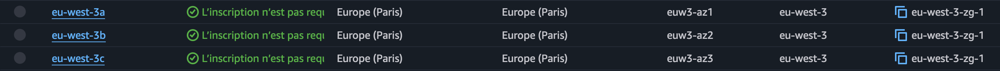
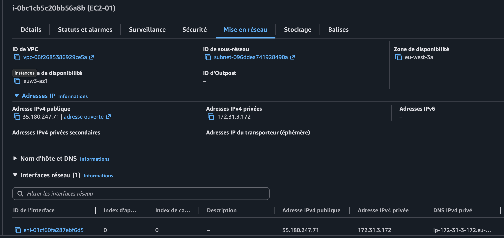
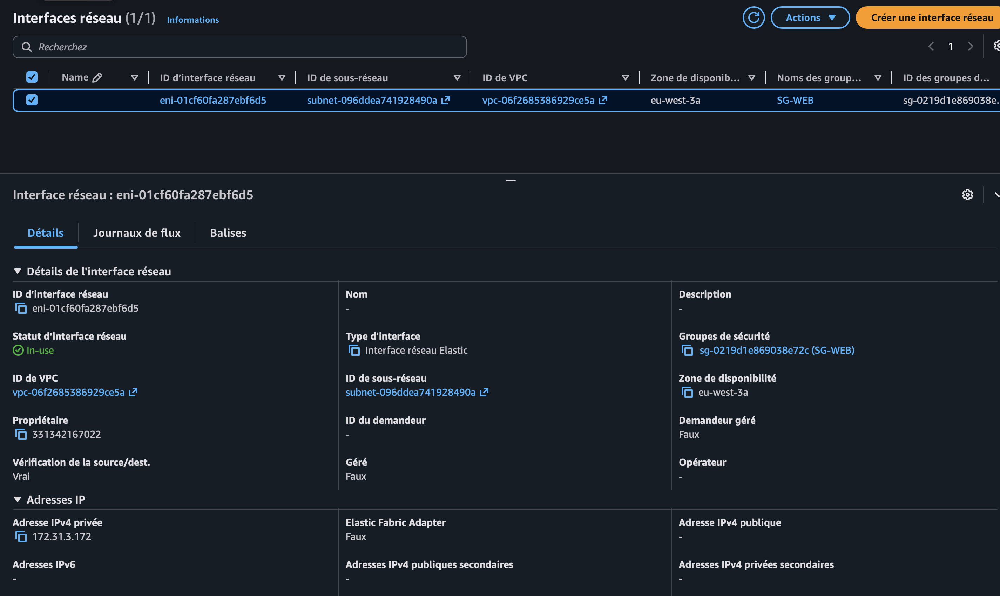
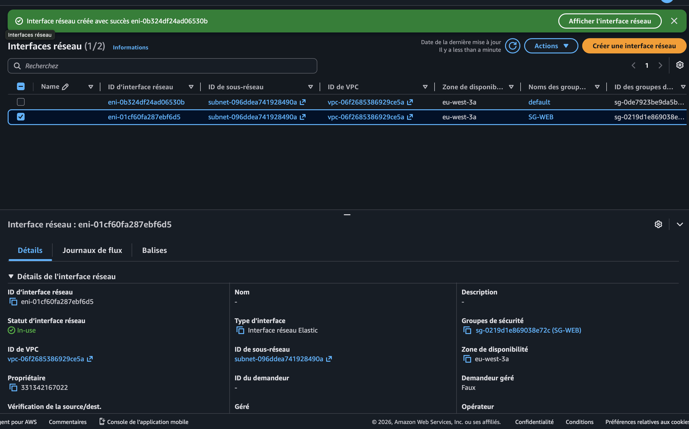
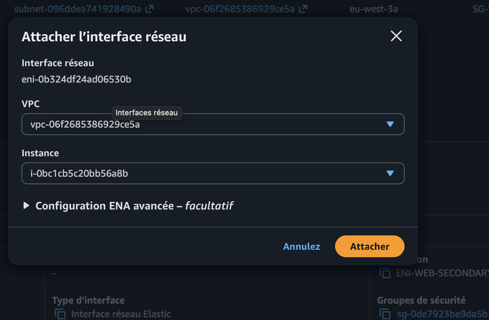
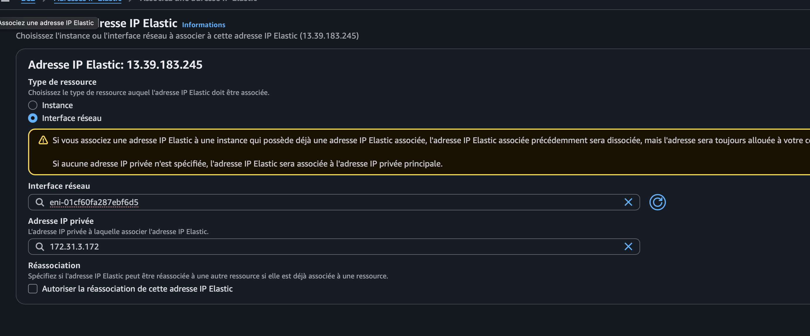
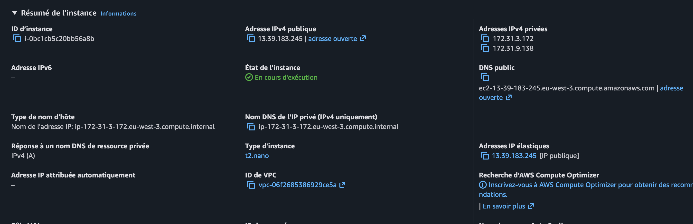
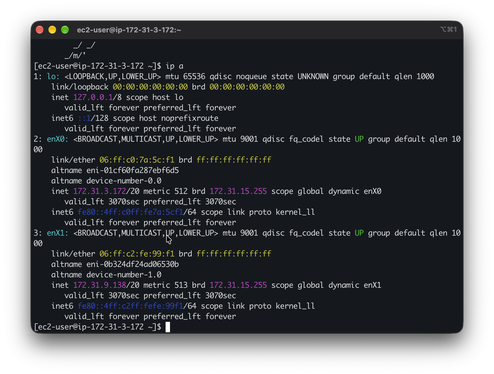
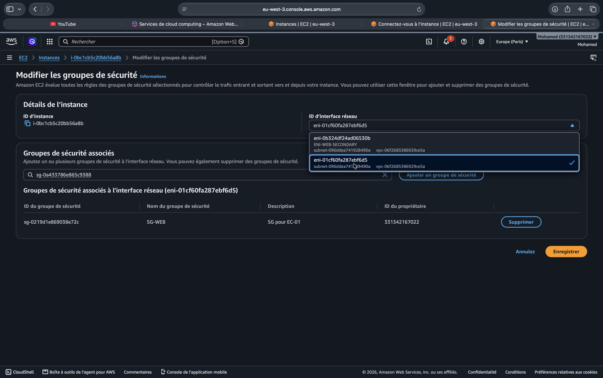

# TP AWS — EC2, ENI, Security Groups, Elastic IP et Availability Zones

Ce dépôt documente un TP réalisé sur AWS afin de comprendre concrètement la relation entre une instance EC2, ses interfaces réseau ENI, les Security Groups, les adresses IP et les Availability Zones.

L'objectif n'est pas seulement de montrer une configuration qui fonctionne. Les captures correspondent aux manipulations réellement réalisées et servent à expliquer ce que j'ai observé.

## 1. Ce que je cherche à comprendre

À la fin de ce TP, je dois être capable d'expliquer simplement les points suivants :

- une région AWS contient plusieurs Availability Zones (AZ) ;
- une EC2 possède une ou plusieurs interfaces réseau ENI ;
- une ENI peut être créée indépendamment d'une EC2 puis attachée à une instance ;
- une ENI reste dans son Availability Zone ;
- une ENI porte notamment une adresse IP privée et des Security Groups ;
- une même EC2 peut avoir plusieurs ENI ;
- les Security Groups sont associés aux ENI ;
- une ENI peut avoir plusieurs Security Groups ;
- une Elastic IP peut être associée à une adresse IP privée portée par une ENI.

## 2. Environnement du TP

- Région : **Europe (Paris) — eu-west-3**
- Instance : **EC2-01**
- Système : **Amazon Linux 2023**
- Type observé : **t2.nano**
- ENI principale : `eni-01cf60fa287ebf6d5`
- ENI secondaire : `eni-0b324df24ad06530b`
- IP privée principale : `172.31.3.172`
- IP privée secondaire : `172.31.9.138`
- Elastic IP utilisée pendant le TP : `13.39.183.245`
- Security Group principal : `SG-WEB`

> Les identifiants et adresses visibles ici correspondent uniquement à l'environnement de laboratoire présenté dans les captures.

## 3. Availability Zones



Dans la région `eu-west-3`, AWS me présente plusieurs AZ : `eu-west-3a`, `eu-west-3b` et `eu-west-3c`.

Une région contient donc plusieurs zones physiquement séparées. L'AZ devient importante pour les ENI car une interface réseau appartient à un subnet, et ce subnet appartient lui-même à une seule AZ.

**Ce que je retiens :** une ENI créée dans `eu-west-3a` reste dans `eu-west-3a`. Je ne peux pas simplement la déplacer sur une instance située dans une autre AZ.

## 4. Première EC2 et son réseau



`EC2-01` est placée dans `eu-west-3a`. La console permet de retrouver son VPC, son subnet, son IP privée et son interface réseau.

À ce moment du TP, l'instance possède une seule ENI. Son IP privée principale est `172.31.3.172`.

Cela permet de faire le lien :

**EC2 → ENI → IP privée → Security Group**

## 5. L'ENI existe comme ressource AWS



En allant directement dans **Interfaces réseau**, je retrouve l'interface `eni-01cf60fa287ebf6d5`.

La capture montre qu'elle est `In-use`, qu'elle appartient à `eu-west-3a`, qu'elle possède l'adresse privée `172.31.3.172` et que `SG-WEB` lui est associé.

**Ce que je comprends :** quand je dis rapidement « le Security Group de mon EC2 », techniquement le Security Group est associé à une ENI utilisée par cette EC2.

## 6. Création d'une deuxième ENI



J'ai ensuite créé une deuxième interface réseau indépendamment de l'EC2.

La console affiche alors deux ENI dans le même VPC et la même AZ. L'ENI secondaire a d'abord été créée comme ressource séparée avant d'être attachée à l'instance.

C'est une démonstration importante : **une ENI n'est pas obligatoirement créée en même temps que l'EC2.**

## 7. Attachement de l'ENI secondaire



AWS permet ensuite de sélectionner l'instance à laquelle l'interface doit être attachée.

L'ENI secondaire est attachée à `EC2-01`. L'instance dispose maintenant de deux cartes réseau virtuelles.

## 8. Elastic IP et ENI



Pendant le TP, l'ancienne IPv4 publique automatique n'était plus disponible. J'ai donc alloué une Elastic IP puis je l'ai associée à l'ENI principale, précisément à son IP privée `172.31.3.172`.

Il faut éviter de raisonner comme si Linux recevait directement l'adresse publique. Dans cette configuration, AWS fait l'association entre l'Elastic IP et l'adresse privée de l'ENI.

**Association observée :**

`13.39.183.245` → `172.31.3.172` → ENI principale → `EC2-01`

La deuxième ENI n'a pas besoin d'une adresse publique pour fonctionner dans le VPC.

## 9. Une EC2 avec deux adresses privées



Après l'attachement, la console EC2 affiche deux IPv4 privées :

- `172.31.3.172`
- `172.31.9.138`

L'Elastic IP `13.39.183.245` est associée à l'interface principale.

Cette capture permet de voir simplement qu'une seule EC2 peut disposer de plusieurs interfaces et donc de plusieurs adresses privées.

## 10. Vérification directement dans Linux



La commande utilisée est :

```bash
ip a
```

Amazon Linux voit bien deux interfaces :

```text
enX0
  altname eni-01cf60fa287ebf6d5
  172.31.3.172/20

enX1
  altname eni-0b324df24ad06530b
  172.31.9.138/20
```

C'est une des vérifications les plus utiles du TP : les IDs `eni-...` configurés dans AWS apparaissent également côté système.

Je ne suis donc plus seulement en train de regarder une abstraction dans la console AWS. Le système d'exploitation voit réellement deux interfaces réseau différentes, avec deux adresses MAC et deux IP privées.

## 11. Security Groups : ils sont associés aux ENI



Cette capture est particulièrement importante.

Quand je demande à AWS de modifier les Security Groups de mon instance qui possède deux ENI, la console me demande d'abord **quelle interface réseau** je veux modifier.

Je peux sélectionner l'ENI principale ou `ENI-WEB-SECONDARY`.

Cela confirme directement que les Security Groups sont appliqués aux interfaces réseau.

Une même EC2 peut donc avoir par exemple :

- ENI principale → `SG-WEB`
- ENI secondaire → un autre SG

Une ENI peut également recevoir plusieurs SG. Dans ce cas, leurs règles d'autorisation se cumulent. Les Security Groups ne fonctionnent pas comme une liste avec des règles `DENY` explicites : ce qui est autorisé par au moins une règle applicable est permis, et ce qui n'est autorisé par aucune règle reste bloqué.

## 12. Incident SSH rencontré pendant le TP

Après l'association de l'Elastic IP, une connexion SSH a échoué avec :

```text
WARNING: UNPROTECTED PRIVATE KEY FILE!
Permissions 0644 for 'KeySsh_EC2-01.pem' are too open.
This private key will be ignored.
```

Au départ, il aurait été facile d'accuser les Security Groups ou la deuxième ENI. Le message SSH indiquait pourtant un problème local : macOS refusait d'utiliser la clé privée car ses permissions étaient trop ouvertes.

Correction :

```bash
chmod 400 KeySsh_EC2-01.pem
ssh -i KeySsh_EC2-01.pem ec2-user@13.39.183.245
```

La connexion a ensuite fonctionné.

**Leçon :** lorsqu'un flux ne fonctionne pas, il ne faut pas modifier les Security Groups au hasard. Il faut lire l'erreur et déterminer si le problème vient du réseau AWS, du filtrage, du routage, de l'authentification ou du système local.

## 13. Security Group vs firewall classique

Ce TP m'a également permis de corriger une représentation que j'avais du firewall.

Avec un firewall on-premise comme pfSense ou FortiGate, on place généralement un équipement sur le chemin de certains flux et on applique des politiques de filtrage à travers cet équipement.

Un Security Group AWS fonctionne différemment. Ce n'est pas une appliance firewall centrale placée à l'entrée du VPC. C'est une politique de filtrage stateful appliquée aux interfaces réseau des ressources.

Je retiens donc :

**EC2 = machine virtuelle**

**ENI = interface/carte réseau virtuelle**

**Security Group = politique de filtrage stateful associée à l'ENI**

## 14. Ce que le TP a démontré

Le TP m'a permis de vérifier concrètement que :

1. une EC2 peut avoir plusieurs ENI ;
2. une ENI peut être créée avant d'être attachée à une EC2 ;
3. chaque ENI possède sa propre identité, adresse MAC et IP privée ;
4. Linux retrouve les mêmes IDs d'ENI que la console AWS ;
5. les Security Groups sont associés aux ENI ;
6. deux ENI d'une même EC2 peuvent donc avoir des Security Groups différents ;
7. une Elastic IP peut être associée à l'adresse privée d'une ENI ;
8. une ENI reste liée à son AZ ;
9. un problème SSH n'est pas automatiquement un problème de Security Group.

## 15. Suite du laboratoire

Le laboratoire n'est pas terminé. Les prochaines manipulations permettront de documenter :

- tentative volontaire d'attacher une ENI de `eu-west-3a` à une EC2 d'une autre AZ ;
- plusieurs Security Groups sur la même ENI et vérification du cumul des règles ;
- référence d'un Security Group depuis un autre Security Group ;
- communication privée EC2 ↔ EC2 ;
- Cluster Placement Group ;
- Spread Placement Group ;
- Partition Placement Group ;
- comparaison Stop / Hibernate.

Ces parties seront ajoutées uniquement après avoir été réellement testées.

---

### Idée principale retenue

AWS sépare clairement la machine et son réseau. Une EC2 utilise des ENI, les ENI portent les paramètres réseau et les Security Groups filtrent les flux au niveau de ces interfaces. Comprendre cette séparation permet ensuite de comprendre beaucoup plus facilement le réseau EC2.
