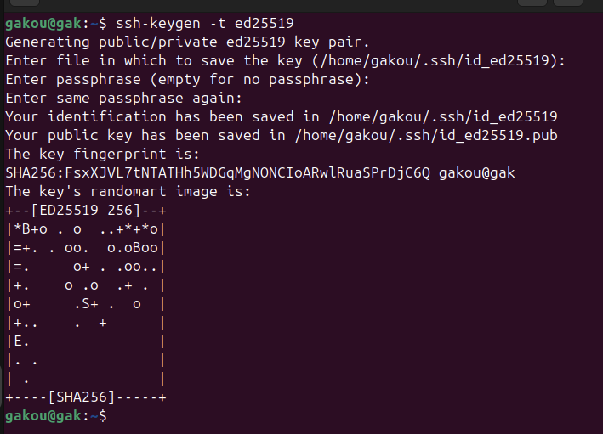
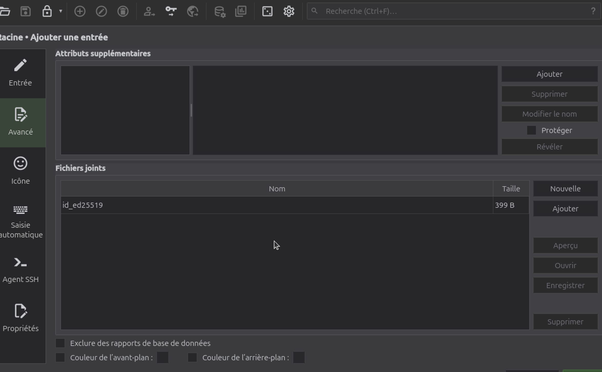
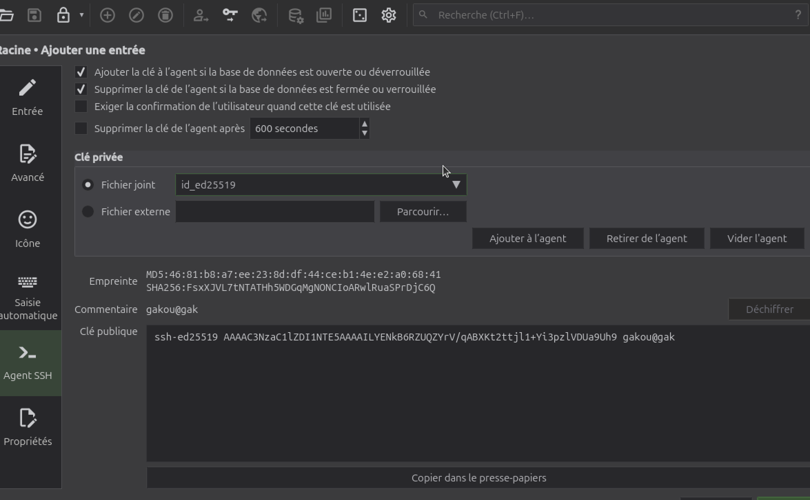
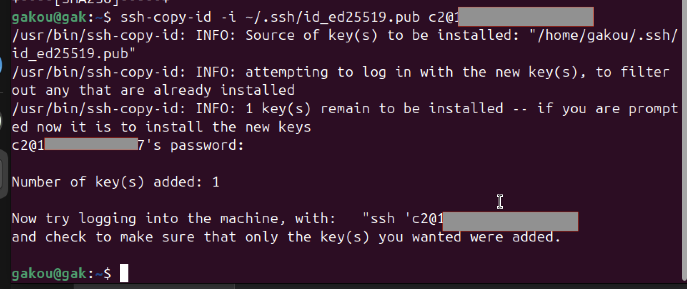
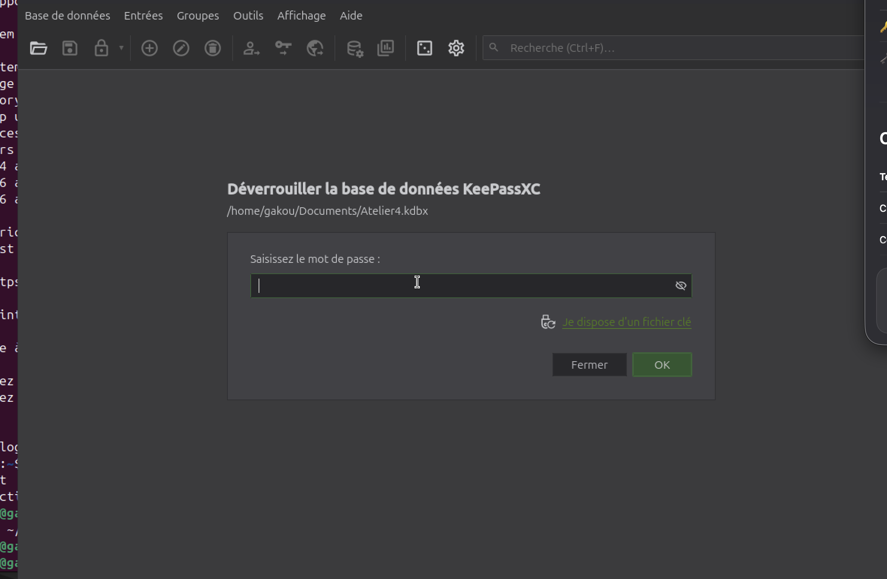

# Secure SSH Key Management with KeePassXC

This guide explains how to implement a **secure SSH key management service** using **KeePassXC** to strengthen administrator access control and reduce key exposure risks.

---

## 🎯 Objectives

The purpose of this setup is to:

- **Avoid storing private keys in plaintext** on local machines;
- **Automatically load SSH keys** only when the KeePassXC database is unlocked;
- **Enhance administrative access security** through encrypted key management.

---

## ⚙️ Implementation Steps

### 1. Generate a New SSH Key

Generate a new SSH key pair from your administrator workstation:

```bash
ssh-keygen -t ed25519
```



- The **public key** will be installed on the remote server.  
- The **private key** will be securely stored inside KeePassXC.

---

### 2. Import the Private Key into KeePassXC

Open KeePassXC and add a new entry corresponding to your SSH key.

  


When configuring the entry, enable the following options:

- ✅ *Add key to agent when database is opened*  
- ✅ *Remove key from agent when database is locked*

This ensures that your SSH key is only active while the KeePassXC database is unlocked.

---

### 3. Install the Public Key on the Server

From your administrator machine, copy the public key to the target server:

```bash
ssh-copy-id user@remote-server
```



Afterward, **lock KeePassXC** and **delete any local copy of the private key** from your file system.

---

### 4. Test the Secure Behavior

#### 🔒 When KeePassXC is Locked

When KeePassXC is locked, the SSH key is not loaded in the agent. Any SSH connection attempt will require the password:

  


#### 🔓 When KeePassXC is Unlocked

Once KeePassXC is unlocked, the SSH key is automatically loaded into the agent, and the SSH connection proceeds without prompting for a password:


---

## Expected Results

With this configuration:

- Private keys are **never stored in plaintext** on the system;
- SSH sessions can **only be initiated when KeePassXC is unlocked**;
- Administrator access is **secured without adding workflow complexity**.

---
