#   
  
**Introduction to the Problem and Architecture Overview**  
  
The objective of this project is to deploy a functional OpenVPN infrastructure in a virtualized environment, simulating a realistic network scenario with separation between LAN and WAN zones. The main challenge is to allow a client located **outside the local network** (WAN 192.168.64.0/24) to securely access the OpenVPN server located **inside an internal network** (LAN 192.168.10.0/24), while ensuring routing, Network Address Translation (NAT), and secure traffic forwarding through the router.  
The central issue lies in correctly configuring inter-network routing, NAT, and setting up a VPN tunnel that enables the remote client to reach internal resources as if it were part of the local network.  
1. **A Linux router** providing the connection between the WAN network (enp0s1 – 192.168.64.0/24) and the LAN network (enp0s2 – 192.168.10.0/24). It implements routing rules, iptables, and NAT to allow traffic forwarding.  
2. **A Linux router** providing the connection between the WAN network (enp0s1 – 192.168.64.0/24) and the LAN network (enp0s2 – 192.168.10.0/24). It implements routing rules, iptables, and NAT to allow traffic forwarding.  
3. **A Linux router** providing the connection between the WAN network (enp0s1 – 192.168.64.0/24) and the LAN network (enp0s2 – 192.168.10.0/24). It implements routing rules, iptables, and NAT to allow traffic forwarding.  
  
  
**Setting UP**  
  
The make-cadir /etc/openvpn/easy-rsa command creates the Easy-RSA directory structure used to generate and manage certificates. The directory is accessed with cd /etc/openvpn/.  
![vm1@vm1 - [127]> sudo make-cadir /etc/openvpn/easy-rsa](Attachments/E89F9AF0-A392-4156-828F-8B3E0883B033.png)  
The make-cadir /etc/openvpn/easy-rsa command creates the Easy-RSA directory structure used to generate and manage certificates. The directory is accessed with cd /etc/openvpn/.  
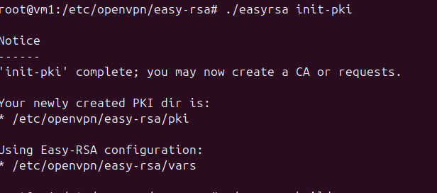  
Setting up the Certificate Authority:  
  
  
Next, we generate a key pair for the server:  
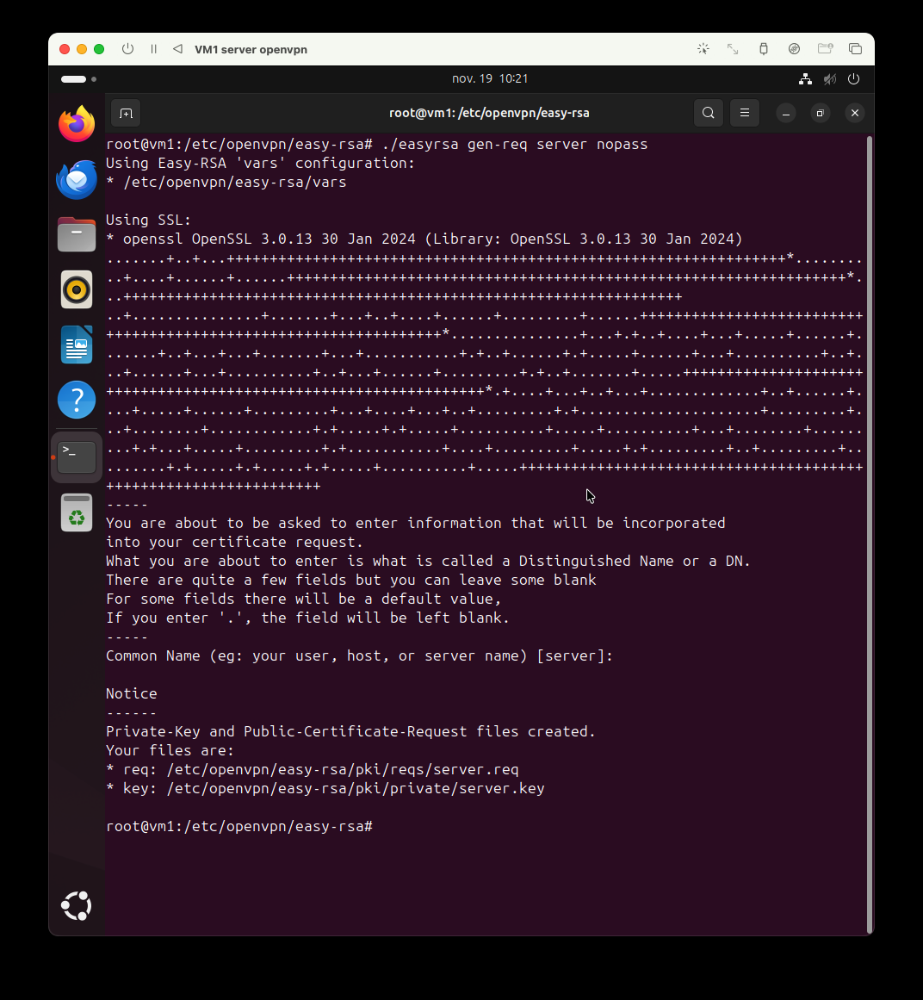  
  
  
Diffie–Hellman parameters must be generated for the OpenVPN server. The following command places them in **pki/dh.pem**:  
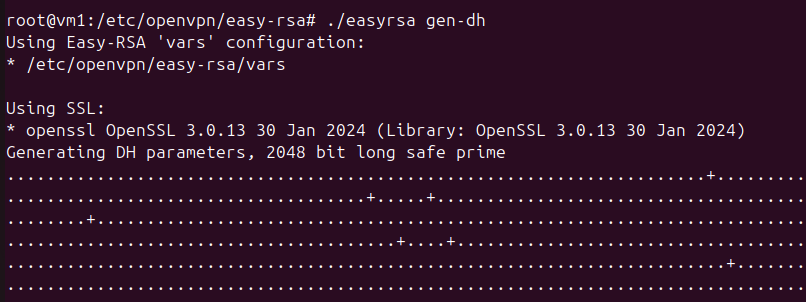  
  
  
Finally, a server certificate is created:  
  
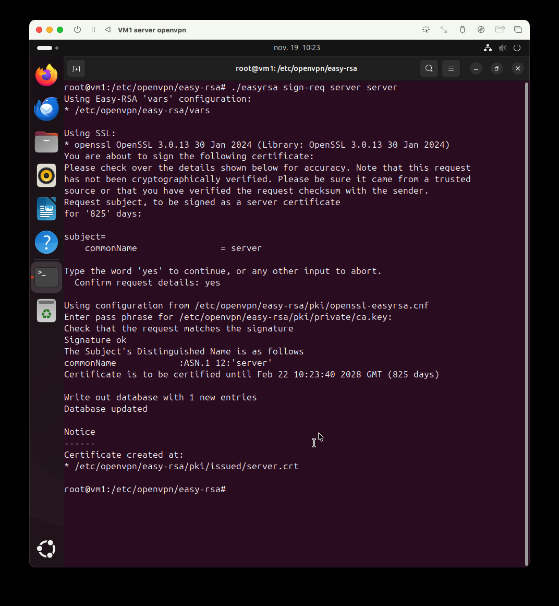  
  
All certificates and keys are generated in subdirectories. Standard practice is to copy them into /etc/openvpn/:  
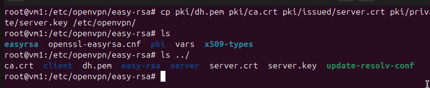  
  
**Client Certificate Creation**  
Certificate generation and signing:  
  
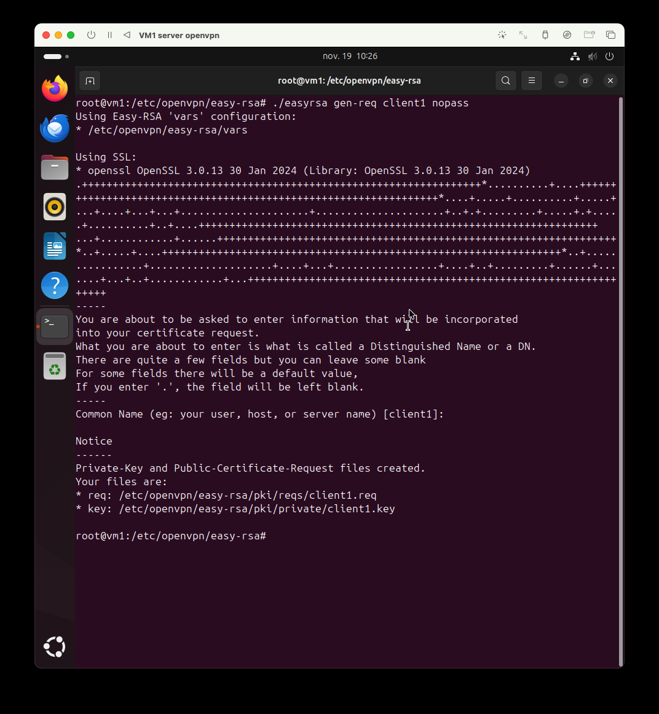  
  
  
  
  
Moving the configuration file:  
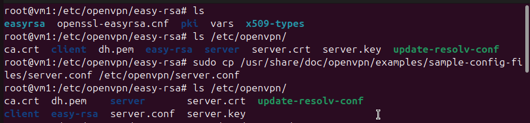  
  
Here we see essential files such as *openssl-easyrsa.cnf*, *vars*, the *pki/* directory, and Easy-RSA scripts.  
The /etc/openvpn/ directory shows *ca.crt*, *dh.pem*, *server.key*, *server.crt*.  
  
Importing the default server configuration:  
sudo cp /usr/share/doc/openvpn/examples/sample-config-files/server.conf /etc/openvpn/server.conf  
  
Then we modify /etc/openvpn/server.conf to ensure the following lines point to the generated certificates and keys:  
  

| ca ca.crt
cert myservername.crt
key myservername.key
dh dh.pem
tls-auth ta.key 0 |
| -------------------------------------------------------------------------------- |
  
  
  
Generation of a TLS authentication key (TA):  
  
Below, the openvpn@server service starts correctly. The logs confirm the creation of tun0, the assignment of 10.8.0.1/24, and the opening of UDP port 1194.  
“Initialization Sequence Completed” confirms the server is ready.  
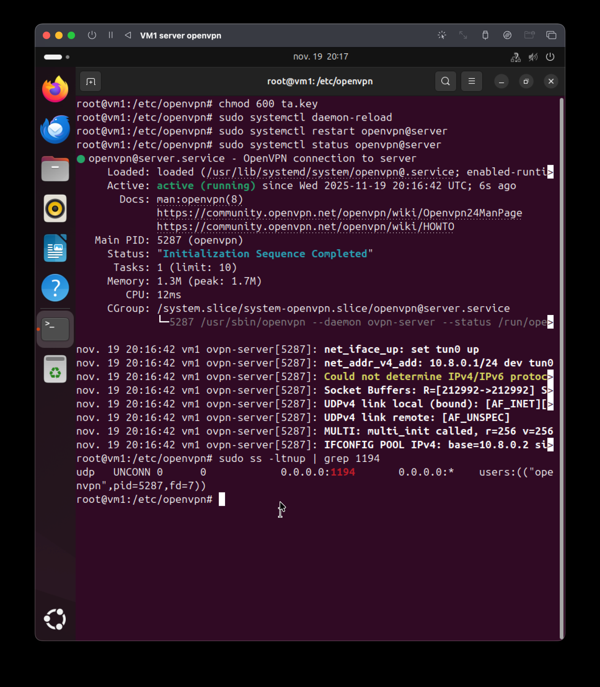  
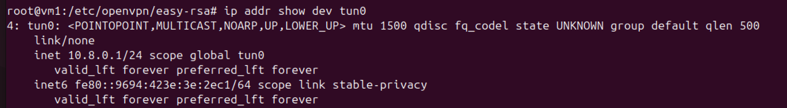  
  
**On the Client Side**  
  
Install OpenVPN and transfer the server-generated files:  
  
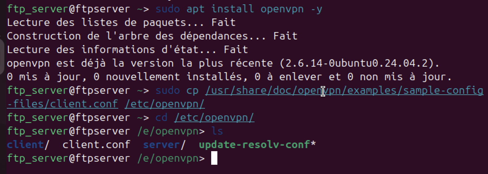  
  
Move files into the correct directory:  
![ftp_server@ftpserver /e/openvpn [1]> sudo mv =/Documents/ca.cct =/Documents/s](Attachments/60B70E19-3E08-4FD2-ADF4-0D382D679358.png)  
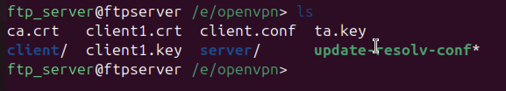  
  
  
When the client connects to the OpenVPN server, it must reach **the interface the server is actually listening on**.  
The server is in the LAN **192.168.10.0/24** but behind a router.  
The client is in **192.168.64.0/24** and **cannot directly reach a LAN IP**.  
  
The only reachable address is the router’s WAN: **192.168.64.39**.  
  
The router receives the VPN traffic and forwards it to the LAN server (192.168.10.10) using routing + NAT.  
This is exactly like accessing a server behind a home Internet box.  
  
In server.conf, we modify this line:  
  
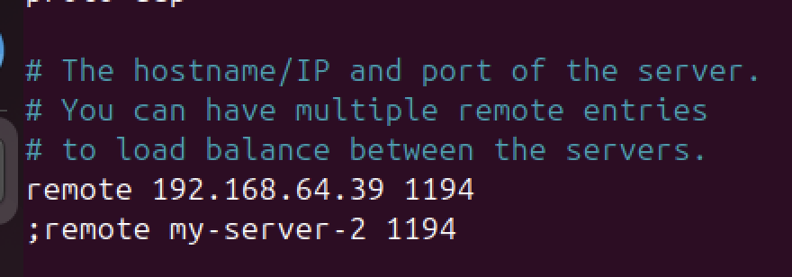  
Add a DNAT rule on the router:  
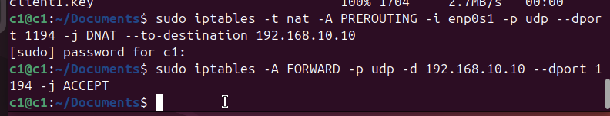  
OpenVPN now works correctly:  
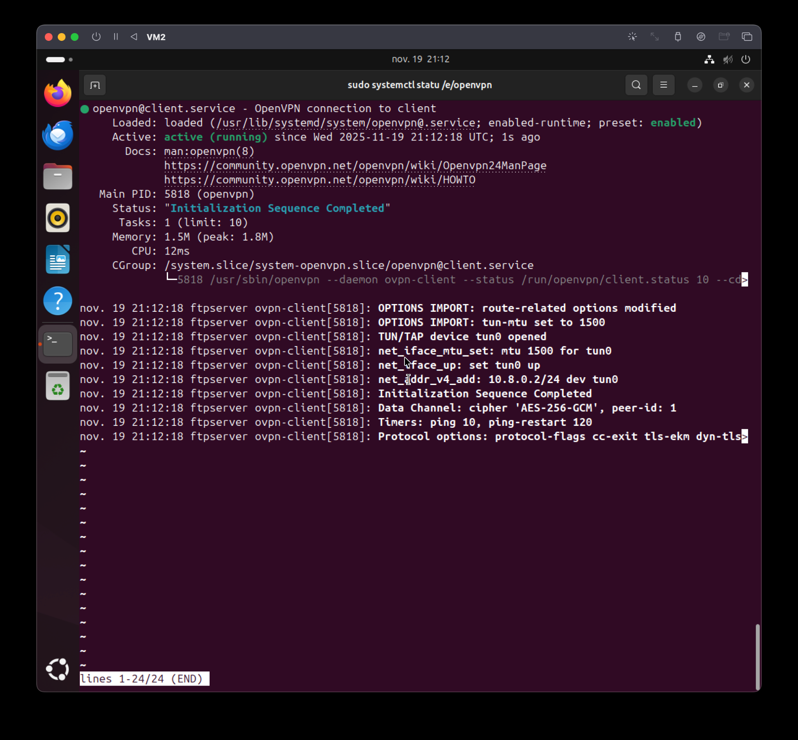  
  
The tun0 tunnel is created on the client:  
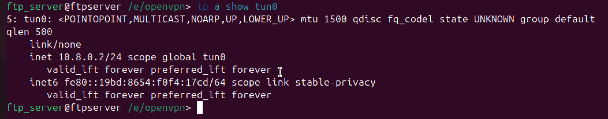  
The client can ping through the tunnel, and vice versa:  
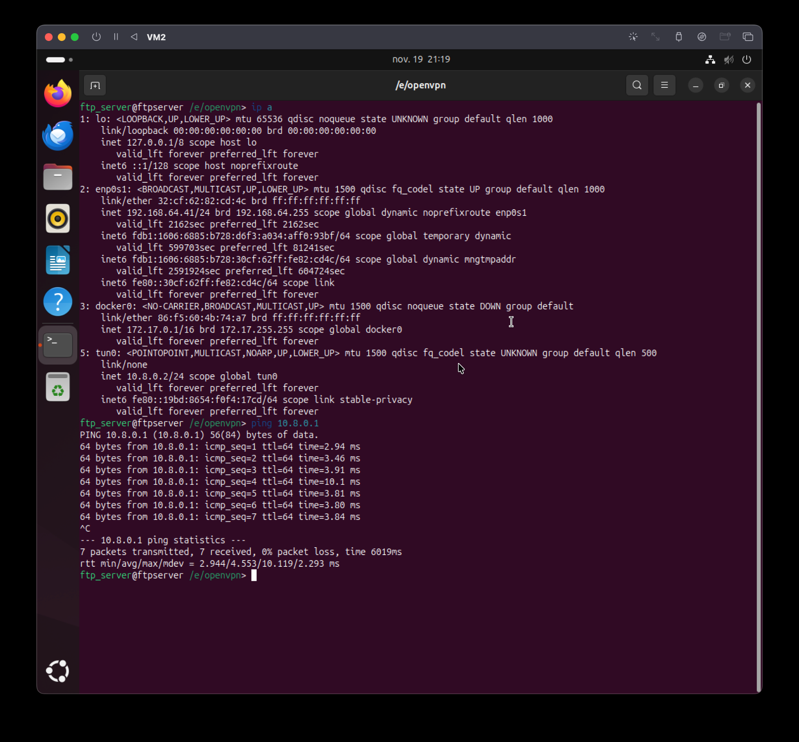  
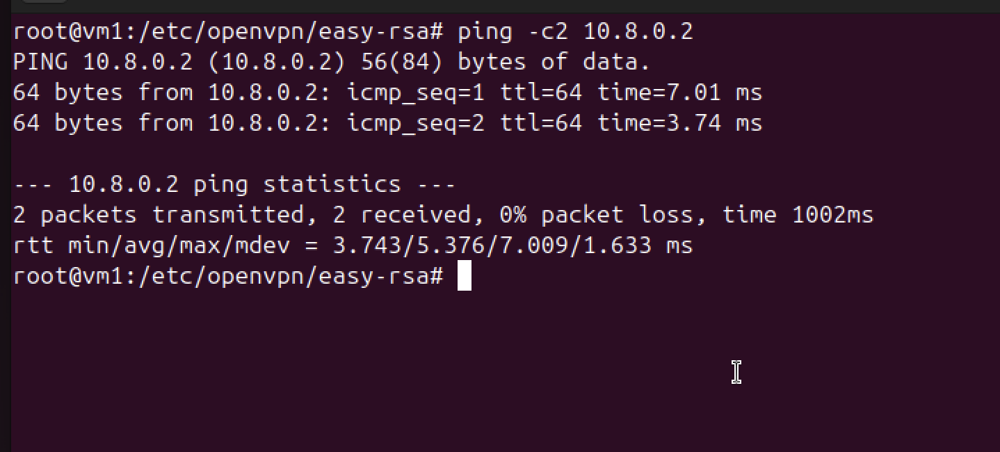  
Once connected to the VPN, the client receives an IP address from the VPN network (10.8.0.x), but it does not automatically know how to reach the LAN behind the server. The server therefore has to send it a static route (push) saying: “if you want to reach 192.168.10.0/24, go through the VPN tunnel.” This allows the client to access the LAN as if it were part of it. Without this route, the client would only see the VPN server (10.8.0.1) and never the LAN machines, because it would send the packets to its local gateway instead of sending them into the tunnel.  
  
So that the client can reach the 192.168.10.0 network behind the gateway.  
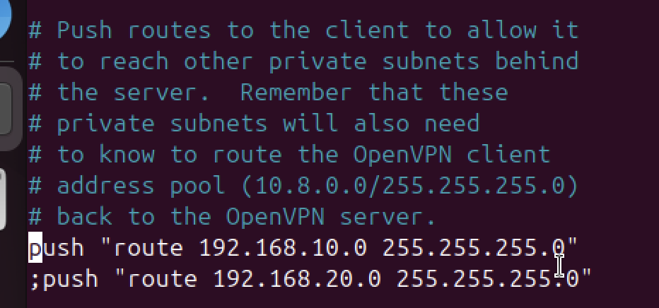  
These rules below are added on the router and allow traffic coming from VPN clients (network 10.8.0.0/24) to access the LAN and the Internet. The first rule allows VPN traffic to leave the router towards the LAN (enp0s2), the second allows responses from the LAN back to the VPN clients, and the third applies NAT (MASQUERADE) so that VPN clients can access the Internet using the router’s WAN address.  
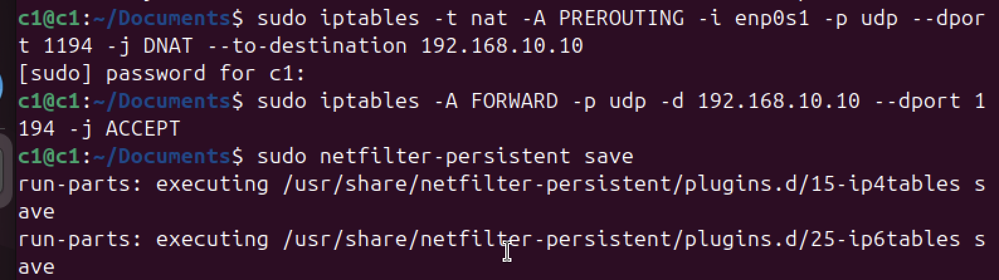  
After this modification, we restart the OpenVPN service on the server and test the ping from the client to the 192.168.10.0/24 network (here we are pinging the OpenVPN server at 192.168.10.10).  
![ftp_server@ftpserver /e/openvpn [1]> ping -c3 192.168.10.10](Attachments/34242D3B-036A-4EAB-8D1A-851D2926F5E3.png)  
**Conclusion**  
The implementation of this OpenVPN infrastructure made it possible to successfully establish a secure tunnel between the client and the server, while correctly integrating routing to the LAN network. The deployed architecture — consisting of a router with dual interfaces (WAN 192.168.64.0/24 and LAN 192.168.10.0/24), an OpenVPN server located on the LAN, and a remote client — now operates coherently thanks to rigorous configuration of encryption, Easy-RSA certificates, and iptables rules enabling forwarding and NAT. After several adjustments to resolve firewall, NAT, and certificate path issues, the VPN environment provides stable connectivity: the client reaches the server via its WAN interface, receives an IP address in 10.8.0.0/24, and can access the server’s private network. This work demonstrates mastery of PKI concepts, routing, firewalling, and the secure deployment of a VPN solution in a virtualized environment.  
