This is a complete lab project scenario to implement and experiment with networking, security, and administration concepts using OPNsense, Suricata, and virtual machines. This project simulates an enterprise environment with segmented networks, services, and a secure infrastructure.

## Lab Project Scenario: Secure Infrastructure for a Small Business

### Lab Objective: 

Create a secure and functional enterprise network infrastructure including:
1. A firewall/router (OPNsense) to manage network traffic.
2. Isolated network segments (LAN, DMZ, WAN).
3. An IDS/IPS engine to detect and prevent threats.
4. A secure web server in a DMZ.

### Network Topology:
1. WAN: Internet connection (provided by the host network or a simulator).
2. LAN: Local area network for employees 
3. DMZ: Demilitarized zone hosting a public web server


# Configuration

Here we have our OpnSense Machine that has 3 interfaces : 
* WAN Interface 10.0.2.15 : The IP is given automaticlly via DHCP by the host machine 
* LAN Interface 192.168.1.1 : The LAN interface which is set statically is the local network for client computers. In VirtualBox, we choose the **Internal network mode**
* DMZ 192.168.2.1 : Dematerilized zone hosting a ubuntu web server

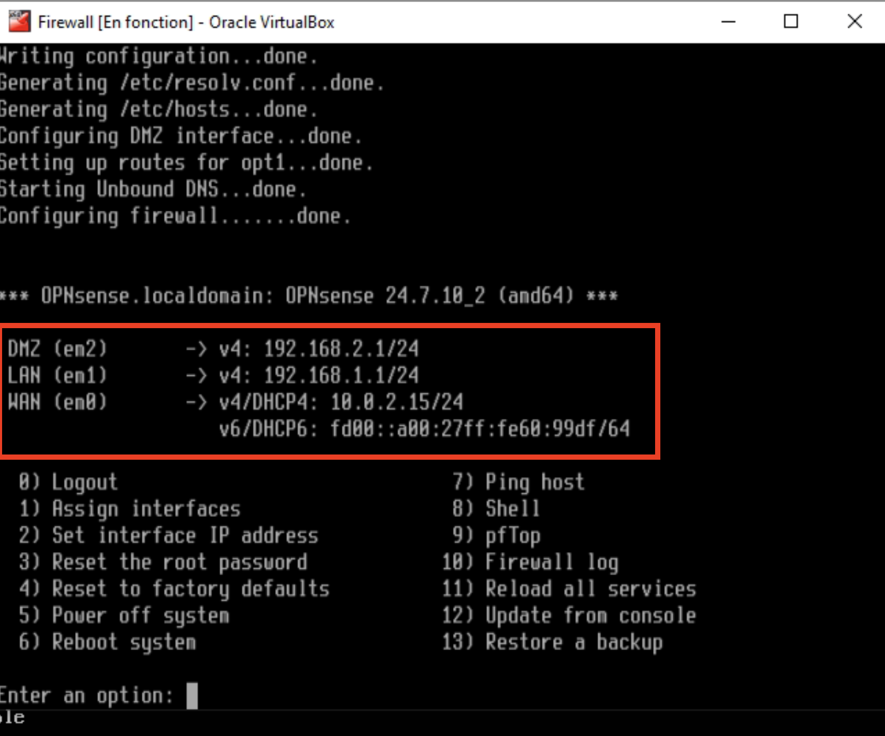

After the OpenSense Machine we set now a Kali machine which is inside the 192.168.1.0/24 (LAN network). In Virtual box we select the **Internal Network**. We will use this kali machine for accessing the OpnSense Interface at the 192.168.1.1 ip address

But We have to configure this Kali machine to be inside the LAN network, and to do so we have to open de **interface file** which allow us to set IPs on Kali.

We open that file with the **sudu cat /etc/network/interfaces, as bellow

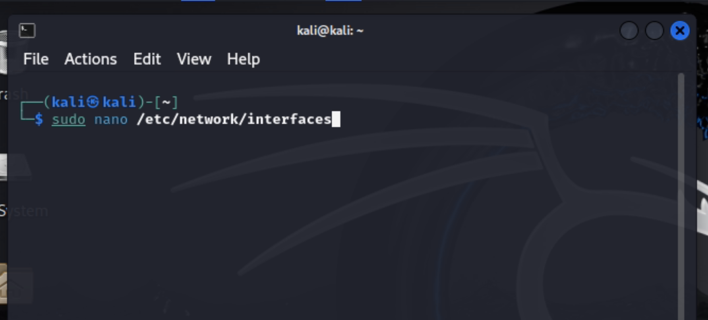

We edit this file by adding our IP address (on eth1 interface, the ip and the mask) as shown bellow

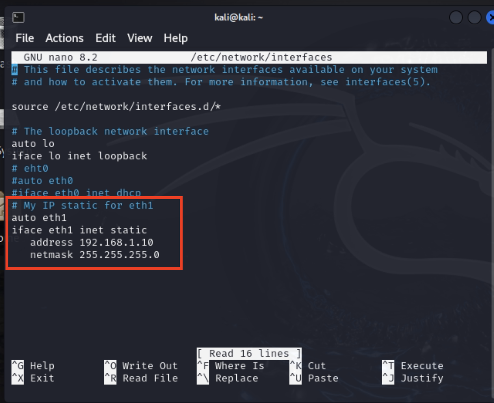

So our Kali Machine has 192.168.1.10/24 address 

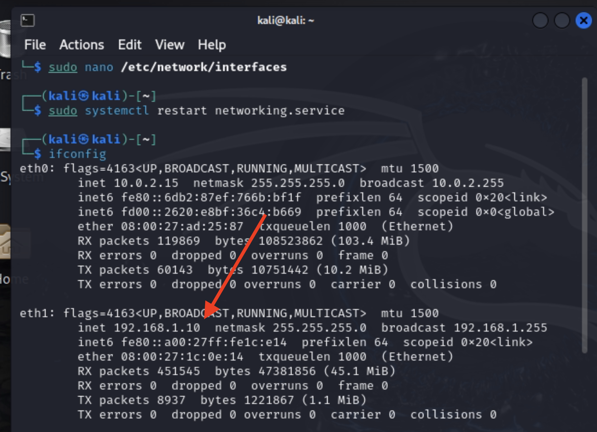

Let's try a ping toward our OpnSense LAN interface 
* 192.168.1.10 (Kali machine) -> 192.168.1.1 (OPNSense LAN interface)

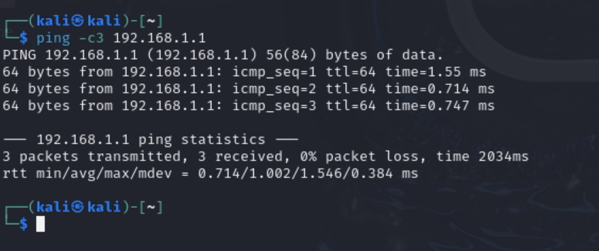

## OpnSense GUI interface

Now we have set the IP for Kali, let's connect to the Opnsense GUI Portals by searching its IP addresss on firefox, then we enter the username and password set for Opnsense and the Login button, as shown bellow

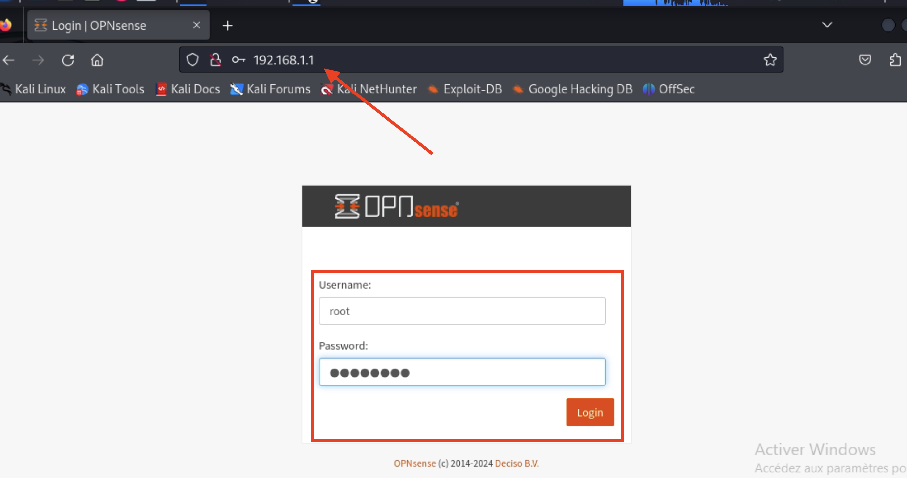

Under the "Interfaces" tab we can see the 3 interfaces
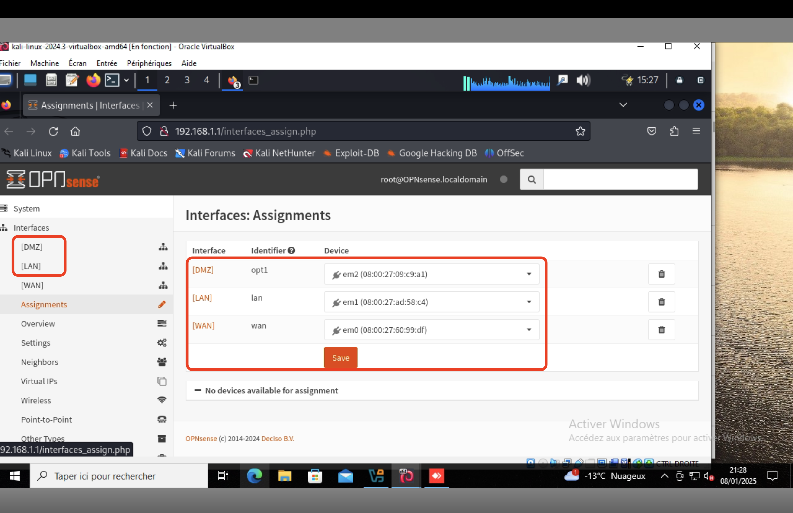


## Allowing Ping to the DMZ Interface on OPNsense

## **Context**
By default, new interfaces like the **DMZ** in OPNsense are protected by restrictive firewall rules. This means that **all incoming and outgoing traffic** is blocked unless specific rules are created to allow certain types of communication.

To enable **ping (ICMP)** to the DMZ interface, a dedicated rule must be added to the firewall. This allows the use of ping to verify network connectivity and troubleshoot potential issues.

---

## **Steps to Configure the DMZ Firewall**

### **1. Verify Default Rules**
Navigate to **Firewall > Rules > DMZ**:
   - As shown in the screenshot, no rules are defined for the DMZ interface by default, which blocks all incoming traffic.
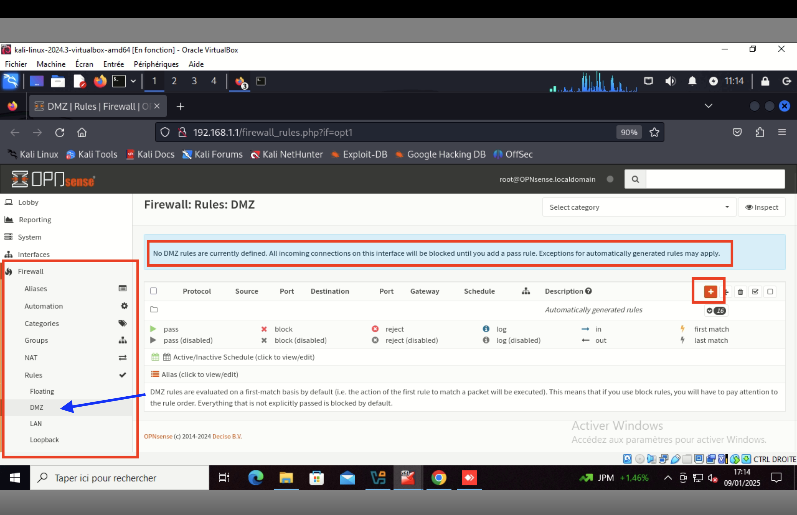
---

### **2. Add a Rule to Allow ICMP**
To allow ping to the DMZ interface:
1. Click on the **+ Add** button to create a new rule.
2. Configure the rule with the following settings:
   - **Action**: `Pass` (allow traffic).
   - **Interface**: `DMZ`.
   - **Direction**: `in` (incoming traffic to the DMZ interface).
   - **TCP/IP Version**: `IPv4`.
   - **Protocol**: `ICMP` (to allow only ping traffic).
   - **Source**: `DMZ net` (represents all devices in the DMZ network).
   - **Destination**: `DMZ net` (the IP address of the DMZ interface).
3. Click **Save** to save the rule.
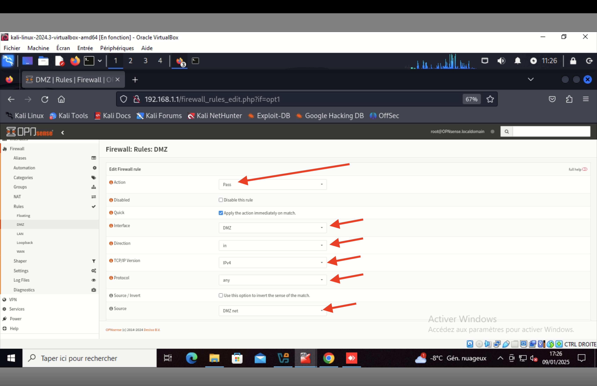
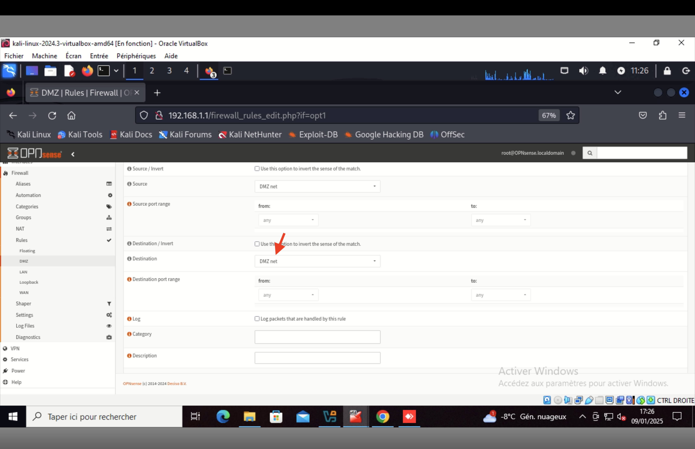
---

### **3. Apply Changes**
After creating the rule, click **Apply Changes** at the top of the page to activate the new configurations.
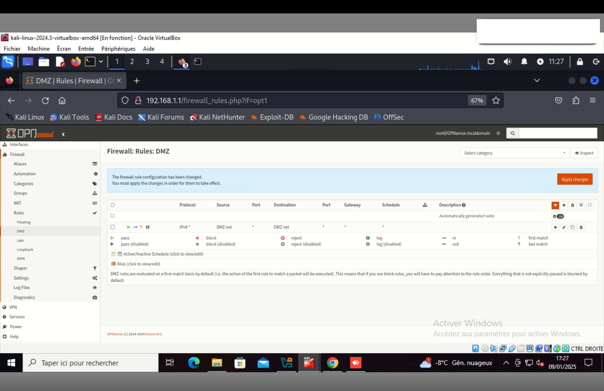
---

## **Expected Result**
With this rule in place:
- Devices in the DMZ network, or any source defined in the rule, can send ICMP packets (ping) to the DMZ interface.
- This ensures that the DMZ interface is operational and correctly connected to the network.

---

## **Security Considerations**
1. **ICMP-specific Rule**:
   - Limiting the rule to ICMP ensures that only ping traffic is allowed, keeping other types of traffic (HTTP, HTTPS, etc.) blocked.
2. **Logs (Optional)**:
   - You can enable the **Log packets that are handled by this rule** option to monitor ICMP requests in the firewall logs.

---

# Outbound NAT Configuration and Firewall Rules in OPNsense

## **1. Hybrid Outbound NAT Mode**
The **Hybrid Outbound NAT rule generation** mode was enabled to allow a combination of:
- Automatically generated NAT rules for default traffic handling.
- Manually created NAT rules for specific traffic use cases.

This flexibility allows for precise control over traffic flow while maintaining default functionality.

---

## **2. Steps to Configure Outbound NAT**

### **Objective:**
Manually allow machines in the DMZ network to access the Internet using NAT.

### **Steps:**
1. Navigate to **Firewall > NAT > Outbound**.
2. Select **Hybrid Outbound NAT rule generation** and click **Save**.
3. Under the **Manual rules** section, click the **Add (+)** button to create a new rule.
4. Configure the following fields:
   - **Interface**: `WAN`  
     This applies the NAT rule to the WAN interface, which connects to the Internet.
   - **TCP/IP Version**: `IPv4`
   - **Protocol**: `any`
   - **Source Address**: `DMZ net`  
     This specifies that the source traffic originates from the DMZ network.
   - **Source Port**: Leave as `any`.
   - **Destination Address**: `any`  
     This allows DMZ traffic to reach any external destination.
   - **Destination Port**: Leave as `any`.
   - **Translation/Target**: `Interface address`  
     This translates the source IP of DMZ traffic to the WAN interface IP for NAT.
   - **Description**: Add a meaningful description like `Manually allow DMZ machines to access internet`.
5. Click **Save** to apply the rule.
6. Apply changes by clicking the **Apply Settings** button at the top of the page.

### **Outcome:**
This rule allows machines in the DMZ network to access the Internet by translating their source IPs to the WAN interface IP.

---

## **3. Second Firewall Rules for the DMZ**

### **Objective:**
Define specific rules to manage traffic for the DMZ network.

### **Steps to Create a Firewall Rule:**
1. Navigate to **Firewall > Rules > DMZ**.
2. Click the **Add (+)** button to create a new rule.
3. Configure the following fields:
   - **Action**: `Pass`  
     This allows the traffic to pass.
   - **Interface**: `DMZ`  
     The rule applies to the DMZ interface.
   - **Direction**: `in`  
     Controls incoming traffic to the DMZ.
   - **TCP/IP Version**: `IPv4`
   - **Protocol**: `any`
   - **Source**: `DMZ net`  
     Specifies that the traffic originates from the DMZ network.
   - **Destination**: `any`  
     Allows the traffic to reach any destination.
   - **Description**: Add a description like `Manually allow DMZ machines to access internet`.
4. Save the rule and apply the changes
### **Outcome:**
This rule permits DMZ machines to initiate connections to external networks while maintaining control over inbound traffic.

---

## **4. Screenshots**
Below are the screenshots of the configurations applied:

### **Outbound NAT - Manual Rule**
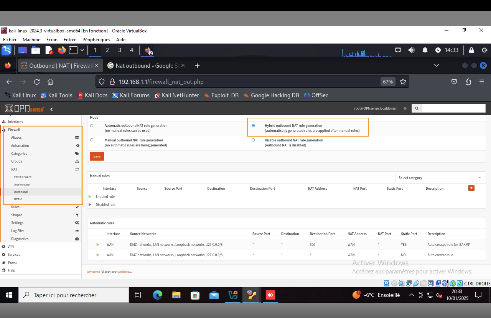
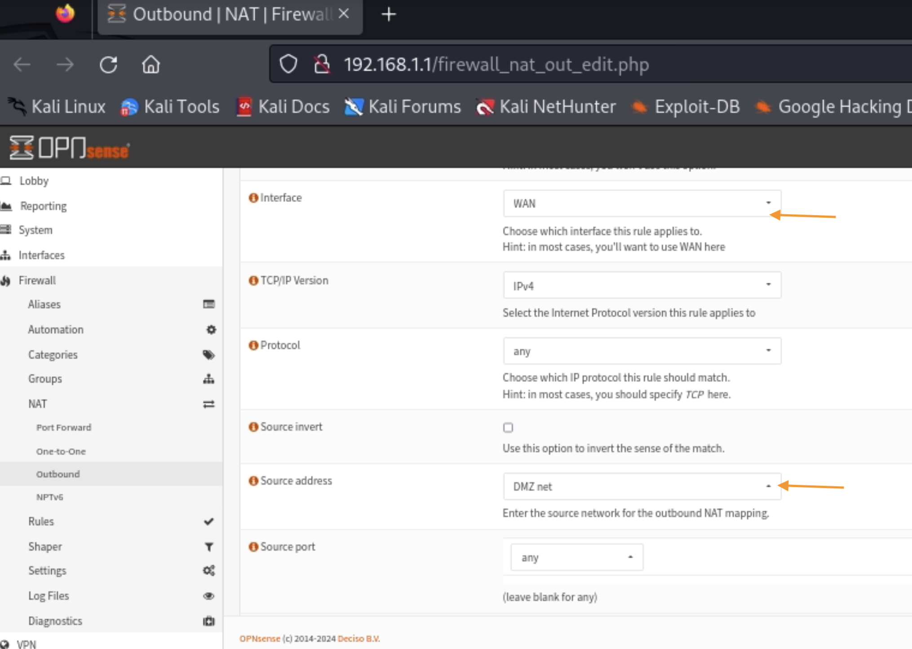
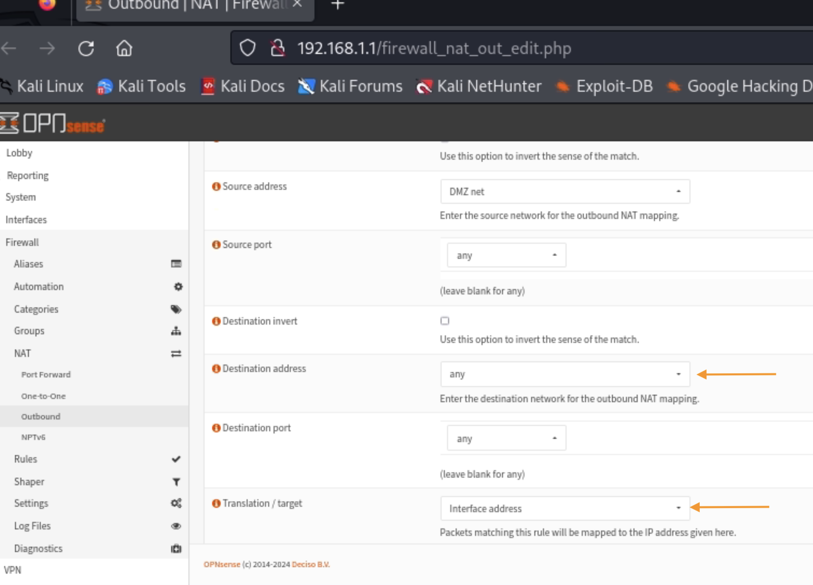
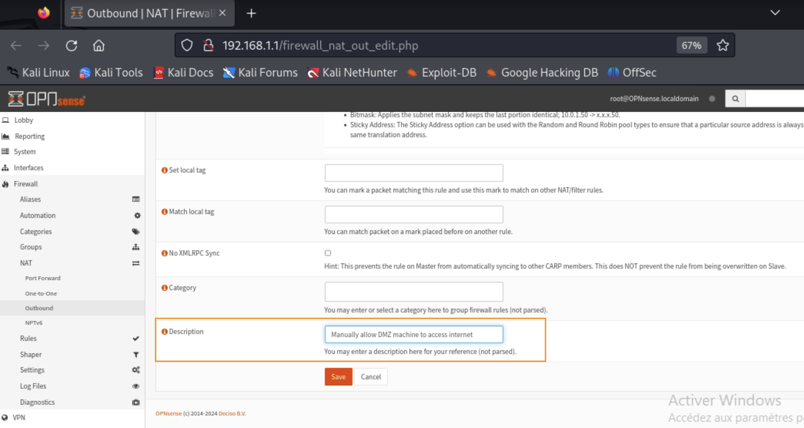
We can see now that the rule has beeen added
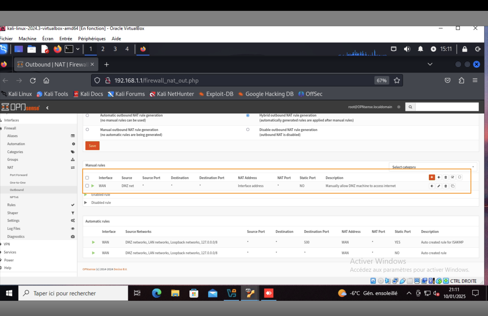

### **Firewall Rules - DMZ**
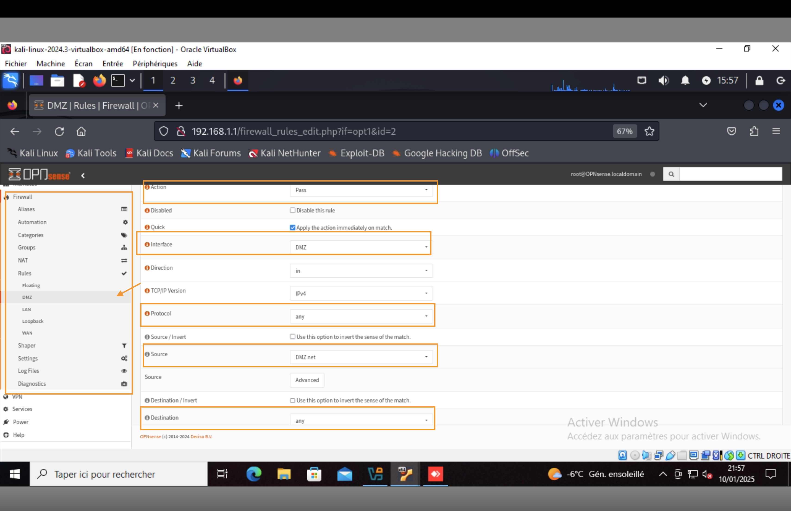
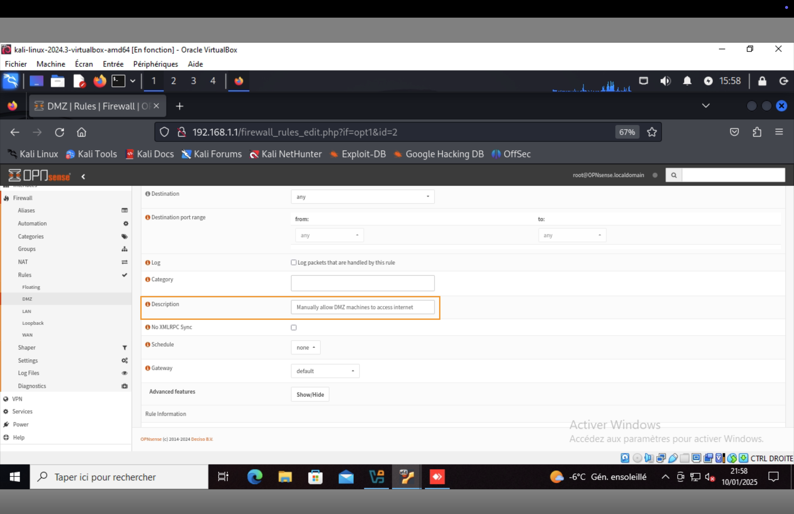
   We can see now that the rule has beeen added
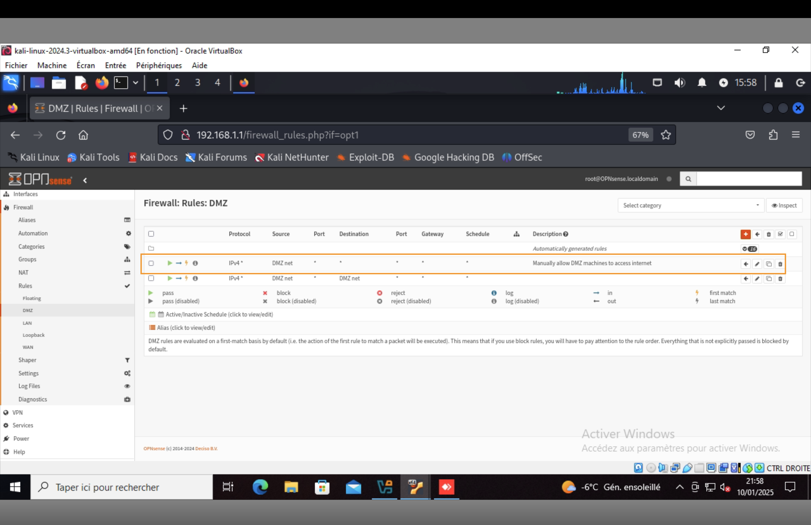
---

## **5. Verification**
1. **DMZ Machines**:
   - Confirm that devices in the DMZ can access the Internet.
   - Verify that traffic passes through the WAN interface using NAT.
2. **Logs**:
   - Check traffic logs in **Firewall > Log Files > Live View** to ensure that traffic matches the rules.
3. **Testing**:
   - Use a machine in the DMZ to ping external websites (e.g., `8.8.8.8`) or access the Internet via a web browser.
   - Ensure the connection works as expected.

---

# Ubuntu Server in the DMZ with VirtualBox Internal Network

## **1. Installing Ubuntu Server**

### **Objective:**
Deploy an Ubuntu Server in the DMZ network to host services securely and isolate it from internal LAN traffic.

### **Steps:**
1. Download the Ubuntu Server ISO from the official [Ubuntu website](https://ubuntu.com/download/server).
2. Create a new virtual machine in **Oracle VirtualBox**:
   - Select **Ubuntu (64-bit)** as the operating system type.
   - Allocate sufficient CPU, RAM, and storage resources for your server.
3. Attach the downloaded ISO as the boot disk and start the VM.
4. Complete the Ubuntu Server installation:
   - Choose the minimal server installation without GUI.
   - Configure a static IP during installation (optional; can also be done later).

---

## **2. Configuring the Virtual Machine in VirtualBox**

### **Objective:**
Place the Ubuntu Server in the DMZ using VirtualBox's **Internal Network** to simulate a secure network environment.

### **Steps:**
1. Open the **Settings** of the Ubuntu Server VM in VirtualBox.
2. Navigate to **Network** and configure the following:
   - **Adapter 1**: Enable and select `Internal Network`.
     - Name the network as `DMZ`.
     - This will connect the VM to the same virtual network as the OPNsense DMZ interface.
   - Ensure **Adapter 2** is disabled to prevent direct access to the LAN or WAN.
3. Start the VM and verify its network configuration:
   - Set a static IP that matches the DMZ network range (e.g., `192.168.2.10/24`).
   - Ensure the gateway points to the OPNsense DMZ interface (e.g., `192.168.2.1`).

---

## **3. Configuring the Ubuntu Server in the DMZ**

### **Objective:**
Assign the server a static IP in the DMZ and ensure it communicates correctly within the DMZ network.

### **Steps:**
1. Open the network configuration file on Ubuntu Server:
   ```bash
   sudo nano /etc/netplan/50-cloud-init.yaml
2. Edit the file to configure static ip and DNS 
   ```
   network:
   version: 2
   ethernets:
    enp0s3:
      addresses:
        - 192.168.2.10/24
      gateway4: 192.168.2.1
      nameservers:
        addresses:
          - 8.8.8.8
          - 8.8.4.4
   ```
3. The let's apply by doing so 
   ```bash
   sudo netplan apply

4. After applying the network configuration, we can check the config by looking at the content of the 50-cloud-init.yzml, the IP address that is set and the route that have added

   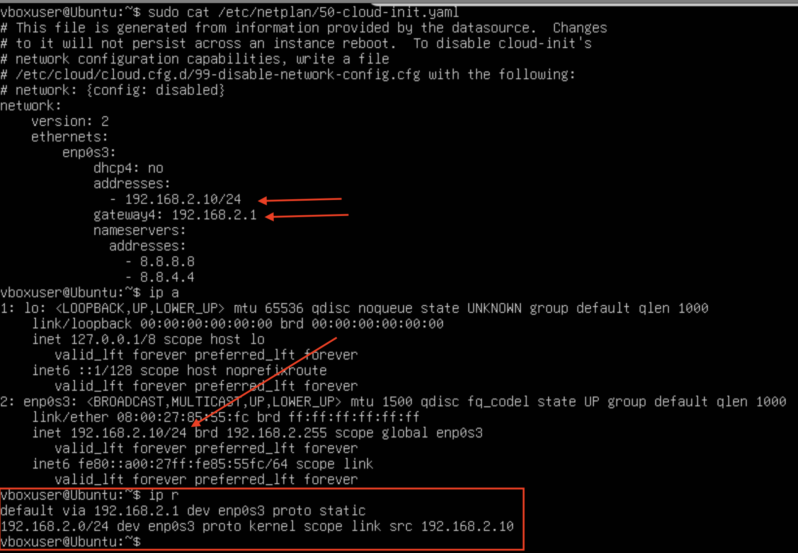
5. The we check our netxork configuration by doing a list of ping toward the DMZ, 8.8.8.8 and google.com
   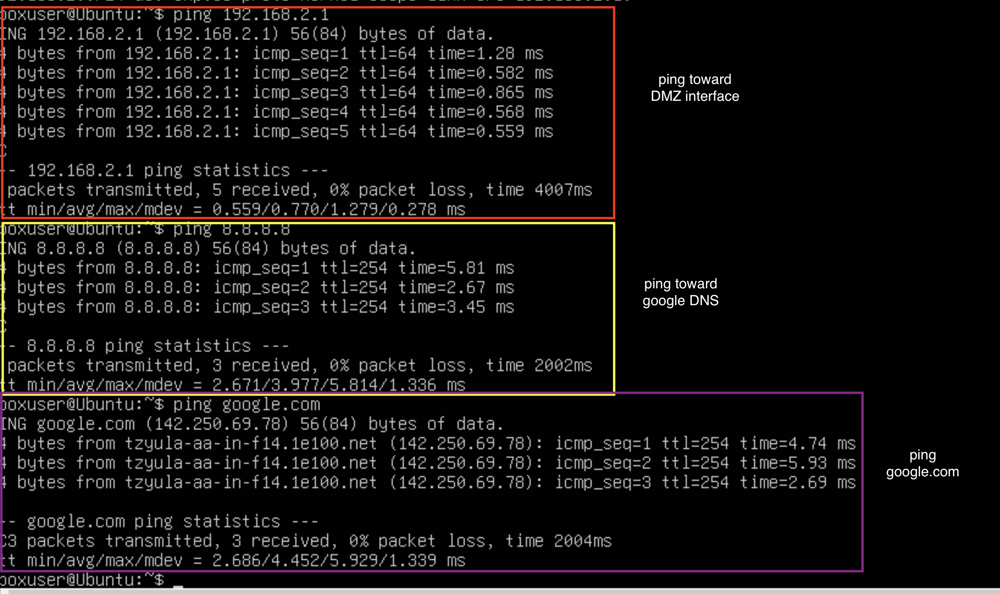


# Setting Up Nginx on Ubuntu Server in the DMZ

## **1. Objective**
Deploy and configure an Nginx web server on the Ubuntu Server located in the DMZ to host and serve web content securely.

---

## **2. Prerequisites**

1. **Ubuntu Server** installed and configured in the DMZ as outlined in the previous section.
2. **Static IP address** assigned to the Ubuntu Server (e.g., `192.168.2.10`).
3. Internet connectivity for downloading and installing packages (configured through OPNsense NAT and firewall rules).

---

## **3. Installing Nginx**

### **Steps:**
1. Update the system:
   ```bash
   sudo apt update && sudo apt upgrade -y
2. Install Nginx
   ```bash
   sudo apt install nginx -y   
   ```
   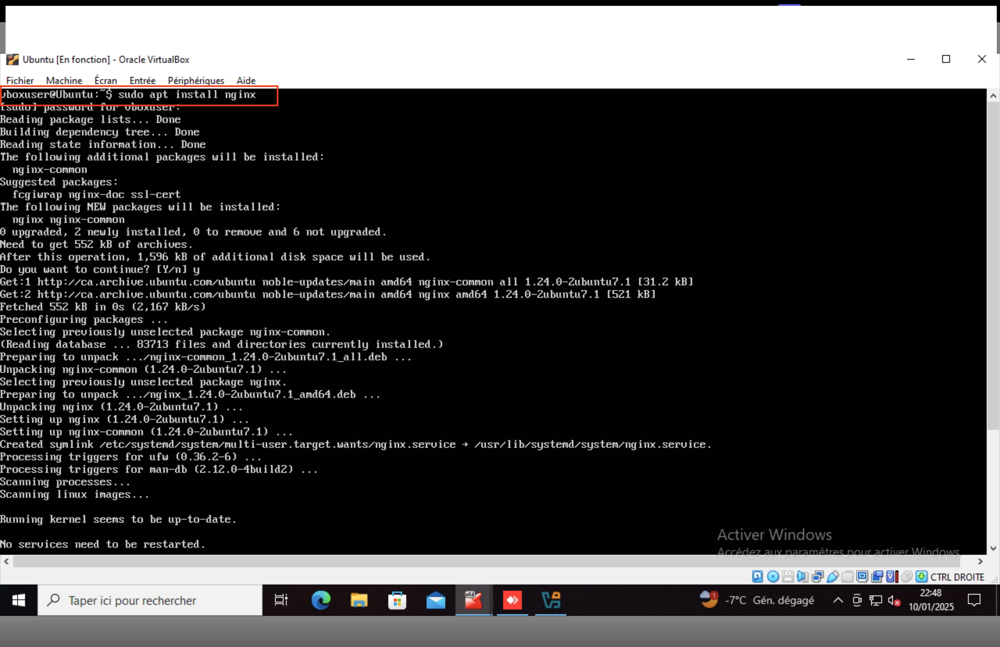

   Enable, start and verify the status of the Nginx service
   ```bash
   sudo systemctl enable nginx
   sudo systemctl start nginx
   ```
   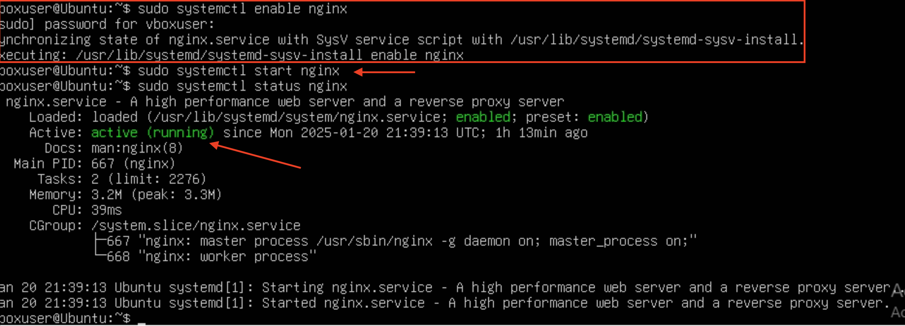
   
3. Verify the Nginx installation 

   We would firstly verify its installation by try to connect to the nginx via a **VM that is inside the DMZ network**. To do so, we open our kali machine, change the IP to put the kali machine inside the DMZ network with **a static IP : 192.168.2.20** (for example), Then, we open Firefox and search the ip of our Ubuntu Server (192.168.2.10)
   We should see a landing page like the image shown bellow
   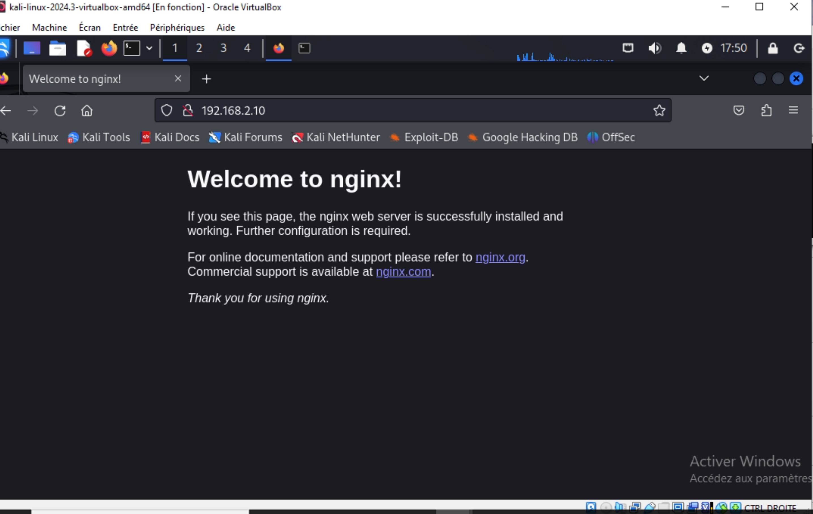

   This prove that our Nginx is functional and well set up

   #### For the purpose of the homelab we will not set up all the configuration for a web server. For a network and security oriented homelab, it is not necessary to configure a full web server. Installing Nginx and using its default configuration is enough to test firewall rules and simulate a service in DMZ 


# IN PROGRESS ...
