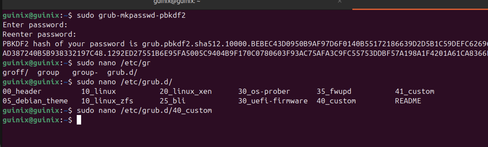
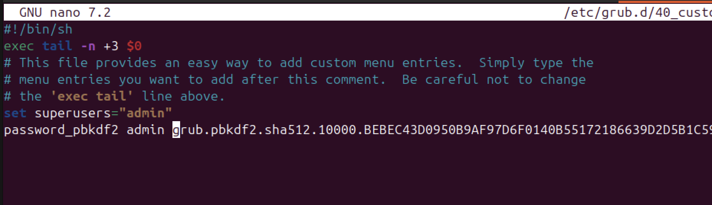
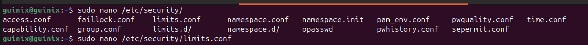
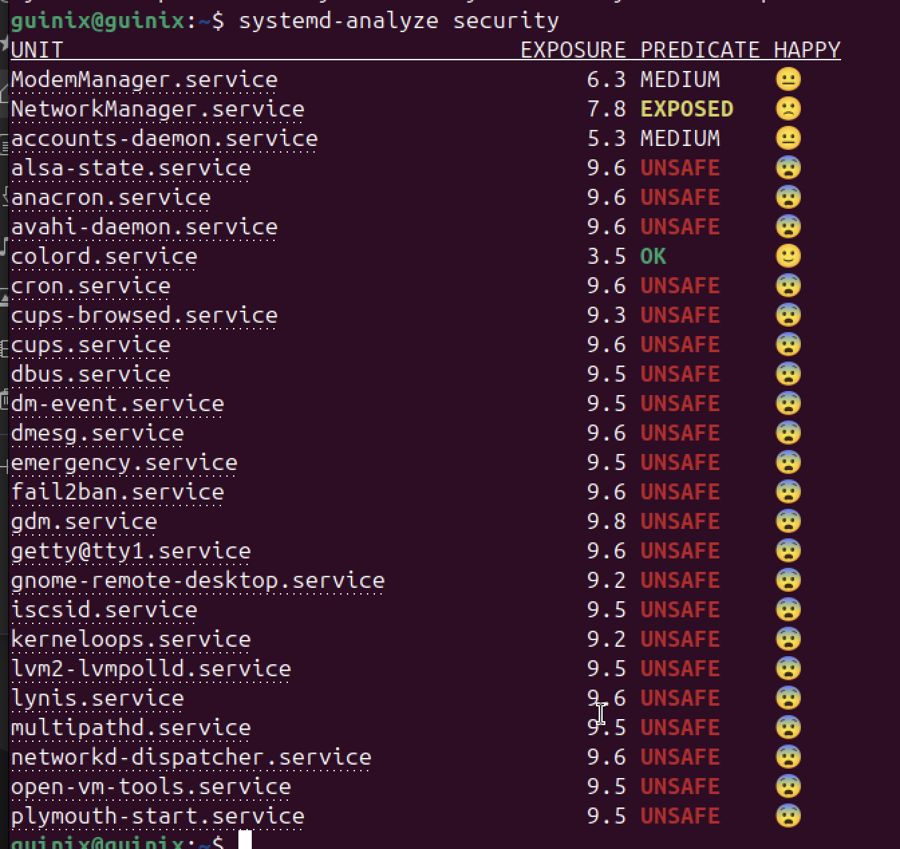

Projet 1 : Documentation


📖 Explication :

Cela signifie que ton fichier /etc/apt/sources.list ne contient aucun dépôt dédié aux mises à jour de sécurité.
→ Si une faille critique est corrigée par Ubuntu/Debian, ton système ne sera pas mis à jour automatiquement sans ce dépôt.

### 🔸 Alerte Lynis [PKGS-7388] : Dépôt de sécurité manquant

Lynis a signalé l'absence d’un dépôt de sécurité dans `/etc/apt/sources.list`.

Cependant, après vérification manuelle dans le fichier `/etc/apt/sources.list.d/ubuntu.sources`, on constate la présence du dépôt suivant :

Le dépôt de sécurité est bien actif. L'alerte est donc un **faux positif dû au nouveau format `.sources` utilisé par Ubuntu 24.04 (noble)**.

### 🔸 Alerte Lynis [FIRE-4512] : Aucun filtrage iptables actif

Lynis a détecté que les modules iptables sont chargés, mais sans aucune règle active, ce qui expose le système.

✅ **Correctif appliqué** :
- Installation et configuration du pare-feu `ufw`
- Définition des règles par défaut (`deny incoming`)
- Autorisation du port SSH
- Activation du pare-feu

🔎 Vérification :
```bash
sudo ufw status verbose


On est maintenant dans la partie “Suggestions” de Lynis, qui te recommande des améliorations non critiques mais très utiles pour renforcer la sécurité. Je vais t’expliquer les plus importantes et te dire quoi faire pour chacune.


 Les 8 suggestions prioritaires à appliquer (+ commandes concrètes)
✅ 1. Installer fail2ban pour bloquer les attaques par brute force
sudo apt install fail2ban -y
sudo systemctl enable fail2ban
sudo systemctl start fail2ban
https://doc.ubuntu-fr.org/fail2ban
```


### ✅ Protection contre les attaques par force brute SSH – [Lynis DEB-0880]

Lynis a recommandé l’installation de `fail2ban` pour bloquer automatiquement les IP en cas d’échecs de connexions répétés.

**Action effectuée :**
- Installation de `fail2ban` :
  ```bash
  sudo apt install fail2ban -y

sudo systemctl enable fail2ban
sudo systemctl start fail2bansudo systemctl enable fail2ban
sudo systemctl start fail2ban


## Mettre un mot de passe au chargeur de démarrage GRUB

### Pourquoi mettre un mot de passe sur GRUB ?
Le chargeur de démarrage GRUB (GRand Unified Bootloader) est ce qui permet à un système Linux de démarrer. En appuyant sur une touche (souvent Shift ou Esc) pendant le démarrage, un attaquant peut modifier les options de boot (ex. : passer en mode single-user ou init=/bin/bash), ce qui permet :
	•	d’avoir un accès root sans mot de passe
	•	de contourner les mécanismes de sécurité (pare-feu, services désactivés, etc.)

Étapes de mise en place (voir image ci dessous)

* Générer un mot de passe GRUB chiffré
```
sudo grub-mkpasswd-pbkdf2
```

* Modifier la configuration de GRUB
```
sudo nano /etc/grub.d/40_custom
```
Ajoute en fin de fichier :
```
set superusers="admin"
password_pbkdf2 admin <COLLE_ICI_TON_HASH_GRUB>
```
* Mettre à jour GRUB
```
sudo update-grub
```



`Ainsi GRUB est maintenant protégé par mot de passe, empêchant toute modification non autorisée au démarrage.`

## Désactiver les dumps mémoire inutiles

### Explication fonctionnelle :

Un core dump est un fichier généré automatiquement lorsqu’un programme plante.
Il contient une copie complète de la mémoire du processus au moment du crash : variables, données sensibles, mots de passe en clair, etc.
Par défaut, Linux peut autoriser ces dumps pour aider au débogage.
Mais sur un serveur de production ou exposé, ces fichiers représentent un risque de fuite d’informations sensibles si un attaquant y accède.
Étape à appliquer :

* Éditer le fichier de configuration PAM

```
sudo nano /etc/security/limits.conf
```
* Ajouter cette ligne à la fin : `* hard core 0`


`Cela désactive la création de core dumps pour tous les utilisateurs (*), et les empêche de les activer eux-mêmes (hard).`

## Hardening system services

Les services systèmes gerés par systemd peuvent bénéficier de mesure de sécurités renforcées. 
On peut observer ces services avec la commande `systemd-analyze security`

L'analyse montre que presque tous les services sont marqués UNSAFE. C'est typiquement la config par defaut où les services sont pas isolés meme s'ils fonctionnent correctement.

EXPOSURE : Score de 0 (sécurisé) à 10 (dangereux)  
PREDICATE : Résultat de l’évaluation des règles

On va essayer de mettre le PREDICATE à Medium pas forcement à Ok car l'objectif n'est pas de casser le fonctionnement du service mais d'appliquer un confinement raisonable

### Objectif réaliste : Prioriser les services les plus critiques

| Priorité | Service                  | Rôle                              | Action prévue             |
|----------|--------------------------|-----------------------------------|---------------------------|
| 🟥 Haute | `ssh.service`            | Accès distant                     | Renforcement immédiat     |
| 🟥 Haute | `NetworkManager.service` | Connexion réseau                  | Renforcement prévu        |
| 🟧 Moy  | `cron.service`           | Tâches automatisées               | Ajout confinement         |
| 🟧 Moy  | `fail2ban.service`       | Blocage des IPs suspectes         | Vérification et ajustement|
| 🟨 Basse | `cups.service`           | Impression                        | À désactiver si inutile   |
| 🟨 Basse | `snapd.service`          | Conteneur d’applications Snap     | Évaluer l’utilité         |

* Automatisation du durcissement des services systemd

Dans le cadre du renforcement des services détectés comme UNSAFE par systemd-analyze security, j’ai conçu un script Bash automatisé qui applique des règles de confinement standard à une liste de services prioritaires. Le script est disponible sous le repertoire "ressource".


## 🔒 Priorisation du durcissement des services systemd

Pour optimiser le renforcement de la sécurité de mon système Linux, j’ai classé les services à durcir en fonction de leur niveau de criticité et de leur exposition. Cette méthode permet de prioriser les actions sur les services les plus sensibles sans perturber l’intégrité du système.

---

### 🔴 Priorité 1 : Services critiques

Ces services sont essentiels à la sécurité du système ou directement exposés à Internet. Leur renforcement est à effectuer en priorité absolue.

| Service                  | Rôle                                                              |
| ------------------------ | ----------------------------------------------------------------- |
| `ssh.service`            | Accès distant – vecteur d’attaque principal                       |
| `NetworkManager.service` | Gestion de la connectivité réseau                                 |
| `fail2ban.service`       | Bloque les IP en cas d’attaque par force brute                    |
| `snapd.service`          | Exécute des applications Snap en sandbox                          |
| `cron.service`           | Exécute des scripts automatiquement, souvent avec privilèges root |
| `fwupd.service`          | Met à jour le firmware, accès matériel bas niveau                 |
| `rsyslog.service`        | Gère les journaux système, cible possible pour masquer des traces |

---

### 🟧 Priorité 2 : Services secondaires / bureau / VM

Ces services ne sont pas essentiels sur un serveur et peuvent être durcis ou désactivés selon le contexte.

| Service                        | Rôle                                                           |
| ------------------------------ | -------------------------------------------------------------- |
| `gdm.service`                  | Interface graphique (login manager)                            |
| `udisks2.service`              | Gestion des disques et volumes                                 |
| `cups.service`                 | Impression (rarement nécessaire sur un serveur)                |
| `getty@tty1.service`           | Accès console local                                            |
| `gnome-remote-desktop.service` | Bureau distant, surface d’attaque potentielle                  |
| `open-vm-tools.service`        | Intégration machine virtuelle, à évaluer selon l’environnement |

---

### 📃 Règle de gestion appliquée

1. Traiter tous les services de priorité 1 en premier avec des unités `override.conf`.
2. Tester la stabilité du système.
3. Ensuite, traiter les services de priorité 2 selon leur utilité sur le système cible.
4. Documenter chaque action (date, unité modifiée, options appliquées).

Cette stratégie garantit un durcissement progressif, efficace, et réversible si nécessaire.
