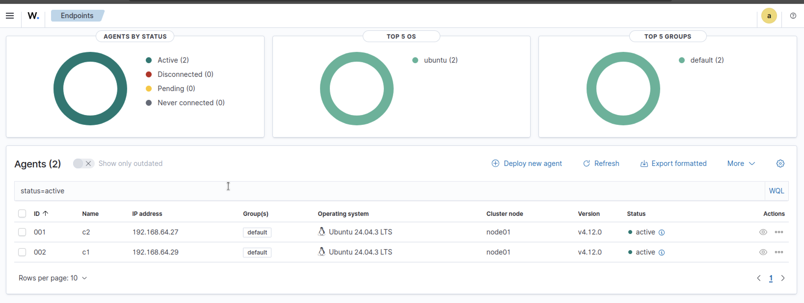
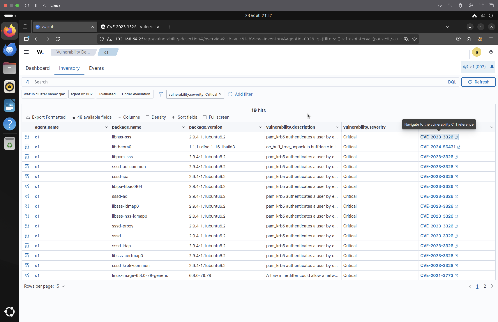
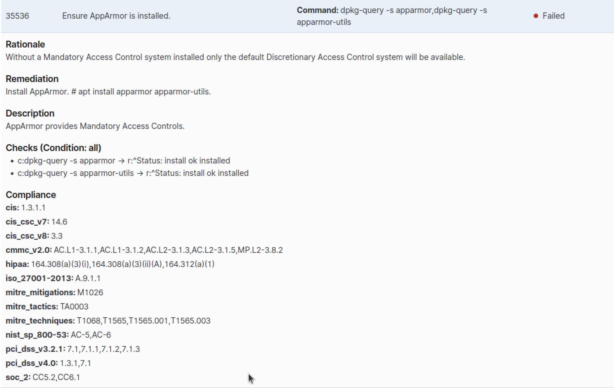
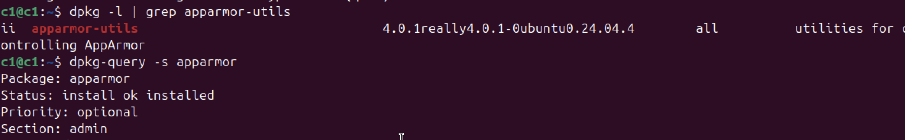
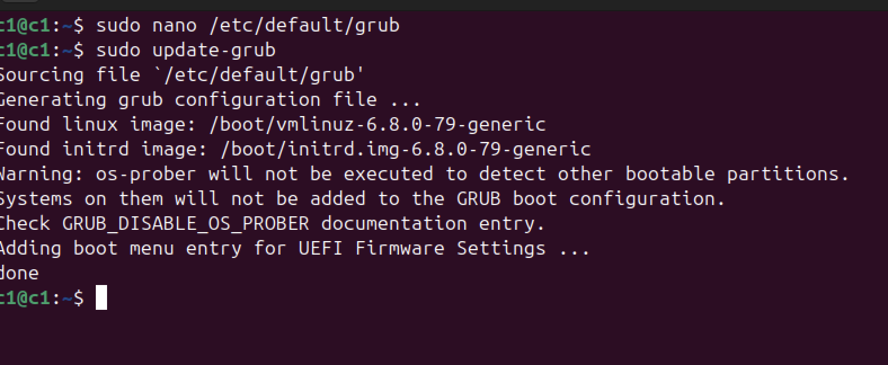
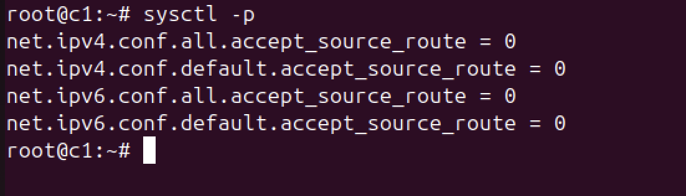

# Step 1 – Identify and Analyze Critical Vulnerabilities on Wazuh Agents

## Objective

Our goal is to interactively explore how **Wazuh** detects and responds to vulnerabilities on connected agents. We begin by inspecting **critical vulnerabilities** found on two Ubuntu agents (`c1` and `c2`), reviewing them, and documenting their exploitability.

---

## Agents Connected and Reporting

We successfully connected two agents to our Wazuh server:

- `c1` (ID: 002)
- `c2`

All inventory and vulnerability data is being correctly reported to the server. We are ready to analyze detected issues.


---

## Dashboard Overview

By accessing the **Vulnerability Detection > c1 > Dashboard** tab, we can see the Wazuh server has detected **19 vulnerabilities** marked as **Critical** for the agent `c1`.


---

## Vulnerability Inventory

When switching to the **Inventory tab**, we see detailed information about each vulnerability:

- **Agent Name**: `c1`
- **Packages** affected: `sssd`, `sssd-ipa`, `pam_krb5`, `libpam-sss`, etc.
- **Severity**: All marked **Critical**
- **Top CVEs**:
  - [CVE-2023-3326](https://nvd.nist.gov/vuln/detail/CVE-2023-3326) — related to **pam_krb5**
  - CVE-2024-56431 — related to `libtheora0`
  - CVE-2021-3773 — related to `netfilter`



---

## Case Analysis: `CVE-2023-3326`

This vulnerability concerns the `pam_krb5` module, which can be abused to **authenticate a user by exploiting Kerberos configuration flaws**.

### Evaluation

We performed a manual inspection on agent `c2` to verify if Kerberos was configured and exploitable.

```bash
ls -l /etc/k*
```

 image 16

## CVE-2023-3326 — pam_krb5 vulnerability

- **Affected Package**: pam_krb5
- **Severity**: Critical
- **Description**: The pam_krb5 module may allow attackers to authenticate using crafted Kerberos inputs.
- **Exploitability**: Not exploitable in current configuration
- **Why**:
  - `/etc/krb5.conf` is missing
  - `pam_krb5` is not used in any active PAM service
- **Remediation**: None required at this time
- **Reference**: <https://nvd.nist.gov/vuln/detail/CVE-2023-3326>

## General Observation on Critical Vulnerabilities

Upon reviewing all critical CVEs flagged by Wazuh on agent `c2`, we observed that:

- **The majority of critical vulnerabilities** relate to `pam_krb5`, `sssd`, or associated packages.
- These packages rely on Kerberos being actively configured on the system.
- However, **no `/etc/krb5.conf` file is present**, and `pam_krb5` is not used in any active PAM service.

### Implication

This means that **most of the reported critical vulnerabilities are not currently exploitable** in the system’s default state.

We retain this conclusion unless:

- A Kerberos configuration is manually introduced,
- Or PAM services are modified to actively use `pam_krb5`.

---

# SCA - CIS Benchmark

Let's now have a look at the SCA module. The Security Configuration Assessment is a module in Wazuh that compare the security configuration of the endpoints to the security standards. Here the security standards use is the CIS for Center for Internet Security that is a non lucratif organization that developp security standards (CIS Benchmark)


As part of my journey to improve system security and harden Linux servers, I ran a Security Configuration Assessment (SCA) using Wazuh on a fresh Ubuntu 24.04 system.

	Initial Scan Results
		- Checks executed: 279
		- ✅ Passed: 84
		- ❌ Failed: 142
		- Not Applicable: 53
		- Final score: 37%
## Issue 1: AppArmor Installation Issue (Wazuh Control 35536)

Wazuh reported that AppArmor was not properly installed, failing compliance check **ID 35536**.

### Problem

Wazuh required both:

- `apparmor` (already installed)
- `apparmor-utils` (missing)

📷 Screenshot of alert:  


---

### Solution Steps

1. **Checked installed packages**  

   ```bash
   dpkg -l | grep apparmor
   ```

   

2. **Installed apparmor-utils**

    ```bash
    sudo apt install apparmor-utils
    ```

    
3. **Verified instimagellation**

    ```bash
    dpkg-query -s apparmor-utils
    ```

    

4. **Confirmation**
  

## Issue 2: GRUB Boot Timeout Not Working

### Problem

The system was booting too quickly, and GRUB was not showing up. Upon inspection, the `GRUB_TIMEOUT` and related parameters were either misconfigured or hidden by default.

### Solution Steps

1. **Edited GRUB Configuration**
   Opened the GRUB file:

   ```bash
   sudo nano /etc/default/grub
   ```

   **Changes made:**
   - Added:

     ```bash
     GRUB_CMDLINE_LINUX="apparmor=1 security=apparmor"
     ```
    🖼️ Screenshots:
   

2. **Updated GRUB**
   Applied the changes using:

   ```bash
   sudo update-grub
   ```

   Output confirmed GRUB was successfully regenerated:

   🖼️ Screenshots:
   

---

You can now reboot and test the GRUB menu during boot:

```bash
sudo reboot
```

## Issue 3: AppArmor Profiles Not Enforced

We enforced all available AppArmor profiles using the `aa-enforce` command:

```bash
sudo aa-enforce /etc/apparmor.d/*
```
🖼️ Screenshots:


We then confirmed that all profiles were active and in **enforce mode** using:

```bash
sudo aa-status
```
🖼️ Screenshots:


## Issue 4: Logging Martian Packets

### Problem

Martian packets are invalid IP packets with impossible source addresses (e.g., spoofed IPs or reserved ranges like `127.0.0.1`, `0.0.0.0`, etc.). They often indicate:

- Network misconfiguration
- Spoofing or scanning attempts
- Packets received from the wrong interface

Linux detects them and logs them **if** logging is enabled.

### Solution

  To enable logging of martian packets:

  Edit `sysctl.conf` and add:

  ```bash
  net.ipv4.conf.all.log_martians = 1
  net.ipv4.conf.default.log_martians = 1
  ```

  Then apply:

  ```bash
  sudo sysctl -p
  ```

🖼️ Screenshots:

  

---

## Issue 5: Disable Source Routing

### Problem

Source routing allows a packet sender to specify the route a packet should take. This is a **security risk** because:

- It allows **bypassing firewall rules**
- It can be exploited in **spoofing or MITM attacks**

### Solution

Disable it for IPv4 and IPv6 with:

```bash
net.ipv4.conf.all.accept_source_route = 0
net.ipv4.conf.default.accept_source_route = 0
net.ipv6.conf.all.accept_source_route = 0
net.ipv6.conf.default.accept_source_route = 0
net.ipv6.route.flush = 1
```

We save this in `/etc/sysctl.conf then run:

```bash
sudo sysctl -p
```

🖼️ Screenshot:




---

## Issue 5: Account Lockout with faillock

### Problem

Brute-force attacks are effective when the system has no login failure protection. By default, Linux allows unlimited password attempts.

### Solution

Use `faillock` to:

- Lock accounts after N failed logins
- Unlock them automatically after some time
- Protect even the `root` account

Edit the config file:

```ini
# /etc/security/faillock.conf

deny = 3
unlock_time = 600
even_deny_root
root_unlock_time = 900
```

🖼️ Screenshots:

- `deny = 3`:  
  

- `unlock_time = 600`, `even_deny_root` and `root_unlock_time = 900`:  
  

---

