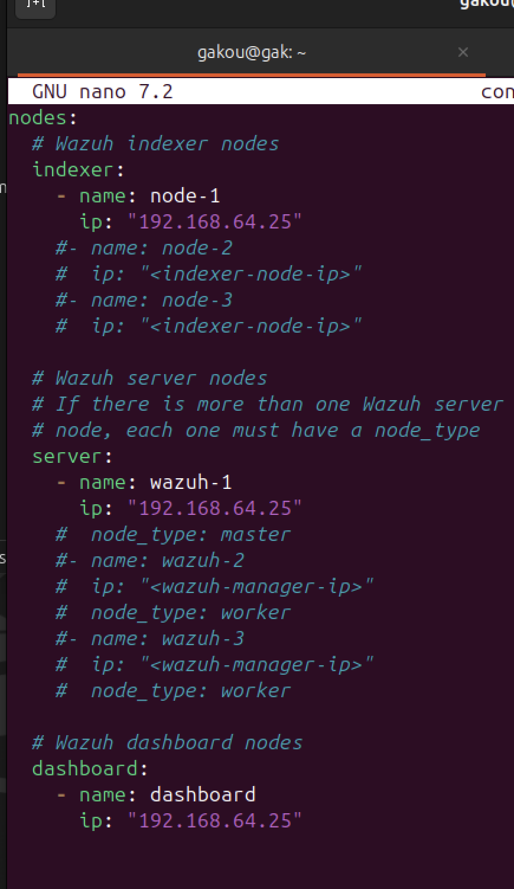
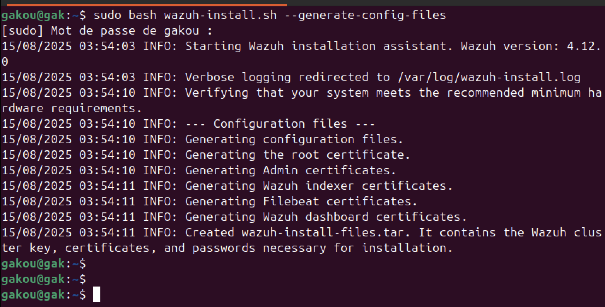
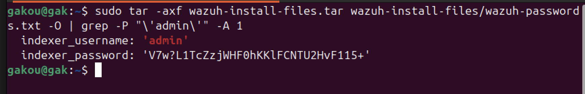
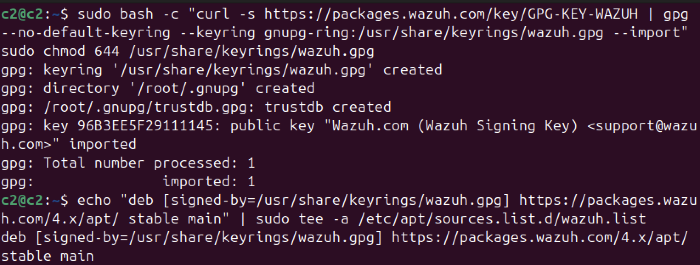
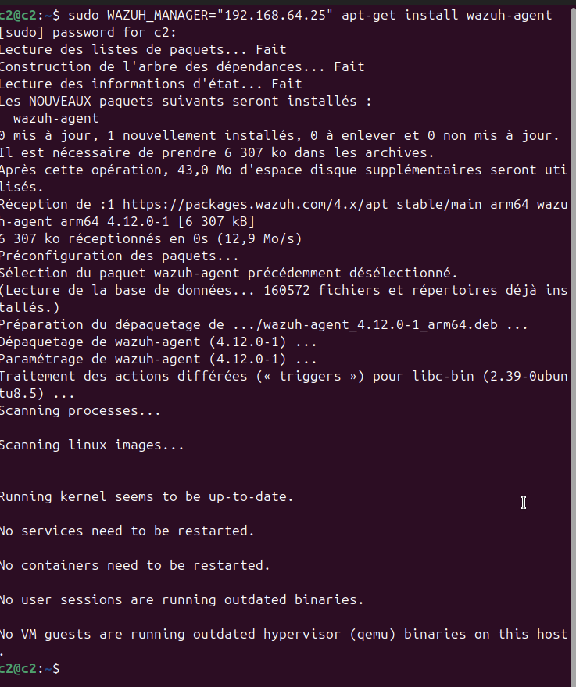
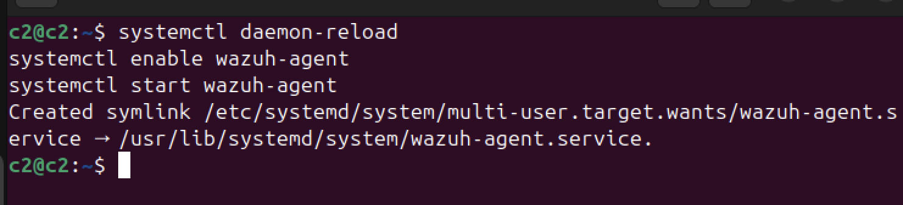

# Wazuh SIEM Deployment & Security Monitoring Lab


I install and configure wazuh using the assisted installation method
## 1. Installing Wazuh Indexer
Download the Wazuh installation assistant and the configuration file.

```bash
curl -sO https://packages.wazuh.com/4.12/wazuh-install.sh
curl -sO https://packages.wazuh.com/4.12/config.yml
```


After downloading, we have to open de /config file to replace the node names and IP values with the corresponding names and IP addresses

This document explains the roles and structure of your `config.yml` used to deploy Wazuh manually, on a **single virtual machine**.

All components (Indexer, Server, Dashboard) are hosted on the same VM with IP `192.168.64.25`.
* The Indexer is based on OpenSearch and is responsible for storing logs and indexing events
* The Wazuh Server is the core component that collects data from agents analyzes logs and events and triggers alerts based on rules
* The Dashboard is the web interface


Then we run the Wazuh installation assistant with the option --generate-config-files to generate the Wazuh cluster key certificates, and passwords necessary for installation
```bash 
wazuh-install.sh --generate-config-files
```
This step prepares the required configuration files and certificates before launching the actual installation.


### 1.2. Wazuh indexer nodes installation
Now we run it with the option --wazuh-indexer and the node name to install and configure the Wazuh indexer. Here I use the node-1.
```bash 
wazuh-install.sh --wazuh-indexer node-1
```


### 1.3. Initialiazation of the cluster
Now we run it with the option --wazuh-indexer and the node name to install and configure the Wazuh indexer. Here I use the node-1.
```bash 
wazuh-install.sh --start-cluster
```

~~~ 
We only need to initialize the cluster once.
~~~

After initialize the cluster we need to get our admin and password 
```
tar -axf wazuh-install-files.tar wazuh-install-files/wazuh-passwords.txt -O | grep -P "\'admin\'" -A 1
```

---
## 2. Installing Wazuh Server
To install the Wazuh server, run the Wazuh installation assistant with the `--wazuh-server` flag, followed by the name of the server node defined in your `config.yml`
This command will deploy the Wazuh manager services apply the relevant certificates and start the server components of your Wazuh cluster.
```bash
bash wazuh-install.sh --wazuh-server wazuh-1
```

Our server is now successfully installed
## 3. Wazuh dashboard installation

We use the same command with the different option. This time we use the --wazuh-dashboard dashboard options to install our dashboard
```bash
bash wazuh-install.sh --wazuh-dashboard dashboard
```

Once Wazuh is installed, a confirmation message appears with access details:

- **URL**: `https://<your_server_ip>` (default port: 443, you can also change the default port)
- **Username**: `admin`
- **Password**: generated automatically

The admin password is stored inside a file:

- `wazuh-install-files/wazuh-passwords.txt`  
- This file is inside the archive: `wazuh-install-files.tar`

To extract and display it, run:

```bash
tar -O -xvf wazuh-install-files.tar wazuh-install-files/wazuh-passwords.txt
```

## 4. Adding 2 agents

Here we use 2 VMs that will be agents for our wazuh server.
### 4.1 Add repository
First over all, we must add the Wazuh repository to download the official packages
1. Installation of the GPG key:
``` bash
sudo bash -c "curl -s https://packages.wazuh.com/key/GPG-KEY-WAZUH | gpg --no-default-keyring --keyring gnupg-ring:/usr/share/keyrings/wazuh.gpg --import"
sudo chmod 644 /usr/share/keyrings/wazuh.gpg
```
2. Now add the repository
``` bash
echo "deb [signed-by=/usr/share/keyrings/wazuh.gpg] https://packages.wazuh.com/4.x/apt/ stable main" | tee -a /etc/apt/sources.list.d/wazuh.list
```
See screenshot below : 

### 4.2 Let's now deploy the wazuh agent
On the endpoint machine (where you want to install the agent), replace 192.168.64.25 with the real IP of your Wazuh manager, and run : 
```bash
WAZUH_MANAGER="192.168.1.50" apt-get install wazuh-agent
```
It tells the agent where to send data, then installs the Wazuh agent.
See screenshot below : 


And we restart the service... 
```bash
systemctl daemon-reload
systemctl enable wazuh-agent
systemctl start wazuh-agent
```
See screenshot below : 



~~~
We do the same process for the 2nd agent.
~~~

# Finally the deployment process is now complete, and the Wazuh agent is successfully running on our linux system.
