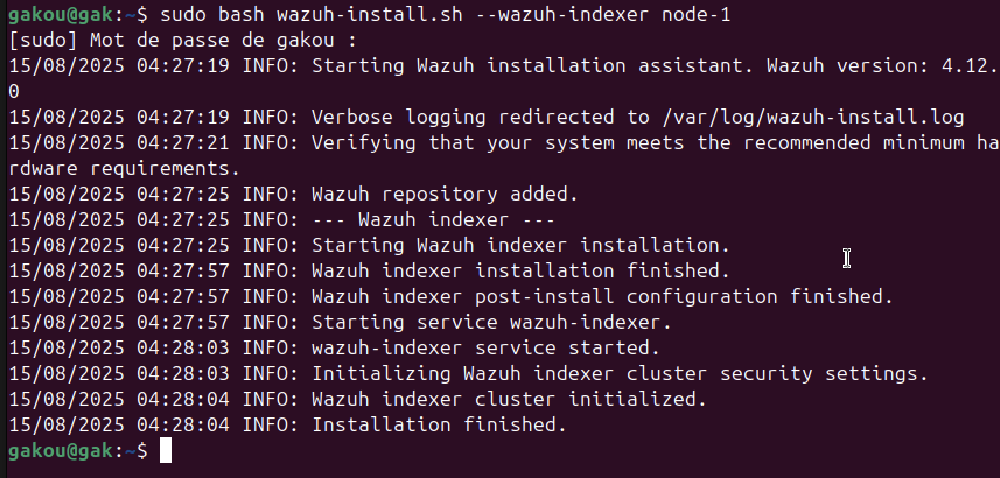

# Wazuh SIEM Deployment & Security Monitoring Lab


## 🚀 Deployment Steps
I install and configure wazuh using the assisted installation method
### 1. Installing Wazuh Server
Download the Wazuh installation assistant and the configuration file.

```bash
curl -sO https://packages.wazuh.com/4.12/wazuh-install.sh
curl -sO https://packages.wazuh.com/4.12/config.yml
```


After downloading, we have to open de /config file to replace the node names and IP values with the corresponding names and IP addresses

This document explains the roles and structure of your `config.yml` used to deploy Wazuh manually, on a **single virtual machine**.

All components (Indexer, Server, Dashboard) are hosted on the same VM with IP `192.168.64.25`.
* The Indexer is based on OpenSearch and is responsible for storing logs and indexing events
* The Wazuh Server is the core component that collects data from agents analyzes logs and events and triggers alerts based on rules
* The Dashboard is the web interface


Then we run the Wazuh installation assistant with the option --generate-config-files to generate the Wazuh cluster key certificates, and passwords necessary for installation
```bash 
wazuh-install.sh --generate-config-files
```
This step prepares the required configuration files and certificates before launching the actual installation.


### 2. Wazuh indexer nodes installation
Now we run it with the option --wazuh-indexer and the node name to install and configure the Wazuh indexer. Here I use the node-1.
```bash 
wazuh-install.sh --wazuh-indexer node-1
```


### 3. Initialiazation of the cluster
Now we run it with the option --wazuh-indexer and the node name to install and configure the Wazuh indexer. Here I use the node-1.
```bash 
wazuh-install.sh --start-cluster
```

~~~ 
We only need to initialize the cluster once.
~~~

After initialize the cluster we need to get our admin and password 
```
tar -axf wazuh-install-files.tar wazuh-install-files/wazuh-passwords.txt -O | grep -P "\'admin\'" -A 1
```

---
### 2. Installing Wazuh Agent (Example: Ubuntu)
```bash
curl -sO https://packages.wazuh.com/4.8/wazuh-agent.deb
sudo WAZUH_MANAGER="192.168.1.10" dpkg -i wazuh-agent.deb
sudo systemctl enable wazuh-agent
sudo systemctl start wazuh-agent
```

### 3. Creating Custom Rules
I edited `/var/ossec/etc/rules/local_rules.xml` to add rules for:
- SSH brute-force attempts
- Port scanning detection
- Unauthorized file modifications

Example rule:
```xml
<rule id="100100" level="10">
  <decoded_as>ssh</decoded_as>
  <description>SSH brute-force attempt detected</description>
  <group>authentication_failed,</group>
</rule>
```

Restarting the manager:
```bash
sudo systemctl restart wazuh-manager
```

### 4. Testing Detection
- Ran an **Nmap scan** from attacker machine to monitored host.
- Attempted multiple failed SSH logins.
- Modified a monitored file.

I then verified that alerts appeared in the **Wazuh Dashboard** in real time.

---

## 📊 Results
- Successfully centralized logs from multiple hosts.
- Real-time alerts for suspicious activities such as SSH brute-force attempts, scans, and file changes.
- Reduced investigation time by correlating alerts in the dashboard.

---

## 🔍 Lessons Learned
- Fine-tuning detection rules is essential to reduce false positives.
- Deploying multiple agents increases network visibility.
- Wazuh’s flexibility as an open-source SIEM allows for deep customization.

---

## 📷 Screenshots
*(I plan to add screenshots here)*
1. Wazuh Dashboard overview
2. Example alert details
3. Custom rule triggering

---

## 📚 References
- [Wazuh Official Documentation](https://documentation.wazuh.com/)
- [Wazuh GitHub Repository](https://github.com/wazuh/wazuh)
- [Wazuh Ruleset Guide](https://documentation.wazuh.com/current/user-manual/ruleset/index.html)
