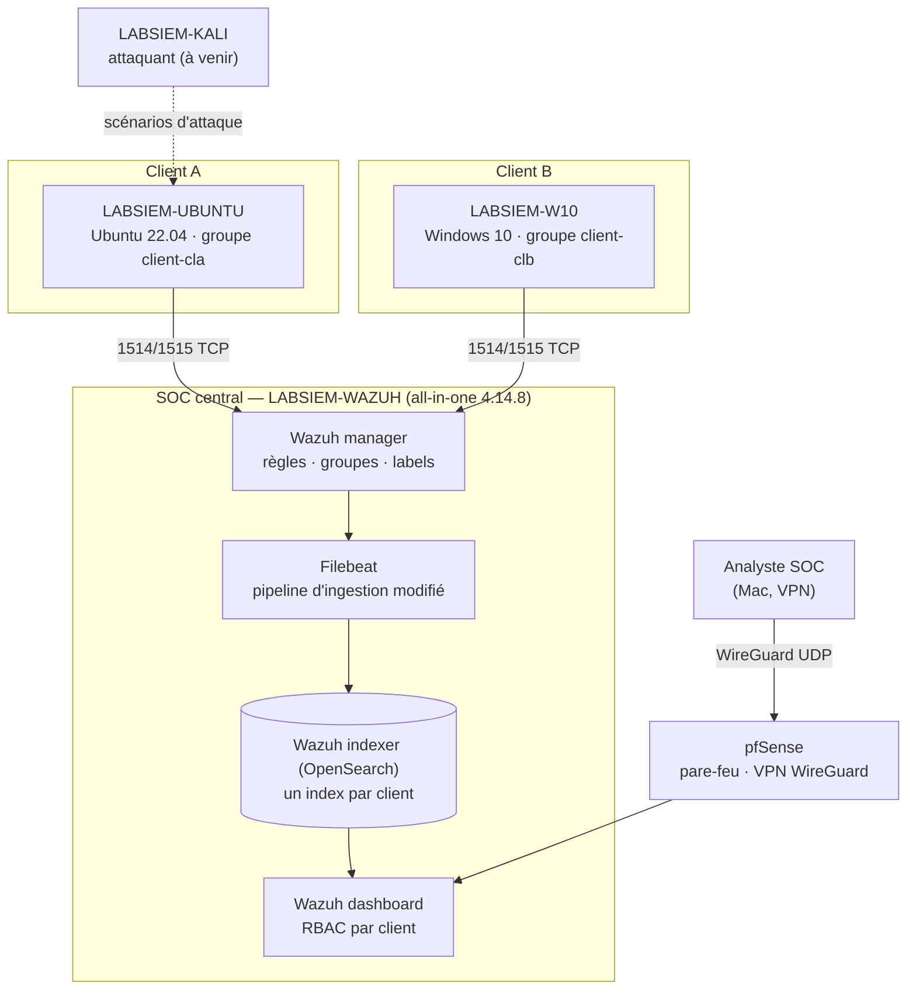
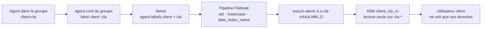

# SOC Wazuh multi-clients — cloisonner les données sans déployer une stack par client


Lab personnel qui répond à une question concrète de SOC mutualisé (MSSP) :

> **Comment superviser plusieurs clients sur une seule plateforme Wazuh, tout en garantissant que chaque client ne voit que ses propres données ?**

Wazuh n'est pas multi-tenant nativement. Ce projet construit le cloisonnement **par conventions et configuration**, de façon **automatisable** : l'arrivée d'un nouveau client ne demande ni nouvelle infrastructure, ni modification du socle.

---

## Résultats clés

| Objectif | Résultat | Preuve |
|---|---|---|
| Un index par client, créé automatiquement | ✅ | `wazuh-alerts-4.x-cla-*`, `…-clb-*`, `…-unassigned-*` ([détails](docs/03-index-par-client.md#résultats)) |
| Aucune alerte client dans le mauvais index | ✅ | `unassigned` ne contient que le manager et l'agent non affecté |
| Un utilisateur client lit ses alertes | ✅ | `count: 14` sur son index |
| Un utilisateur client ne lit pas celles d'un autre | ✅ | `HTTP 403 security_exception` |
| Le dashboard ne montre que ses alertes | ✅ | 14 alertes affichées = contenu de son index |
| Nouveau client sans toucher au pipeline | ✅ | Script [`onboard_client.sh`](scripts/onboard_client.sh) |
| Liste des agents filtrée par client (API Wazuh) | 🔄 | En cours ([doc](docs/05-rbac-api-wazuh.md)) |

---

## Architecture du lab



Détails : [docs/01-architecture.md](docs/01-architecture.md)

---

## Comment fonctionne le cloisonnement

Trois couches indépendantes, chacune testée :



| Couche | Mécanisme | Documentation |
|---|---|---|
| 1. Collecte | Groupe d'agents par client + label poussé par le groupe (non modifiable côté client) | [02-groupes-labels.md](docs/02-groupes-labels.md) |
| 2. Stockage | Pipeline d'ingestion qui route chaque alerte vers l'index de son client (modifié **une seule fois**) | [03-index-par-client.md](docs/03-index-par-client.md) |
| 3. Accès | Rôles OpenSearch en lecture seule par client + `do_not_fail_on_forbidden` + RBAC de l'API Wazuh | [04-rbac-indexer.md](docs/04-rbac-indexer.md), [05-rbac-api-wazuh.md](docs/05-rbac-api-wazuh.md) |

---

## Structure du dépôt

```
.
├── README.md
├── docs/
│   ├── 01-architecture.md          # Topologie, flux, conventions, rôles des composants
│   ├── 02-groupes-labels.md        # Groupes, labels, enrôlement des agents
│   ├── 03-index-par-client.md      # Modification du pipeline Filebeat
│   ├── 04-rbac-indexer.md          # Rôles OpenSearch, tests d'isolation
│   ├── 05-rbac-api-wazuh.md        # RBAC de l'API Wazuh (en cours)
│   ├── 06-onboarding-client.md     # Procédure pour un nouveau client
│   ├── 07-depannage.md             # Problèmes rencontrés et solutions
│   └── 08-feuille-de-route.md      # Étapes suivantes
├── configs/
│   ├── manager/shared/             # agent.conf des groupes clients
│   ├── agent/                      # Bloc <enrollment> (Linux / Windows)
│   ├── filebeat/                   # Processeurs ajoutés au pipeline
│   └── indexer/                    # Rôle, rattachement, config de sécurité
└── scripts/
    ├── patch_pipeline.py           # Applique / vérifie la modification du pipeline (idempotent)
    ├── onboard_client.sh           # Crée groupe, label, rôle et rattachement d'un client
    ├── check_isolation.sh          # Tests d'isolation pour un compte client
    └── audit_routage.sh            # Vérifie que chaque alerte est dans le bon index
```

---

## Démarrage rapide

Sur le manager Wazuh (all-in-one), une fois le pipeline modifié :

```bash
# 1. Modifier le pipeline (une seule fois, à revérifier après chaque mise à jour)
sudo python3 scripts/patch_pipeline.py
sudo filebeat setup --pipelines && sudo systemctl restart filebeat

# 2. Ajouter un client (groupe, label, rôle, rattachement)
sudo ./scripts/onboard_client.sh clc

# 3. Vérifier le routage et l'isolation
./scripts/audit_routage.sh
./scripts/check_isolation.sh --client clc --user clientc_test --other cla
```

---

## Stack

Wazuh 4.14.8 (manager, indexer, dashboard, agents) · OpenSearch Security · Filebeat · pfSense · WireGuard · Ubuntu 22.04 · Windows 10 · Bash · Python

---

## Ce que ce projet m'a appris

- **Le cloisonnement se joue en plusieurs couches.** Des index séparés ne suffisent pas : le dashboard interroge aussi l'API Wazuh, qui a son propre RBAC.
- **Le comportement par défaut d'OpenSearch protège, mais bloque.** Une recherche sur `wazuh-alerts-*` échoue en 403 dès qu'un index est interdit ; `do_not_fail_on_forbidden` rend le dashboard utilisable sans ouvrir les données.
- **Diagnostiquer avant de corriger.** Un manager arrêté avec « Error reading XML file (line 0) » venait non pas du contenu du fichier, mais de ses droits (`root:root` au lieu de `root:wazuh`). Voir [07-depannage.md](docs/07-depannage.md).
- **Automatiser dès le premier client.** Les conventions (nommage, groupes, labels) coûtent peu au début et beaucoup à rattraper.

---

## Avertissement

Projet de laboratoire, à visée pédagogique. Les adresses IP sont celles d'un réseau privé de test ; aucun mot de passe ni secret n'est publié. Avant toute mise en production : haute disponibilité (cluster d'indexers, workers), sauvegardes, tests d'intrusion et revue de sécurité.

## Auteur

**Mohamed Gakou** — Ingénieur cybersécurité · [LinkedIn](https://linkedin.com/in/mohamed-gakou) · [GitHub](https://github.com/mgakou)
