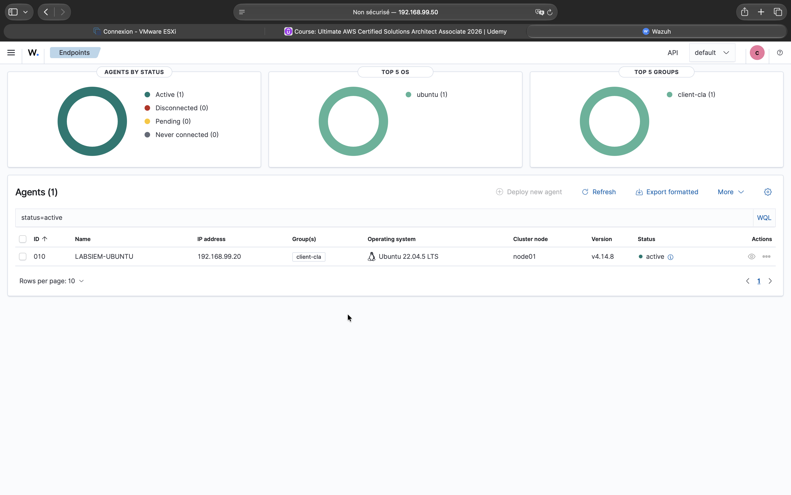

# 05 — RBAC de l'API Wazuh

## Pourquoi une deuxième couche

Le dashboard affiche deux sources de données, chacune avec ses propres permissions :

| Zone du dashboard | Source | Permission appliquée |
|---|---|---|
| Alertes, graphiques, Discover | Indexer (OpenSearch) | Rôle `client_<code>_ro` ([04](04-rbac-indexer.md)) |
| Liste des agents, inventaire, SCA, configuration | API Wazuh du manager (port 55000) | **RBAC de l'API Wazuh** |

Sans RBAC côté API, un compte client voit soit aucun agent (état actuel, sûr mais trop restrictif), soit les agents de **tous** les clients (fuite).

## Prérequis : `run_as`

Le dashboard doit appliquer les droits de l'utilisateur connecté, et non ceux du compte technique :

```bash
sudo grep -n "run_as" /usr/share/wazuh-dashboard/data/wazuh/config/wazuh.yml
# attendu : run_as: true
sudo systemctl restart wazuh-dashboard   # si modifié
```

## Configuration réalisée

Les politiques et le rôle sont créés **par l'API** (reproductible et scriptable) ; le rattachement à l'utilisateur dans l'interface.

### Jeton d'API

```bash
WAPI="https://localhost:55000"
TOKEN=$(curl -sk -u wazuh-wui -X POST "$WAPI/security/user/authenticate?raw=true")   # expire après 15 min
H=(-H "Authorization: Bearer $TOKEN" -H "Content-Type: application/json")
curl -sk "${H[@]}" "$WAPI/security/users?search=wazuh-wui&pretty=true" | grep allow_run_as   # doit être true
```

### 1. Politiques (id 100 et 101)

Deux politiques, car les types de ressources diffèrent :

```bash
curl -sk "${H[@]}" -X POST "$WAPI/security/policies?pretty=true" -d '{
  "name": "client-cla-agents",
  "policy": {
    "actions": ["agent:read","syscheck:read","sca:read","syscollector:read","rootcheck:read"],
    "resources": ["agent:group:client-cla"],
    "effect": "allow"
  }}'

curl -sk "${H[@]}" -X POST "$WAPI/security/policies?pretty=true" -d '{
  "name": "client-cla-group",
  "policy": {
    "actions": ["group:read"],
    "resources": ["group:id:client-cla"],
    "effect": "allow"
  }}'
```

> « The specified name or policy already exists » : une politique de même nom **ou de même contenu** existe déjà. La lister (`/security/policies?search=client`) et réutiliser son id.

### 2. Rôle et politiques attachées

```bash
curl -sk "${H[@]}" -X POST "$WAPI/security/roles?pretty=true" -d '{"name":"client_cla"}'
curl -sk "${H[@]}" -X POST "$WAPI/security/roles/<ID_ROLE>/policies?policy_ids=100,101&pretty=true"
curl -sk "${H[@]}" "$WAPI/security/roles?search=client_cla&pretty=true"   # policies : [100, 101]
```

### 3. Rattachement à l'utilisateur (interface)

Server management → Security → **Roles mapping** → Create role mapping :

| Champ | Valeur |
|---|---|
| Name | `client_cla_to_clienttest_mapping` (sans espace ni apostrophe) |
| Roles | `client_cla` |
| Internal users | `clienta_test` |
| Custom rules | vide |

## Résultat

Connecté avec `clienta_test` :



| Contrôle | Attendu | Obtenu |
|---|---|---|
| Nombre d'agents visibles | 1 | **1** ✅ |
| Agent visible | `LABSIEM-UBUNTU` | `LABSIEM-UBUNTU`, groupe `client-cla` ✅ |
| `LABSIEM-W10`, `labsiem-service` | invisibles | invisibles ✅ |
| Alertes | 14, client A uniquement | inchangé ✅ |

Le cloisonnement est désormais effectif sur les deux sources du dashboard : l'indexer (alertes) et l'API Wazuh (agents).

## À automatiser

Ajouter à `onboard_client.sh` la création des politiques et du rôle via l'API, ainsi que la règle de rattachement (format à récupérer avec `GET /security/rules`).
