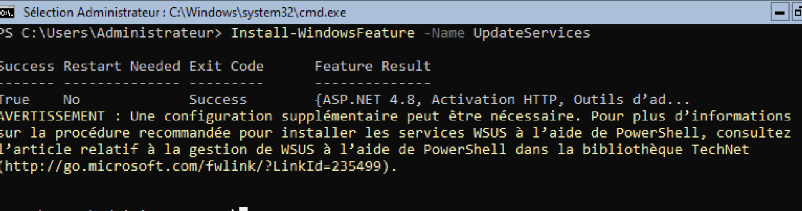

# Objectives: 
 - How to install a service on Windows. Even if details differ, services are installed and configured in a similar way.
 - How to develop a strategy (understanding the global context, strengths, and weaknesses of the implementation).
 - Security-related concepts.

Lab 2: Setting up a WSUS Server

Mohamed GAKOU

09/22/2024

Report

### I. Prerequisites
### II. Diagram Design
### III. Basic Configuration
### IV. Update Organization
### V. Update Policy
### VI. Security
### VII. A Bit of Imagination

# 1. Prerequisites

We keep the AD from the first lab (TP1-Authentication), then install a new VM that will serve as our WSUS server and join it to the AD domain. The client from Lab 1 is also maintained and joined to the domain.

# 2. Diagram Design


***Figure 1: Network diagram showing the client, AD, and WSUS.***


***Figure 2: How the WSUS server works.***

WSUS (Windows Server Update Services) is an essential service for centralized management of Microsoft updates within an enterprise network. It enables synchronization, approval, management, and monitoring of updates, thereby enhancing security, improving system stability, and optimizing Internet bandwidth usage.

# 3. Basic Configuration

The WSUS server runs on a Windows Server system dedicated to this task.  
After configuring IP addresses and performing the necessary pings as shown in Figure 3, the first step in installing the WSUS server is to run the following command:  
**Install-WindowsFeature -Name UpdateServices** as shown in Figure 4.  


***Figure 3: Testing connectivity***



***Figure 4: WSUS Server Installation***   

To verify that WSUS is properly installed, we run:   
**Get-Service -Name WsusService** and as shown in Figure 5, the server is correctly installed.  

     
***Figure 5: WSUS Installation Check***

  
***Figure 6: Feature Installation*** 

Then, as shown above (Figure 6), we go to the machine running Active Directory to add new features.  
Figure 7 shows the features added.  

   
***Figure 7: Added Features***

 
***Figure 8: Synchronization Display***

After adding features, we synchronize AD with the WSUS server using **mmc.exe**. Figure 8 shows the synchronization view.

# 4. Update Organization

In our WSUS update management strategy, we divide machines into two groups in order to test updates before deploying them across the entire network. The **Test group** contains a test machine, such as a non-critical server or workstation. This group allows us to verify whether updates cause issues or install correctly. The **Production group** includes all other machines, which only receive updates after validation in the Test group.

To manage updates, we start by synchronizing available updates with Microsoft Update, either automatically or manually. Updates are first approved for the Test group. After validation, they are approved for the Production group. If an update causes problems in the Test group, it can be denied or removed, preventing any impact on production.

Our schedule is simple: during the first week, we synchronize updates and test them on the Test group for one or two days. If everything goes well, we approve the updates for the Production group the following week, monitoring results for another week.

We prioritize **security updates**, which are essential for protecting our systems, as well as **critical and cumulative updates**, which fix bugs and improve stability. We exclude optional updates and major new versions to limit risks.

Finally, we check the update status every week through the WSUS console and reports. This allows us to track successful or failed updates. Updates in the Test group are configured for automatic installation, while those in the Production group are applied manually, ensuring full control before deployment to critical systems.

# 5. Update Policy

We implement the proposed organization by creating 2 GPOs on the AD server: 1 for Test and 1 for Production.  

  
***Figure 9: Creating Test & Production GPOs***

We then create the Test & Production groups on our WSUS server (if they do not already exist – hence the ***if***).  

  
***Figure 10: Setting up Test and Production Groups***

Using the **Set-GPRegistryValue** command *(see images 11–15)*, we configured GPOs to assign WSUS automatic update settings.  
For the **Test group**, we defined automatic updates with immediate installation (AUOptions = 4).  
For the **Production group**, we configured updates to download but require manual installation (AUOptions = 3).  

These GPOs were then linked to the corresponding Organizational Units (OU_TEST & OU_PRODUCTION), differentiating update behavior between groups. We enforced the policies with **gpupdate /force** and verified correct application through reports.  

  
***Figure 11: Policy settings for the TEST group***

  
***Figure 12: Policy settings for the PRODUCTION group***

  
***Figure 13: Display of already created OUs***

  
***Figure 14: Linking GPOs to OUs***  

  
***Figure 15: AD verification of created organizations***

# 6. Security

To ensure strong security of the WSUS server and optimize update management, several complementary measures must be implemented.  

First, **strong authentication** is a priority. This includes using accounts with limited rights and configuring multi-factor authentication (MFA) to strengthen server access. This reduces identity theft and unauthorized access risks.  

In addition, **data protection** between the server and clients must be ensured through SSL certificates, protecting the confidentiality and integrity of sensitive data in transit. It is also important to secure the WSUS database itself with local encryption, reducing risks in case of direct server access.  

Implementing a **regular backup program** is also essential. Backups must include the database, configurations, and metadata, stored in secure locations separate from the main infrastructure. Reports generated by these tools allow proactive planning of patch and security update deployment.  

Finally, developing a **Disaster Recovery Plan (DRP)** is critical. This strategic document must detail recovery and restoration steps in case of major failure or incident, minimizing downtime and ensuring rapid resumption of operations.  

By combining these strategies, the WSUS server will be better protected against internal and external threats while ensuring optimal operational continuity.  

# 7. A Bit of Imagination

Example script to assign machines to WSUS groups and check their update status:  

```powershell
# WSUS group name
$WsusGroupName = "Postes_Utilisateurs"

# List of machines to check
$Machines = @("Poste1", "Poste2", "Poste3")

# WSUS server address
$WsusServer = "NomServeurWSUS"

# Connect to the WSUS server
$Wsus = [Microsoft.UpdateServices.Administration.AdminProxy]::GetUpdateServer($WsusServer, $false)

# Check and assign machines to groups
foreach ($Machine in $Machines) {  
    try {  
        $ComputerTarget = $Wsus.GetComputerTargetByName($Machine)  
        if ($ComputerTarget -ne $null) {  
            $Group = $Wsus.GetComputerTargetGroups() | Where-Object { $_.Name -eq $WsusGroupName }  
            if ($Group) {  
                $ComputerTarget.ChangeComputerTargetGroup($Group)  
                Write-Output "Machine $Machine added to group $WsusGroupName."  
            } else {  
                Write-Output "Group $WsusGroupName not found on the WSUS server."  
            }  
        } else {  
            Write-Output "Machine $Machine not found on the WSUS server."  
        }  
    } catch {  
        Write-Output "Error while checking or assigning machine $Machine : $_"  
    }  
}

# Check update status
$ComputerTargets = $Wsus.GetComputerTargets()  
$Report = @()

foreach ($Computer in $ComputerTargets) {  
    $UpdateSummary = $Computer.GetUpdateInstallationSummary()  
    $Report += [PSCustomObject]@{  
        "Machine Name"        = $Computer.FullDomainName  
        "Approved Updates"    = $UpdateSummary.InstalledNotApplicablePercentage  
        "Missing Updates"     = $UpdateSummary.MissingPercentage  
        "Failed Updates"      = $UpdateSummary.FailedPercentage  
    }  
}

# Generate CSV report
$Report | Export-Csv -Path "C:\WSUS_Report.csv" -NoTypeInformation  
Write-Output "Report generated: C:\WSUS_Report.csv"
param(  
    [string]$KBNumber  
)  

# Verify parameter
if (-not $KBNumber) {  
    Write-Host "Please pass a KB number as parameter. Example: .\Check-KB.ps1 -KBNumber KB5005698"  
    exit  
}

# Search KB in installed updates
$KBInstalled = Get-HotFix | Where-Object { $_.HotFixID -eq $KBNumber }

if ($KBInstalled) {  
    Write-Host "KB $KBNumber is installed."  
} else {  
    Write-Host "KB $KBNumber is not installed."  
}
---

