# Objective: Understand securing an Active Directory server

## SKILLS :

-   Discover how to perform a security audit on AD
-   Master account attributes
-   Master GPOs related to WSUS

# Lab 3: Securing

GAKOU Mohamed

9/12/2024

Report

Table of Contents

### I. Designing your infrastructure diagram

### II. Group Policy

### III. Securing accounts

### IV. Administration scripts

### V. Security audit

## Prerequisites

We continue with the same topology as in the first two labs.

## 1. **Designing infrastructure diagram:** {#designing-your-infrastructure-diagram:}

***Diagram of a secured network***

To strengthen domain security, domain controller 2 and the storage
server were repositioned in an isolated private network. This
reconfiguration places these servers in a protected zone, separated from
the rest of the infrastructure, thus minimizing exposure to external
threats. By confining them to a restricted network inaccessible from
outside, the risks of attacks or compromise are reduced. In this way,
the segmentation of sensitive resources ensures better confidentiality
of data while limiting the potential attack surface.

## 2. Group Policy

Activation of AES in ***GPO Editor \> Policies \> Windows Settings \>
Security setting \> Local Policies \> Security Options.***

***Selection: Configure encryption types allowed for Kerberos***

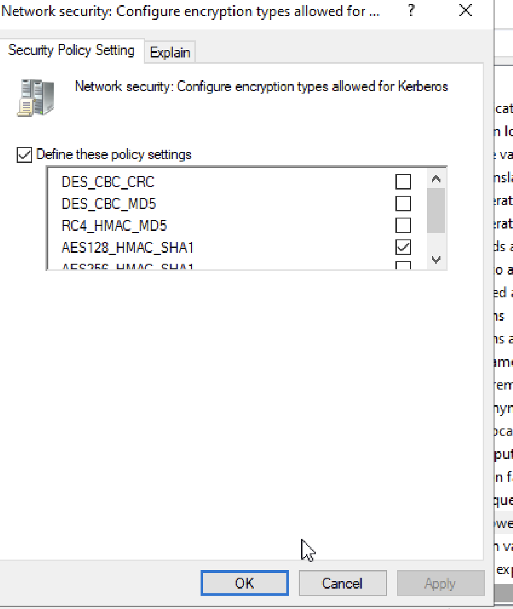 ***Selection:
AES128_HMAC_SHA1***

Then we run **klist** after logging off to view cached tickets (see
image below) 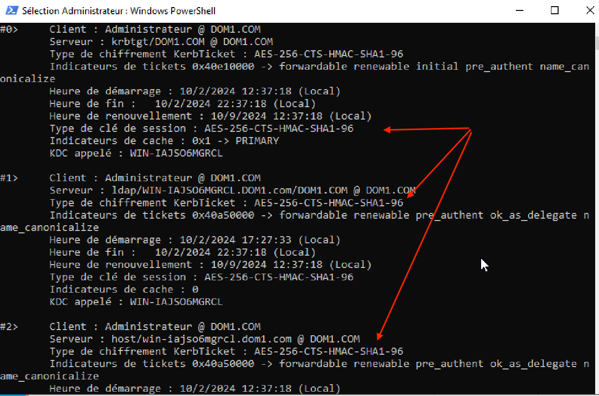 **Displaying klist
tickets**

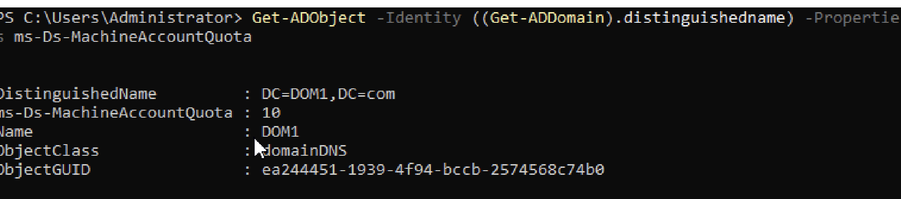 In the image above, the value
of the ms-Ds-MachineAccountQuota parameter designates the number of user
accounts a non-admin user can create. By default, the value is set to
10.

## 3. Securing accounts

Script that deletes expired accounts and sends you an email notification

**The script:**

**\# Import the Active Directory module**

Import-Module ActiveDirectory

**\# Variable configuration**

\$smtpServer = "smtp.yourcompany.com"\
\$smtpPort = 587\
\$senderEmail = "admin@yourstartup.com"\
\$receiverEmail = "mkhaled@yourstartup.com"\
\$expireDate = (Get-Date).AddDays(-30)

**\# Retrieve expired user accounts based on expiration date**

\$expiredUsers = Get-ADUser -Filter {Enabled -eq \$true -and
AccountExpirationDate -le \$expireDate}

**\# Delete expired user accounts**

\$expiredUsers \| ForEach-Object {\
Remove-ADUser -Identity $_ -Confirm:$false\
}

**\# Send email notification of deleted expired accounts**

\$subject = "Expired accounts deleted"\
\$body = "Expired user accounts have been successfully deleted."\
Send-MailMessage -SmtpServer \$smtpServer -Port \$smtpPort -From
\$senderEmail -To \$recipientEmail -Subject \$subject -Body \$body

**\# Display confirmation message**

Write-Host "Script completed. Expired user accounts deleted, and a
notification email was sent."

## 4. Administration scripts

\### 1. Location

To secure the script, we can keep it on our AD machine since it is only
accessible to administrators. However, we can also implement a shared
folder with restricted access on a server.

Only administrators or authorized users should be able to read, execute,
or modify these scripts. This centralized location facilitates script
management and updates.

### Implementation

We use the Task Scheduler to run the script once a week, every Sunday.
We give the script a name, the trigger will be execution every Sunday,
and the action will be running the script (see images below)

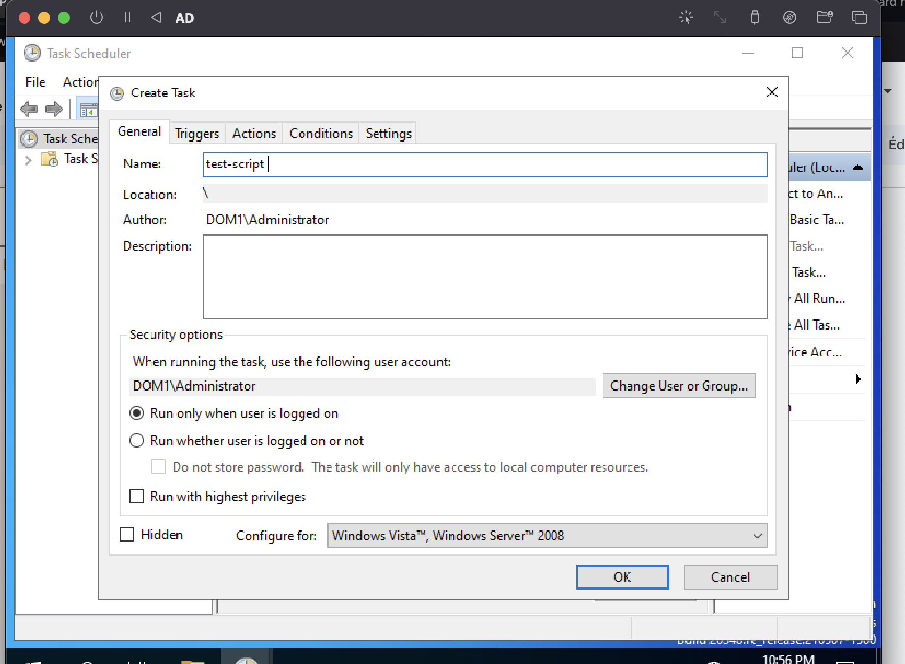 ***Task creation***

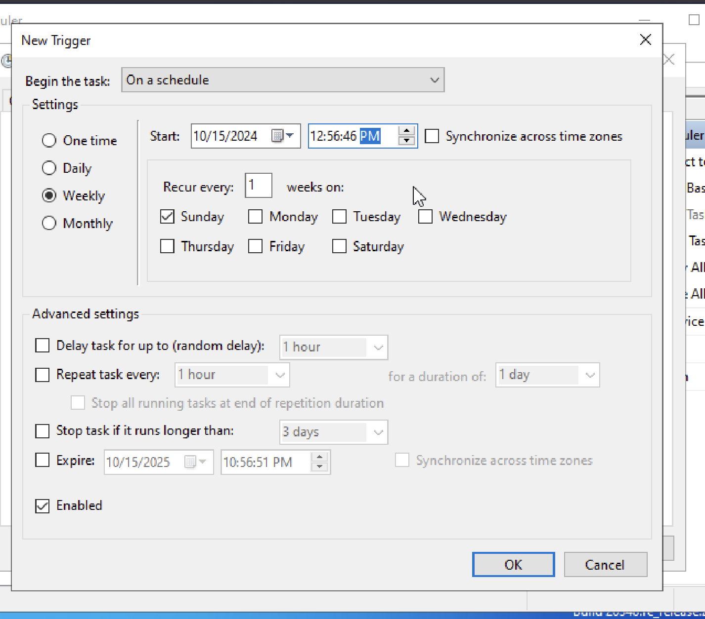 ***Trigger creation (every
Sunday)***

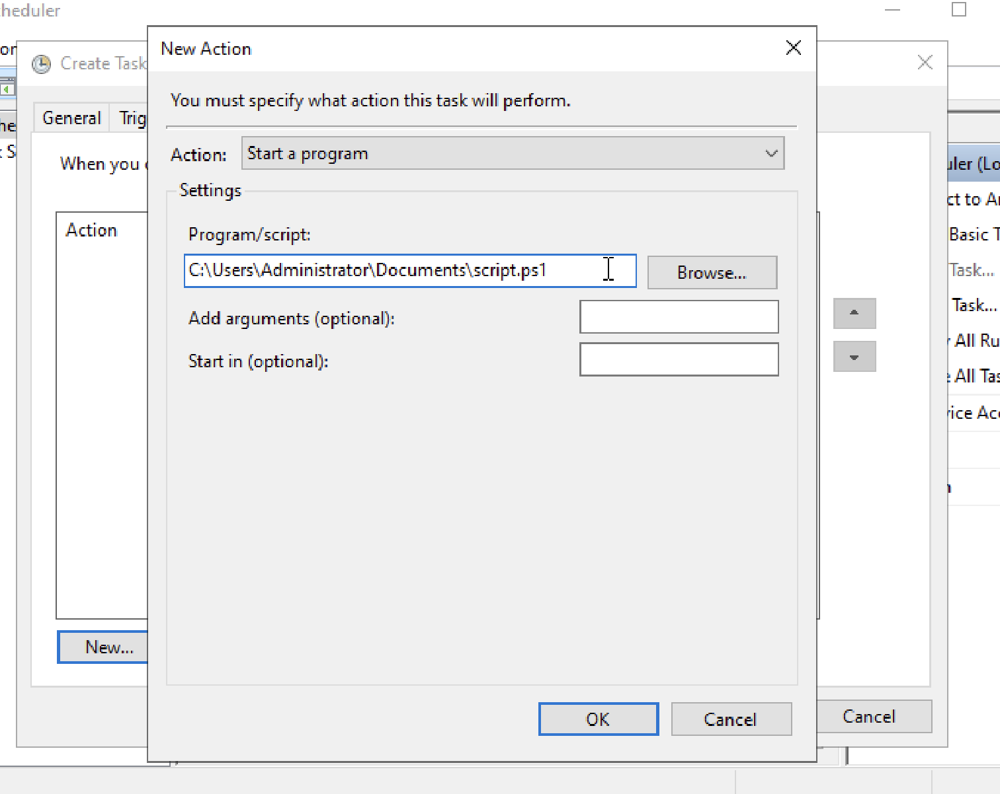 ***Implementation of the
action***

## 5. Security audit

PingCastle is a security audit tool designed to quickly and effectively
assess the security of Active Directory (AD) environments. This tool
helps system administrators and security teams identify vulnerabilities
and misconfigurations that could compromise AD. PingCastle generates a
detailed report highlighting critical risks, potential weaknesses, and
areas for improvement to strengthen infrastructure resilience. Key
features include access rights analysis, detection of excessive
privileged accounts, verification of updates and patches, and
identification of trust relationships between domains. Its ease of use
and ability to provide actionable results in a short time make it a
valuable tool for proactive security management. You can download it
here: https://www.pingcastle.com/download/

The current PingCastle score for the environment is 55 (see image
below). In this section, we resolve some security strategies

 ***PingCastle score***

### NTLM2 only

The resolution of the first issue is to allow NTLMv2 and deny LM and
NTLM. For this, go to ***GPO Editor \> Policies \> Windows Settings \>
Security setting \> Local Policies \> Security Options.*** In Network
security: LAN Manager authentication level, select "Send NTLMv2 response
only. Refuse LM & NTLM" (see images below)

 ***Allow NTLMv2***

 ***Allow NTLMv2 only***

### ms-DsMachineAccountQuota issue

The resolution of the second issue is to prevent a non-admin user from
creating user accounts, which means setting
**ms-Ds-MachineAccountQuota** to 0 (see image below)

 ***Changing
ms-Ds-MachineAccountQuota value***

### Domain Controller password policy

The issue described concerns the domain password policy, which may allow
passwords shorter than 8 characters, posing a security risk. Here's how
we resolved it:

-   In **GPMC**, **Forest** \> **Domains** \> **DOM1** \> **Group Policy
    Objects**, right-click on **Default Domain Policy** and **Edit**.
    -   Go to **Computer Configuration** \> **Windows Settings** \>
        **Security Settings** \> **Account Policies** \> **Password
        Policy**.\
    -   Modify the **minimum password length** to **8 characters** or
        more.\
    -   Then validate with **gpupdate /force.** See image below

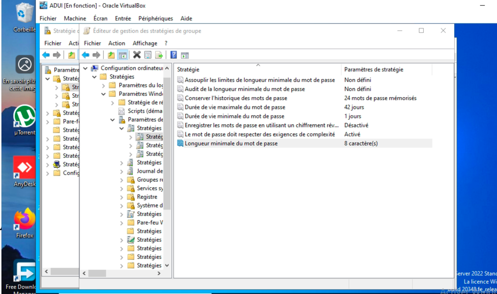

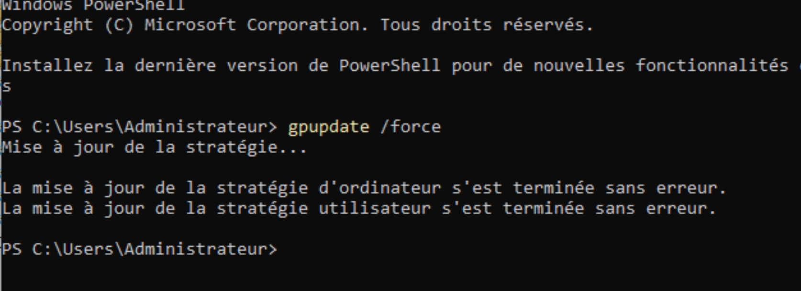

### Recycle bin

The goal is to ensure the Recycle Bin feature is enabled.

To do this, run:

**Enable-ADOptionalFeature -Identity 'Recycle Bin Feature' -Scope
ForestOrConfigurationSet -Target 'DOM1.local'**

Then verify with **Get-ADOptionalFeature -Filter {Name -eq "Recycle Bin
Feature"}** if IsDisableable = false

### AD Backup

The issue concerns verifying that Active Directory (AD) backups are up
to date and performed according to Microsoft recommended standards.

First, create an NTFS partition in path C:`\PNTFS `{=tex}to back up AD
(see image below)

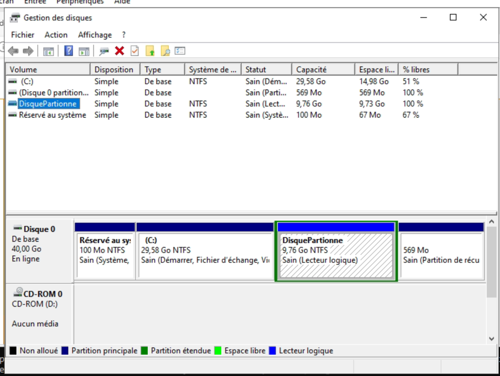

Then install the **Windows Server Backup** feature in Tools and Features

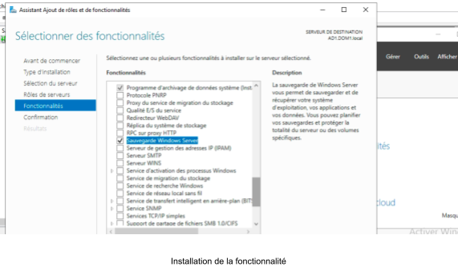

Start the backup with the command: **wbadmin start systemstatebackup
-backuptarget:C:`\PNTFS`{=tex}:** (see image below)

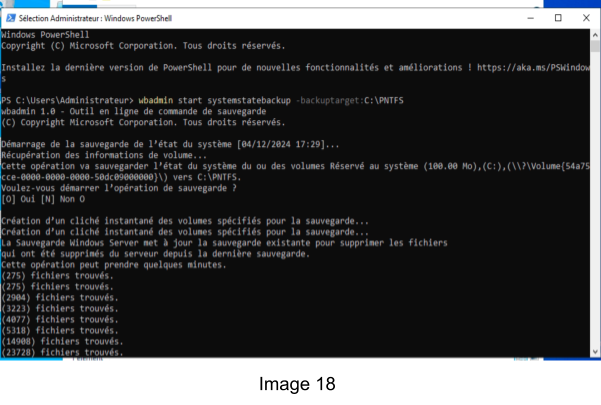

### Native Administrator

The issue described concerns using the native Administrator account (the
built-in Administrator account), which poses a security risk if used
routinely or insecurely.

First, create an AdminAD user who will have full administrator rights
(see image below) 

Now log in with the new account to test if it has full administrator
rights

We can verify that it belongs to the **Domain Admins** group but will
also verify effective rights by performing a basic test (adding and
deleting an account) (see image below).

For security measures, we rename the administrator account to
AdminBackup, making it harder to target in automated attacks.

Then we disable the main admin account

*Note: **PingCastle** relies on the **LastLogonTimestamp** attribute,
which may have replication latency up to **14 days**. This means that
even if the account is disabled, PingCastle may still consider it
"active" during this delay.*

**Activation of key events**

The main objective here is to enable **key events** to ensure effective
collection of critical information without overloading the system with
unnecessary logs. Key events correspond to essential categories
recommended by experts such as **adsecurity.org**.

Key events to enable:

Account modifications, logons and logoffs, access to sensitive
resources, and policy and privilege changes.

As shown in the image, we created a script to enable Success/Failure
audits that we execute in PowerShell

**Disabling the Spooler Service**

This process is often used to fix vulnerabilities or errors related to
the Spooler service. In the AD context, this can be related to
performance or security issues caused by misconfigured printers in an AD
domain.\
To resolve the issue, we stop the service, disable its automatic
startup, and apply group policies as shown in the image below

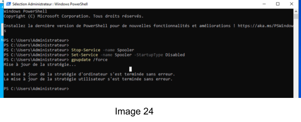
