# Objective: Understand the authentication systems offered by an Active Directory.
## Skills:
*	- Master authentication systems
*	- Learn to manage Kerberos
*	- Understand NTLM and LDAP

MOHAMED GAKOU M1 SSIR  & KHALED SALAH STRI2A

9 Décembre 2024  
**Sommaire**

**0.Étape préliminaire**

**1.Conception du schéma de l’infrastructure :**

**2. Analyse Wireshark**

[**KERBEROS \- Client joint au domaine	9**](#kerberos---client-joint-au-domaine)

[Explication des échanges (image 12 et image 13):	11](#explication-des-échanges-\(image-12-et-image-13\):)

[**NTLM \- Client non joint :	13**](#ntlm---client-non-joint-:)

[Explication des échanges :	15](#explication-des-échanges-:)

[**3\. Compte KRBTGT	17**](#3.-compte-krbtgt)

[**4\. Politique de Sécurité	21**](#4.-politique-de-sécurité)

[1\. Script	21](#script)

[2\. Task Scheduler	21](#task-scheduler)

[3\. Implication :	23](#implication-:)

[**5\. Silo	24**](#5.-silo)

[**6\. Autres Authentifications	26**](#6.-autres-authentifications)

[1\. Créons une GPO refusant les authentifications NTLM :	26](#créons-une-gpo-refusant-les-authentifications-ntlm-:)

[Étapes pour créer une GPO pour interdire NTLM :	26](#étapes-pour-créer-une-gpo-pour-interdire-ntlm-:)

[2\. Test de l’outils ldp.exe :	32](#test-de-l’outils-ldp.exe-:)

[3\. Détail des deux étapes de la connexion à ldp.exe.	35](#détail-des-deux-étapes-de-la-connexion-à-ldp.exe.)

[4\. Protocole utilisé	35](#protocole-utilisé)

[**Conclusion	36**](#conclusion)

## 0\. Étape préliminaire  {#0.-étape-préliminaire}

Dans cette étape nous configurons les adresses réseaux sur l’AD et aussi sur le client joint au domaine : 

Conformément à l’image 1 (ci-dessous) nous avons mis l’AD en place sur la machine et avons configuré une IPv4 statique **192.168.9.2/24** et une passerelle par défaut à **192.168.9.1.** Et comme nous le voyons sur l’image 2, nous avons un seul et unique serveur DNS, vu que nous mettons en place l’AD alors le DNS point vers l’ip de la machine en question car AD repose sur le DNS pour localiser les services et les ressources réseau. Le DNS intégré à l'AD est essentiel pour résoudre les noms des machines, découvrir les contrôleurs de domaine, et permettre l'authentification Kerberos et d'autres services réseau.

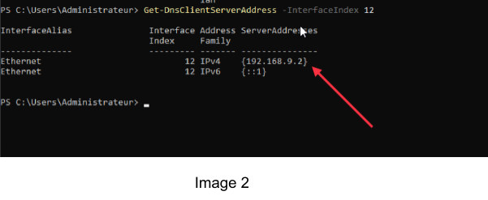

Nous pouvons bien voir que AD est bien installé sur la machine (conf à l’image 3)

Ensuite nous configurons une machine qui sera joint au domaine AD, nous donnons comme IPv4 **192.168.9.3/24,** une adresse par défaut et un serveur DNS qui pointe vers l’IP de machine contrôleur de domaine AD (conformément à l'image 4). Et le ping depuis et vers les machines fonctionnent comme sur l’image 5 et 6 ci dessous

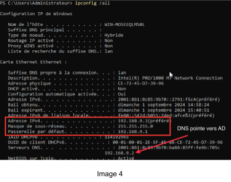

Ensuite nous ajoutons la machine cliente au domaine AD avec **Add-computer** (image 8). Nous pouvons donc voir que le client est maintenant joint au domaine (conf image 8)

## **1.Conception du schéma de l’infrastructure :**  {#1.conception-du-schéma-de-l’infrastructure-:}

Kerberos est un protocole d'authentification réseau conçu pour garantir des échanges sécurisés entre différents utilisateurs et services au sein d'un réseau, notamment dans des environnements où la sécurité des communications est primordiale. Ce protocole est particulièrement utile dans les réseaux d'entreprise où de multiples utilisateurs doivent accéder à différents services ou applications. Il utilise des mécanismes de cryptographie symétrique pour chiffrer les échanges, garantissant ainsi la confidentialité et l'intégrité des données transmises. Une fois l'utilisateur authentifié, il peut accéder aux services sans avoir besoin de ressaisir ses identifiants, ce qui en fait une solution très pratique pour la gestion d'accès dans de grandes infrastructures réseau.

Le fonctionnement de Kerberos repose sur quatre étapes essentielles, avec l’utilisation de clés de chiffrement pour sécuriser les échanges à chaque étape :

1. **Demande d'authentification** : Tout commence lorsque le client souhaite accéder à un service. Sans jamais transmettre son mot de passe en clair, il envoie une demande d'authentification au Serveur d'Authentification (**AS**). Cette demande contient uniquement son identifiant (**ID client**).  
2. **Validation par le Serveur d’Authentification (AS)** : Le **AS** recherche l’identifiant du client dans sa base de données et vérifie son mot de passe. Ce mot de passe est chiffré à l’aide d’une clé dérivée du mot de passe du client (**Kc**). Si l’authentification réussit, le **AS** génère deux éléments :  
   * Une clé de session chiffrée avec la clé secrète du client (**Kc**), que seul le client peut déchiffrer.  
   * Un **Ticket Granting Ticket (TGT)**, qui contient la clé de session et d’autres informations nécessaires pour les étapes suivantes. Ce TGT est chiffré avec une clé secrète connue uniquement par le Ticket Granting Server (**Ktgs**). Le **AS** renvoie ces éléments au client.  
3. **Demande d'accès à un service** : Avec le **TGT** reçu, le client envoie une demande au **Ticket Granting Server (TGS)** pour accéder à un service spécifique. Le **TGS** déchiffre le **TGT** avec sa clé secrète (**Ktgs**) et vérifie qu’il est valide. Si tout est correct, le **TGS** génère :  
   * Une nouvelle clé de session (**Ks**), partagée entre le client et le serveur du service.  
   * Un **Service Ticket (ST)**, contenant la clé de session et d'autres informations, qui est chiffré avec la clé secrète du serveur cible (**Kserv**). Ces éléments sont ensuite renvoyés au client.  
4. **Accès au service** : Le client utilise le **Service Ticket (ST)** pour accéder au serveur hébergeant le service ou l'application qu'il souhaite utiliser. Il envoie le **ST** au serveur, qui le déchiffre à l’aide de sa clé secrète (**Kserv**) et récupère la clé de session partagée (**Ks**). Si tout est valide, le serveur accorde l'accès au client. À partir de ce moment, toutes les communications entre le client et le serveur sont sécurisées à l'aide de cette clé de session (**Ks**).

## **2\. Analyse Wireshark :**  {#2.-analyse-wireshark-:}

## **KERBEROS \- Client joint au domaine** {#kerberos---client-joint-au-domaine}

Tout d’abord, vérifions la configuration Kerberos dans le Gestionnaire de serveur depuis : Outils \> Gestions des stratégies de groupes \> Objets de stratégie de groupe \> Default Controller Domain \> Clic droit puis Modifier (conf image 9\) puis dérouler Stratégie \> Paramètre Windows \> Paramètre de sécurité \> Stratégie de comptes \> Stratégies Kerberos. Ainsi nous pouvons mettre la config souhaitée dans la partie droite (conf image 10).

### 

**2.1 Création de répertoire sur l’AD** 

Nous créons un dossier (conf image 11\) depuis l’AD que nous partageons sur le réseau afin que le client puisse y avoir accès, ainsi nous pourrons observer l'échange depuis Wireshark

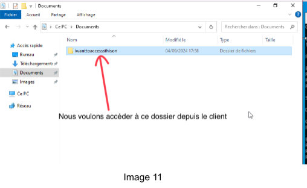

L'étape suivante consiste à accéder à ce dossier depuis le client et d’observer les échanges depuis wireshark conformément à l’image 12 et 13 ci-dessous. (installé sur le contrôleur de domaine).

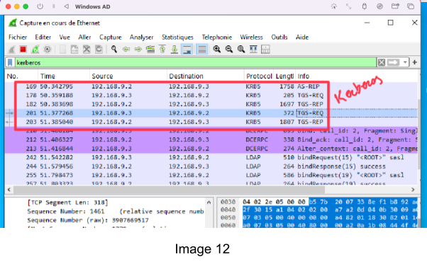

### **Explication des échanges (image 12 et image 13):**  {#explication-des-échanges-(image-12-et-image-13):}

	1\.	**AS-REQ (Authentication Service Request)**

	•	**Source** : La machine cliente 192.168.9.3 

	•	**Destination** : Le contrôleur de domaine (Key Distribution Center ou KDC).

	•	**Description** :  
Le client demande un **Ticket Granting Ticket (TGT)** au service d’authentification (AS) du KDC. Cette requête contient des informations d’identification telles que le nom d’utilisateur.

	2\.	**AS-REP (Authentication Service Reply)**

	•	**Source** : Le KDC 192.168.9.2 

	•	**Destination** : Le client.

	•	**Description** :  
Le KDC répond à la requête AS-REQ et fournit un **Ticket Granting Ticket (TGT)** si les informations sont correctes. Ce TGT est chiffré avec une clé dérivée du mot de passe de l’utilisateur.

	3\.	**TGS-REQ (Ticket Granting Service Request)**

	•	**Source** : La machine cliente.

	•	**Destination** : Le KDC.

	•	**Description** :  
Une fois que le client possède un TGT, il l’utilise pour demander un ticket de service spécifique via le TGS-REQ. Par exemple, dans notre cas pour accéder à un fichier partagé.

	4\.	**TGS-REP (Ticket Granting Service Reply)**

	•	**Source** : Le KDC.

	•	**Destination** : Le client.

	•	**Description** :  
Le KDC répond avec un ticket de service valide (Service Ticket) que le client peut utiliser pour authentifier ses communications avec un serveur cible.

**Interprétation des lignes spécifiques dans la capture :**

	•	**Lignes AS-REQ/AS-REP (ex. lignes 169, 182\)** :  
Ces échanges correspondent à la première phase d’authentification où le client demande et reçoit le TGT.

	

•	**Lignes TGS-REQ/TGS-REP (ex. lignes 201, 203\)** :  
Ces échanges correspondent à la deuxième phase, où le client utilise le TGT pour obtenir un ticket de service.

	•	**KRB5KDC\_ERR\_PREAUTH\_REQUIRED (ex. ligne 160\)** :  
Cette erreur indique que le KDC demande des informations supplémentaires pour continuer le processus (par exemple, une preuve cryptographique pour valider l’identité).

## **NTLM \- Client non joint :** {#ntlm---client-non-joint-:}

Dans cette partie, nous créons un répertoire nommé “iwanttoaccess” sur l’AD (cf image 14). Ce dossier sera accessible sur la machine cliente non issus du domaine mais appartenant au même réseau que l’AD sous le chemin : *\\\\AD1\\Users\\Administrateur\\Downloads\\iwanttoaccess*   
Et en fournissant les identifiants de l’AD depuis la machine cliente conformément à  image 15 ci-dessous  

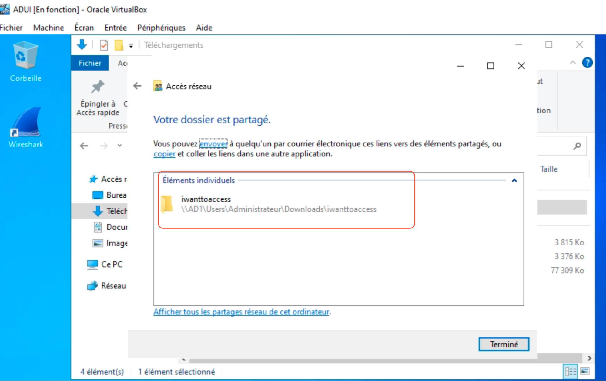 
Image 14

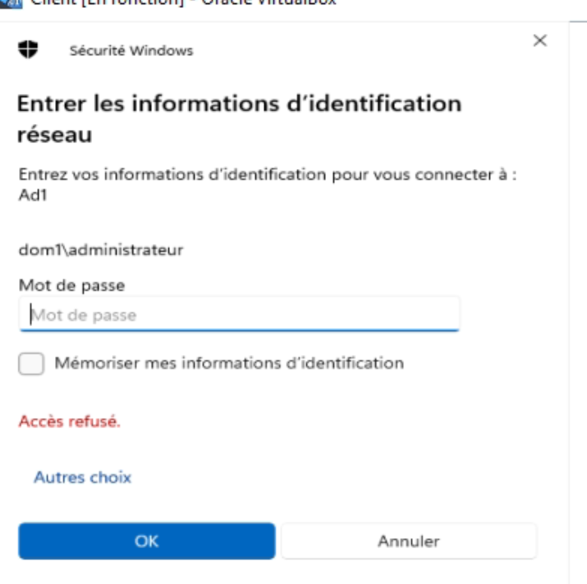
Image 15

Après avoir renseigné les credentials, nous nous rendons sur le répertoire via le chemin spécifié, nous y voyons bien notre répertoire “iwanttoaccess” conformément à l’image 16 ci dessous.   

 
Image 16

En ouvrant wireshark sur l’AD et filtrant par ***ntlmssp*** nous voyons les échanges NTLM entre l’AD et le client non joint au domaine (cf image 17\)  

Image 17

### **Explication des échanges :**  {#explication-des-échanges-:}

1. **NTLMSSP\_NEGOTIATE** (Paquets 248 et 289\)  
   	•	Il s’agit de la première étape du processus d’authentification NTLM.  
   	•	La station cliente envoie un message **Session Setup Request** pour indiquer qu’elle souhaite initier une session SMB2 avec le serveur en utilisant NTLM.  
   	•	Ce message contient les capacités de sécurité et le type de mécanisme d’authentification demandé (ici NTLMSSP).

	2\.	**Session Setup Response (Error: STATUS\_MORE\_PROCESSING\_REQUIRED)** (Paquets 249 et 290\)

	•	Le serveur répond avec un message indiquant qu’il nécessite plus d’informations pour compléter l’authentification.

	•	En NTLM, cela correspond à l’envoi d’un **challenge NTLM** (valeur aléatoire utilisée pour vérifier l’authenticité du client).

	3\.	**NTLMSSP\_AUTH** (Paquets 250 et 291\)

	•	Le client envoie ses informations d’authentification en réponse au challenge NTLM.

	•	Ces informations incluent un hachage de mot de passe combiné au challenge, ainsi que le **nom d’utilisateur** utilisé pour l’authentification.

	•	Les noms d’utilisateur sont visibles dans la colonne **Info** :

	•	CLIENT\\vboxuser dans le paquet 250 : vboxuser est le nom de l’utilisateur qui tente de s’authentifier.

	•	dom1\\administrateur dans le paquet 291: **dom1** est le nom du domaine Active Directory. **administrateur** est le compte d’utilisateur utilisé pour l’authentification. Ce compte est un administrateur du domaine.  
**Contexte général de l’authentification NTLM :**  
Le processus NTLM se déroule en trois étapes principales :

	1\.	**Négociation** (NEGOTIATE) : Le client indique les options d’authentification qu’il supporte.

	2\.	**Challenge** (STATUS\_MORE\_PROCESSING\_REQUIRED) : Le serveur envoie un challenge au client pour vérifier son identité.

	3\.	**Authentification** (AUTH) : Le client renvoie une réponse calculée avec son mot de passe, et le serveur valide cette réponse.

## **3\. Compte KRBTGT** {#3.-compte-krbtgt}

La réinitialisation du mot de passe KRBTGT force la régénération de nouveaux tickets Kerberos pour tous les utilisateurs, rendant inutiles les tickets obtenus avec des informations de sécurité précédemment compromises.

Voici un script pour réinitialiser le mot de passe du compte KRBTGT.

Commentaire : Ici nous avons créons une variable krbtgt qui contient la commande **GetADUser** qui permet d’obtenir le compte KRBTGT dans Active Directory. Ensuite avec la commande **Set-ADAccountPassword** on réinitialise le mot de passe pour ce compte

**Risque** : Invalidation de tous les tickets avant modification du mdp ce qui induit  une interruption de service pour les utilisateurs qui devraient s'authentifier à nouveau.  
**Impact** : Tous les utilisateurs doivent se reconnecter de nouveau avec un nouveau ticket TGT qui sera fourni.

Sur l’AD, nous utilisons klist pour afficher le cache des tickets du kerberos et nous les supprimons (conf image 14), puis sur le client nous demandons à recevoir un nouveau ticket TGT avec klist tgt (conf image 15\) ceci génère de nouveau ticket TGT.  
***NB** : Il faut noter que bien qu'il soit le serveur qui délivre les tickets, les tickets ne seront pas visibles dans son propre cache Kerberos (même avec klist). Toutefois, nous  pouvons vérifier les journaux d'événements pour observer les activités liées à l'émission de tickets Kerberos.*

Vérifions dans les journaux d'événements qu’un TGT a bien été généré grâce à la commande (voir image 16\) :   
Get-WinEvent \-FilterHashtable @{LogName="Security"; ID=4768,4769,4770} | Format-List  
Nous remarquons l’heure à laquelle le ticket a été fourni et aussi l’adresse de client qui a émis la requête et reçu le ticket (image 20 et 21\)

## 

## **4\. Politique de Sécurité**  {#4.-politique-de-sécurité}

La politique de sécurité que nous mettrons en place consiste à renouveler le mot de passe de KERBEROS tous les 180 jours de manière automatique (Task Scheduler).

1. ### Script  {#script}

   Écrire le script dans notepad et l'enregistrer, nous notons que le script doit être exécuté 2 fois de suite car ceci est recommandé. Nous sauvegardons le fichier sous **“mdptousles180jrs.ps1”**
   
   

3. ### Task Scheduler {#task-scheduler}

   Ensuite nous planifions une tâche (Planificateur de tâche) qui s'exécutera tous les 6 mois :   

   

   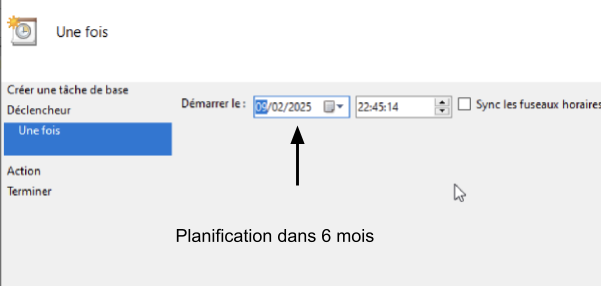

   

   

   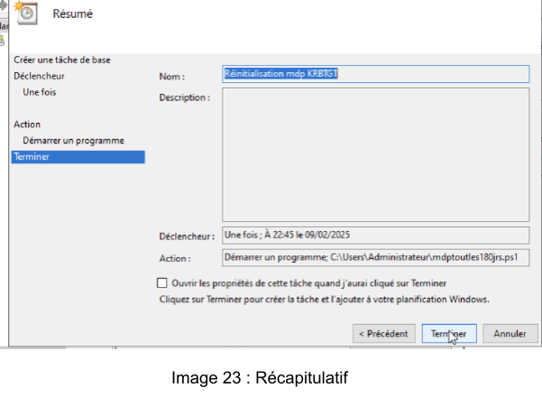   

5. ### Implication :  {#implication-:}

   1. Lorsqu'un attaquant parvient à déchiffrer le mot de passe du compte KRBTGT, il a la possibilité de générer des Golden Tickets qui lui permettent d'accéder à n'importe quelle ressource du domaine sans être détectable, même après la réinitialisation des comptes utilisateurs. Cela peut entraîner une rupture complète dans le domaine.  
   2. Effet d'une réinitialisation incorrecte :  
      En cas de réinitialisation incorrecte du mot de passe du compte KRBTGT (par exemple, sans effectuer une double réinitialisation), cela peut provoquer l'invalidation de tous les tickets Kerberos du domaine. Il sera donc nécessaire que tous les utilisateurs se reconnectent et réinitialisent leurs tickets, ce qui peut entraîner des perturbations importantes dans l'accès aux ressources du réseau.  
        
        
## **5\. Silo** {#5.-silo}

Dans notre infrastructure actuelle, nous avons identifié le besoin de sécuriser davantage l'accès administratif aux serveurs. Pour ce faire, nous proposons la mise en place :

1. **Des silos d’authentification** pour séparer les privilèges selon les catégories fonctionnelles.  
2. **Un serveur bastion** centralisé, utilisé comme unique point d'entrée pour l'administration des serveurs.

Cette solution vise à réduire les risques d'accès non autorisés, améliorer la gestion des droits et faciliter la traçabilité des connexions administratives.

### **Avantages de la solution**

1. **Renforcement de la sécurité** :  
   * Limitation des droits d'accès aux seuls administrateurs concernés.  
   * Restriction des connexions administratives via un serveur bastion.  
2. **Traçabilité accrue** :  
   * Journaux centralisés pour toutes les connexions et actions administratives.  
3. **Gestion simplifiée** :  
   * Regroupement des administrateurs par rôle fonctionnel (ex. réseau, fichiers).  
   * Moins de confusion et de duplication dans la gestion des droits.

### **Inconvénients potentiels**

1. **Complexité initiale** :  
   * Mise en place des silos et configuration des GPO nécessitent un effort de planification et d’exécution.  
2. **Point de défaillance unique** :  
   * Le serveur bastion devient critique. Sa panne pourrait empêcher l’administration des serveurs.

***NB: Pour le scénario du tp nous utilisons le même mdp pour les comptes (à ne pas faire dans un environnement réel)***

**5.1 Etapes d'implémentation**  
**Etape 1** : Création des Groupes fonctionnels

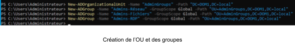

**Étape 2** : Création des comptes d’administration

## 

**Étape 3** : Création des silos d’authentification

**Étape 4** : Configurer le serveur bastion  
Activer RDP sur le serveur bastion  

Créer une nouvelle GPO  

Cela crée une GPO appelée **Restrictions RDP Bastion**.

Définition des groupes administrateurs autorisés à se connecter au Bastion : Admins-Réseau, Admins-Fichiers, Admins-RDP  

Ensuite nous bloquons l'accès RDP pour les autres utilisateurs  

Nous créons l’OU ServeurBastion on lie la GPO au serveur bastion et on applique avec **gpupdate /force**

## **6\. Autres Authentifications** {#6.-autres-authentifications}

1. ### Créons une GPO refusant les authentifications NTLM :  {#créons-une-gpo-refusant-les-authentifications-ntlm-:}

   ### Étapes pour créer une GPO pour interdire NTLM : {#étapes-pour-créer-une-gpo-pour-interdire-ntlm-:}

   Ouvrir la console de gestion des stratégies de groupe (Group Policy Management Console \- GPMC) :  
   * Cliquez sur Démarrer, tapez gpmc.msc et appuyez sur Entrée.  
   * Dans la console, développez votre domaine, cliquez avec le bouton droit sur **"Group Policy Objects"**, puis sélectionnez **"New"** pour créer une nouvelle GPO.

   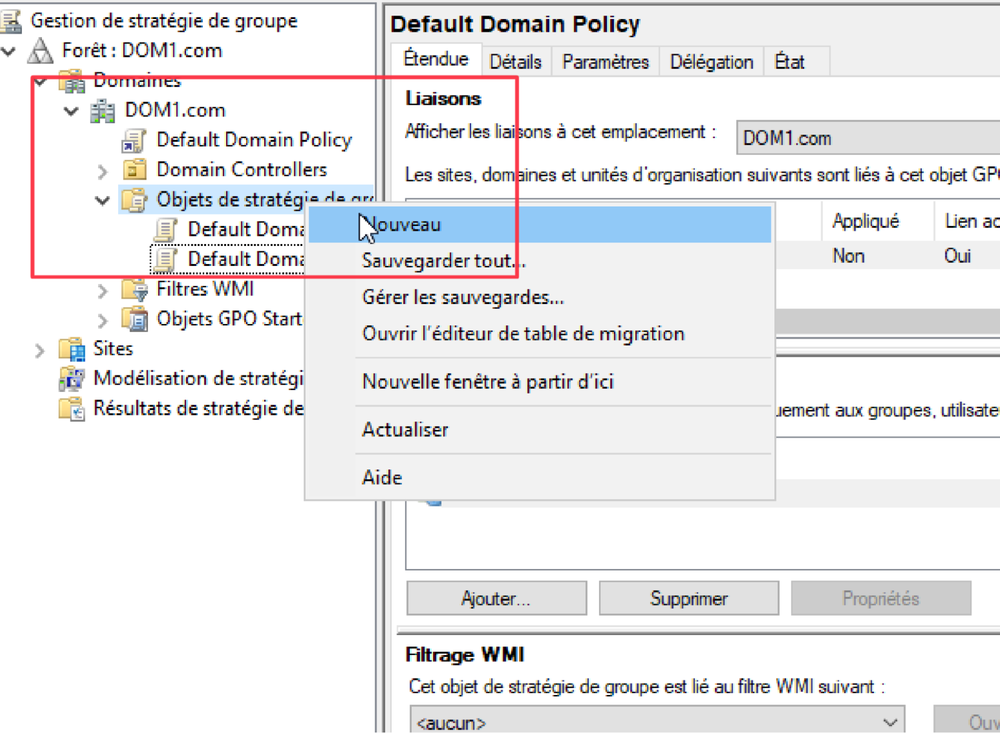

   * Nommez la GPO: **"Disable NTLM Auth"**
   
   

   * Cliquez avec le bouton droit sur la GPO nouvellement créée, puis cliquez sur **"Edit"**.  
   * Naviguez vers le chemin suivant : Computer Configuration \-\> Policies \-\> Windows Settings \-\> Security Settings \-\> Local Policies \-\> Security Options  
     Recherchez les paramètres suivants et configurez-les :  
     **"Network security: Restrict NTLM: Outgoing NTLM traffic to remote servers"** : Configurez cette option sur **"Deny all"** pour bloquer toutes les connexions NTLM sortantes.  
   
   

   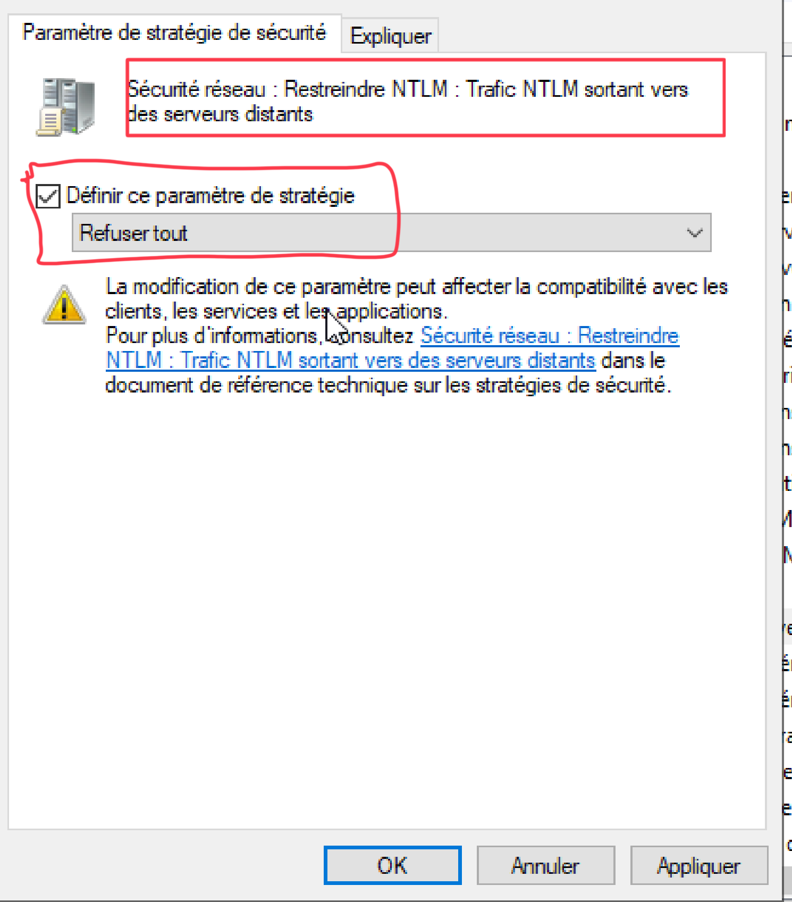
     **"Network security: Restrict NTLM: Incoming NTLM traffic"** : Configurez cette option sur **"Deny all"** pour refuser toutes les connexions NTLM entrantes.
   ![]
	 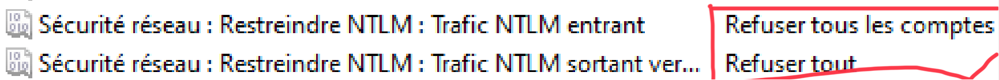
Après avoir configuré la GPO, nous pouvons la lier à tout le domaine.  
Nous faisons un clic droit sur notre domaine puis sélectionnons **"Link an Existing GPO"** et choisir la GPO **"Disable NTLM Authentication"** que nous avions créée.  

3. ### Test de l’outils ldp.exe :  {#test-de-l’outils-ldp.exe-:}

Nous saisissons l’ip de l’AD (ou son nom) ainsi que le port 389(non sécurisé)  
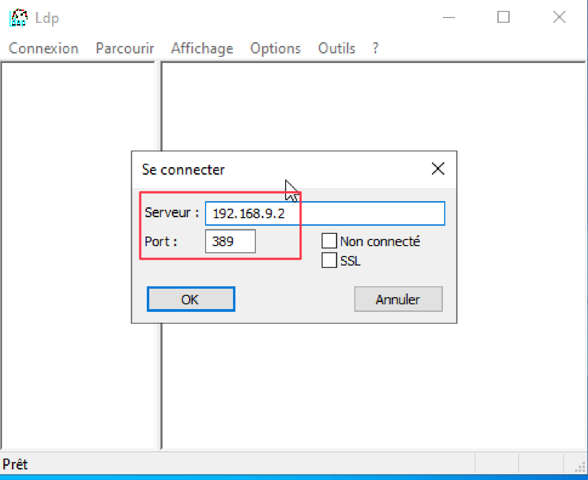

Après etre connecté, nous vouyons une confirmation de la connexion (image ci dessous)  

Ensuite nous lions   

Nous gardons les valeurs par défaut (dans ce cas; image ci dessous)  

Nous somme donc authentifié comme DOM1\\Administrateur

3. ###  Détail des deux étapes de la connexion à ldp.exe. {#détail-des-deux-étapes-de-la-connexion-à-ldp.exe.}

   **La première étape** consiste à se connecter au serveur LDAP en créant une session de communication en utilisant son nom d'hôte (ou adresse IP) et le port. L'outil permet d'établir un lien réseau avec un serveur LDAP ou un contrôleur de domaine Active Directory.  
     
   **La deuxième étape** consiste à authentifier l'utilisateur auprès du serveur LDAP. Il existe différentes méthodes pour accomplir cela : en utilisant une authentification simple (nom d'utilisateur/mot de passe) ou en utilisant des protocoles sécurisés tels que Kerberos ou NTLM via SASL (Layer Simple d'Authentification et de Sécurité).

4. ### Protocole utilisé  {#protocole-utilisé}

   LDAP est le protocole utilisé, il est utilisé pour effectuer des recherches, ajouter ou supprimer des objets dans la structure hiérarchique de l'annuaire Active Directory.  
     
   

   ## Conclusion  {#conclusion}

Au fil de notre progression, nous avons traversé plusieurs étapes cruciales pour configurer et gérer efficacement notre environnement Active Directory sur des machines virtuelles Windows Server. En partant des problèmes de connectivité réseau et de configuration d'IP statique, nous avons ajusté les paramètres de pare-feu et envisagé des solutions comme le DHCP pour améliorer la connexion. Ensuite, nous avons réussi à intégrer nos machines au domaine AD, en corrigeant des erreurs d'identifiants et en assurant que les bonnes informations étaient utilisées.

La gestion des comptes dans Active Directory nous a permis de mieux comprendre la création de silos d'authentification pour les différents serveurs et utilisateurs, tout en surmontant des obstacles liés à la spécification des DN. En parallèle, nous avons mis en place des politiques de sécurité solides, telles que la réinitialisation régulière du compte KRBTGT, renforçant ainsi la sécurité de notre domaine. Nos efforts avec les outils de diagnostic Kerberos nous ont aussi permis de mieux maîtriser l'authentification dans l'environnement. Grâce à ces expériences, nous avons significativement renforcé nos compétences dans la gestion d'un domaine Windows Server, en alliant sécurité et connectivité.
