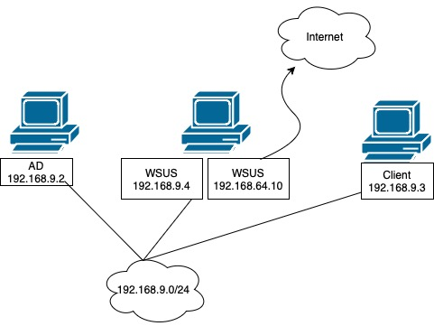
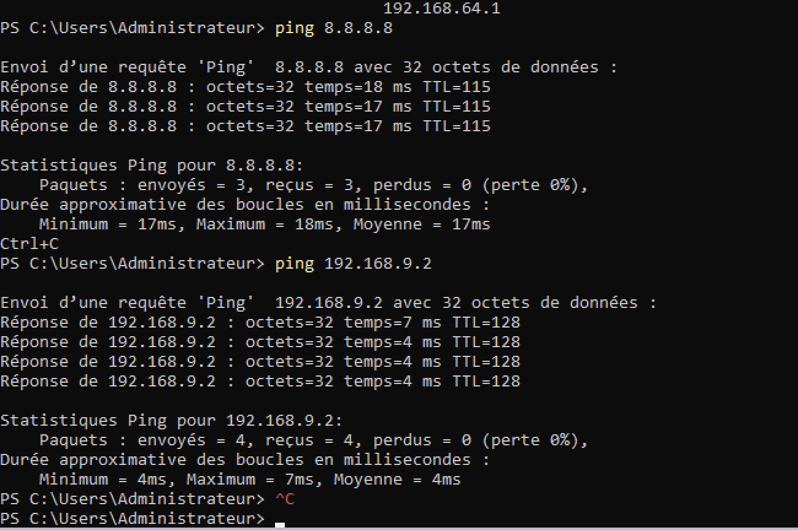
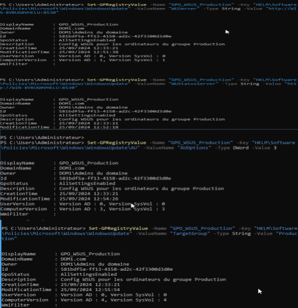
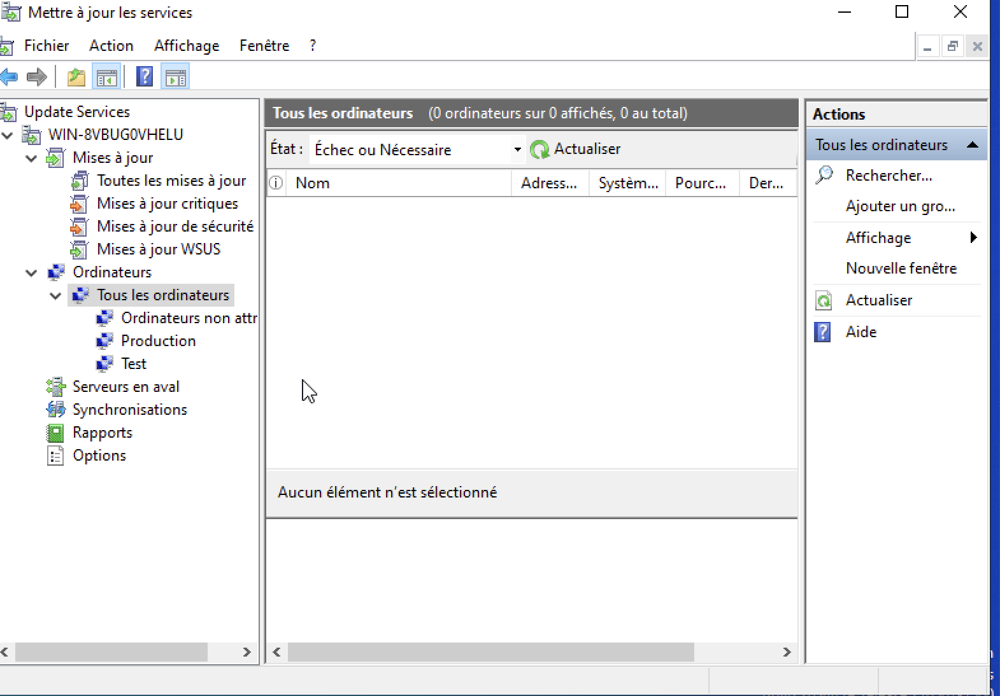

# Objectifs : 
* - Comment installer un service sur Windows. Même si des détails divergent, les services s'installent et se configurent de manière similaires.
* - Comment élaborer une stratégie (Voir le contexte global, les forces et les faiblesses du mise en oeuvre)
* - Les notions liées à la sécurité

TP 2 : Mise en place d’un Serveur WSUS

GAKOU Mohamed

22/09/2024

Compte-Rendu

### I. Prérequis	3
### II. Conception du schéma
### III Configuration basique
### IV. Organisation des mises à jour
### V. Politique de mise à jour
### VI. Sécurisation
### VII. Un peu d’imagination

 # 1. Prérequis

   Nous conservons l’AD du 1er TP (TP1-Authentification), ensuite nous installons une nouvelle VM qui sera notre serveur WSUS et joint au domaine AD; le client du travaux pratiques 1 est aussi maintenu et joint au domaine.

# 2.  Conception du schéma

***Figure 1: Schéma réseau illustrant le client, l’ AD et WSUS.***

***Figure 2: Le fonctionnement de WSUS serveur.***

WSUS(Windows Server Update Services) est un service essentiel pour la gestion centralisée des mises à jour Microsoft au sein d’un réseau d’entreprise. Il facilite la synchronisation, l’approbation, la gestion et le suivi des mises à jour, ce qui permet de renforcer la sécurité, d’améliorer la stabilité des systèmes, tout en optimisant l’utilisation de la bande passante Internet.

 # 3.  Configuration basique {#configuration-basique}

     
   Le serveur WSUS fonctionne sur un système Windows Server spécialement dédié   
   cette tâche.  
   Après avoir configuré les adresses ip et faire les pings nécessaires comme c’est indiqué dans la figure 3, pour installer le serveur WSUS, la première étape consiste à lancer la commande suivante:  
   **Install-WindowsFeature \-Name UpdateServices** comme l'indique la figure 4\.  
   
   

   ***Figure 3: Tester la connectivité***

***Figure 4: Installation du serveur WSUS***   
   

Pour vérifier que le serveur WSUS est bien installé on a exécuté la commande:   
**Get-Service \-Name WsusService** et comme indique la figure 5 que le serveur est bien installé.  

     
***Figure 5: Vérification de l’Installation WSUS***

    

  
 ***Figure 6: Installation des fonctionnalités*** 
 
Puis comme indique la figure ci-dessus(figure 6), on passe à la machine contenant notre Active Directory pour ajouter de nouvelles fonctionnalités.  
La figure 7 nous montre les fonctionnalités ajoutées.  
   
***Figure 7: Les fonctionnalités ajoutés***

 
***Figure 8: Affichage des synchronisations***

Après avoir ajouter les fonctionnalités, nous synchronisons l’AD au serveur WSUS grâce à **mmc.exe**, la figure 8 nous montre l’affichage des synchronisations faites.

 # 4. Organisation des mises à jour  {#organisation-des-mises-à-jour}

Dans notre stratégie de gestion des mises à jour via WSUS, nous divisons les machines en deux groupes afin de tester les mises à jour avant de les déployer sur l'ensemble du réseau. Le groupe Test contient une machine de test, comme un serveur non critique ou un poste de travail. Ce groupe nous permet de vérifier si les mises à jour causent des problèmes ou s’installent correctement. Le groupe Production inclut toutes les autres machines. Ces machines ne recevront les mises à jour qu’après validation dans le groupe Test.

Pour gérer les mises à jour, nous commençons par synchroniser les mises à jour disponibles avec Microsoft Update, ce qui peut être fait automatiquement ou manuellement. Les mises à jour sont d'abord approuvées pour le groupe Test. Après validation, nous les approuvons pour le groupe Production. Si une mise à jour pose problème dans le groupe Test, nous pouvons la refuser ou la retirer, évitant ainsi tout impact sur la production.

Le planning que nous suivons est simple. Durant la première semaine, nous synchronisons les mises à jour et les testons sur le groupe Test pendant un ou deux jours. Si tout se passe bien, nous approuvons les mises à jour pour le groupe Production la semaine suivante, en surveillant les résultats pendant une semaine supplémentaire.

Nous appliquons en priorité les mises à jour de sécurité, qui sont essentielles pour protéger nos systèmes, ainsi que les mises à jour critiques et cumulatives, qui corrigent des bugs et améliorent la stabilité. Nous excluons les mises à jour facultatives et les nouvelles versions majeures pour limiter les risques.

Enfin, nous vérifions chaque semaine l’état des mises à jour installées à travers la console WSUS et les rapports. Cela nous permet de suivre les mises à jour réussies ou échouées. Nous avons configuré les mises à jour du groupe Test pour être appliquées automatiquement, tandis que celles du groupe Production sont appliquées manuellement, garantissant un contrôle total avant leur déploiement sur les systèmes critiques.

# 5. Politique de mise à jour {#politique-de-mise-à-jour}

Nous commençons donc à mettre en place l’organisation proposée en créant les 2 GPOs sur le serveur AD comme ci dessus: 1 GPO Test et 1 GPO Production   
  
***Figure 9: Création des GPOs Test & Production***

Nous passons donc à la mise en place des groupes Test & Production sur notre serveur WSUS (si ils n’existent pas d’où le ***if***)

  
***Figure 10: Mise en place des Groupes Test et Production***

A  partir de la commande **Set-GPRegistryValue** *(cf image 11 à 15\)*, nous avons configuré des stratégies de groupe (GPO) pour assigner les paramètres de mises à jour automatiques via WSUS. Pour le **groupe Test**, nous avons défini les mises à jour automatiques avec l’installation immédiate des mises à jour (option AUOptions \= 4). Pour le **groupe Production**, nous avons configuré le téléchargement des mises à jour, mais avec une notification pour installation manuelle (option AUOptions \= 3). Ces GPOs ont ensuite été liées aux Unités Organisationnelles (OU) correspondantes (OU\_TEST & OU\_PRODUCTION), permettant ainsi de différencier le comportement des mises à jour selon le groupe d’ordinateurs. Nous avons forcé l’application des stratégies avec la commande gpupdate /force et vérifier leur bonne application en générant des rapports.

***Figure 11: Configuration des paramètres de strategies pour le groupe TEST***

***Figure 12: Configuration des paramètres de strategies pour le groupe PRODUCTION***

  
***Figure 13: Affichage des OU (déja créer)***

  
***Figure 14: Liaison entre les GPO et les OUs***  

  
***Figure 15: Vérification depuis l’AD de la présence des organisations mise en place***

# 6.  Sécurisation {#sécurisation}

     
   Pour assurer une sécurité robuste du serveur WSUS et optimiser la gestion des mises à jour, il est crucial de mettre en place plusieurs dispositifs complémentaires.  
   D’abord **l’authentification forte** est une priorité. Cela inclut l’utilisation de comptes disposant de droits limités et la configuration d’une authentification multi-facteurs (MFA) pour renforcer l’accès au serveur. Cette approche réduit les risques d’usurpation d’identité et d’accès non autorisés. Par ailleurs, **la** **protection des données** échangées entre le serveur et les clients doit être assurée par le chiffrement via des certificats SSL. Ce mécanisme permet de protéger la confidentialité et l’intégrité des informations sensibles en transit. En outre, il est tout aussi important de veiller à la sécurité de la base de données WSUS elle-même en y appliquant un chiffrement local, réduisant ainsi les risques en cas d’accès direct au serveur.  
   La mise en place d’un **programme de sauvegardes régulières** est également indispensable.Ces sauvegardes doivent inclure non seulement la base de données, mais aussi les configurations spécifiques et les métadonnées, tout en étant stockées dans des emplacements sécurisés, séparés de l'infrastructure principale. Les rapports générés par ces outils permettent de planifier proactivement l’application des correctifs et des mises à jour de sécurité.  
   Enfin, l’élaboration d’un **Plan de Reprise d’Activité (PRA)** est essentielle**.** Ce document stratégique doit prévoir les étapes de récupération et de restauration du service en cas de panne critique ou d’incident majeur, afin de minimiser le temps d’interruption et d’assurer une reprise rapide des opérations.  
   En combinant ces différentes stratégies, le serveur WSUS sera mieux protégé contre les menaces internes et externes tout en garantissant une continuité opérationnelle optimale.  
   

 # 7. Un peu d’imagination {#un-peu-d’imagination}

Exemple du script pour affecter des postes à des groupes WSUS et vérifier leur état de mise à jour: 

\# Nom du groupe WSUS auquel affecter les postes  
$WsusGroupName \= "Postes\_Utilisateurs"

\# Liste des postes à vérifier  
$Postes \= @("Poste1", "Poste2", "Poste3")

\# Adresse du serveur WSUS  
$WsusServer \= "NomServeurWSUS"

\# Se connecter au serveur WSUS  
$Wsus \= \[Microsoft.UpdateServices.Administration.AdminProxy\]::GetUpdateServer($WsusServer, $false)

\# Vérifier et affecter les postes aux groupes  
foreach ($Poste in $Postes) {  
    try {  
        $ComputerTarget \= $Wsus.GetComputerTargetByName($Poste)  
        if ($ComputerTarget \-ne $null) {  
            $Group \= $Wsus.GetComputerTargetGroups() | Where-Object { $\_.Name \-eq $WsusGroupName }  
            if ($Group) {  
                $ComputerTarget.ChangeComputerTargetGroup($Group)  
                Write-Output "Poste $Poste ajouté au groupe $WsusGroupName."  
            } else {  
                Write-Output "Groupe $WsusGroupName introuvable sur le serveur WSUS."  
            }  
        } else {  
            Write-Output "Poste $Poste introuvable sur le serveur WSUS."  
        }  
    } catch {  
        Write-Output "Erreur lors de la vérification ou de l'affectation du poste $Poste : $\_"  
    }  
}

\# Vérifier l'état des mises à jour  
$ComputerTargets \= $Wsus.GetComputerTargets()  
$Report \= @()

foreach ($Computer in $ComputerTargets) {  
    $UpdateSummary \= $Computer.GetUpdateInstallationSummary()  
    $Report \+= \[PSCustomObject\]@{  
        "Nom du poste"    \= $Computer.FullDomainName  
        "Mises à jour approuvées" \= $UpdateSummary.InstalledNotApplicablePercentage  
        "Mises à jour manquantes" \= $UpdateSummary.MissingPercentage  
        "Mises à jour échouées"   \= $UpdateSummary.FailedPercentage  
    }  
}

\# Générer le rapport CSV  
$Report | Export-Csv \-Path "C:\\Rapport\_WSUS.csv" \-NoTypeInformation  
Write-Output "Rapport généré : C:\\Rapport\_WSUS.csv"

Exemple du script pour vérifier l’état d’installation d’une KB passée en paramètre:

param(  
    \[string\]$KBNumber  
)  
\# Vérifier si le paramètre est fourni  
if (-not $KBNumber) {  
    Write-Host "Veuillez passer un numéro de KB en paramètre. Exemple : .\\Check-KB.ps1 \-KBNumber KB5005698"  
    exit  
}

\# Rechercher la KB dans la liste des mises à jour installées  
$KBInstalled \= Get-HotFix | Where-Object { $\_.HotFixID \-eq $KBNumber }

if ($KBInstalled) {  
    Write-Host "La KB $KBNumber est installée."  
} else {  
    Write-Host "La KB $KBNumber n'est pas installée."  
}
