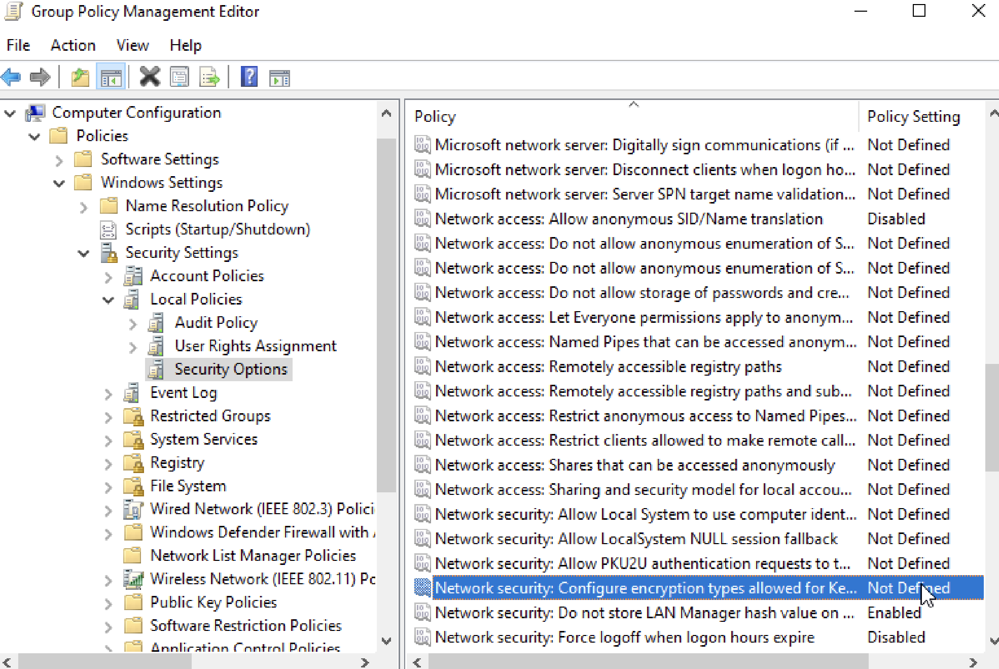
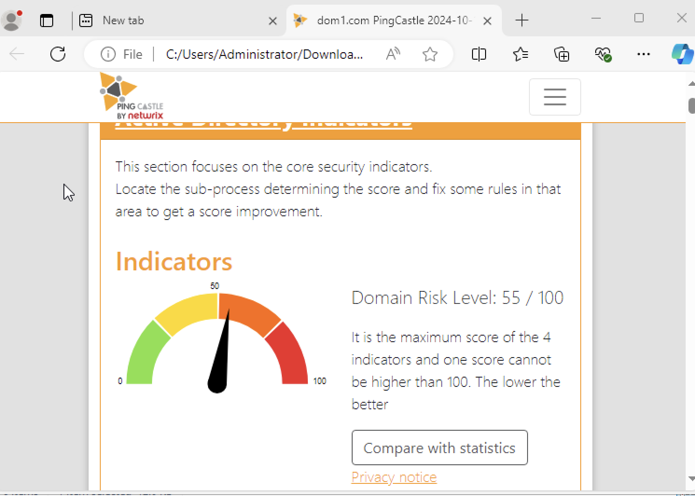
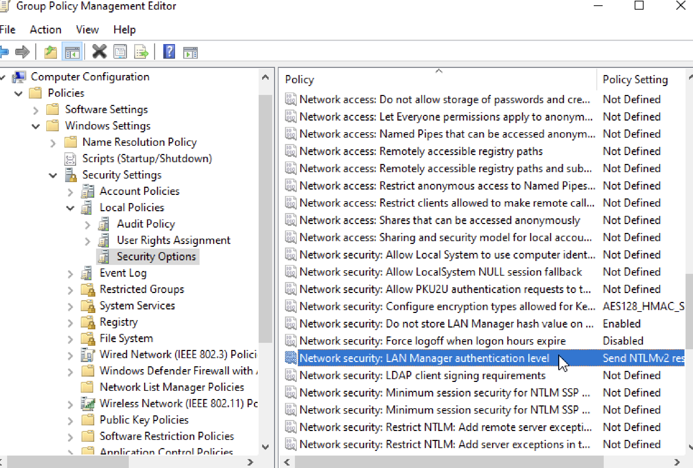
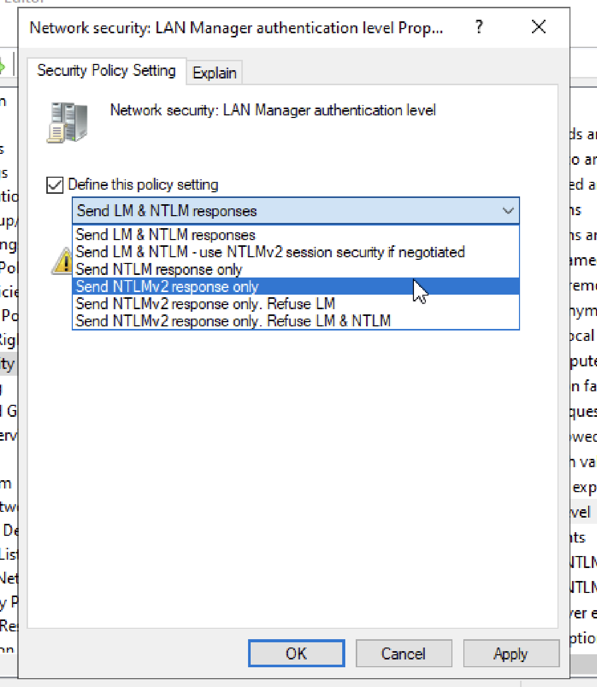
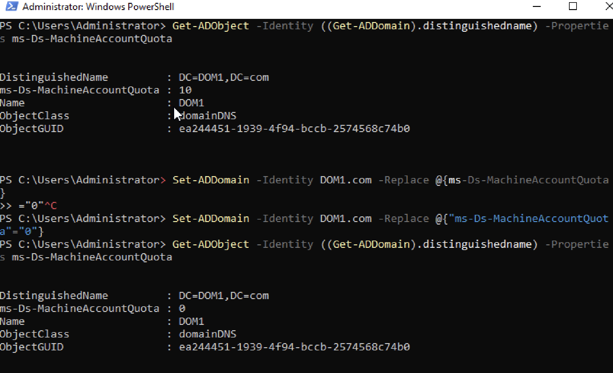
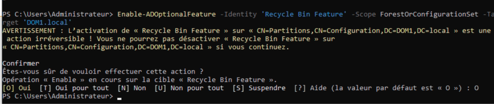
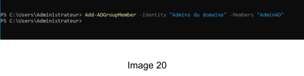
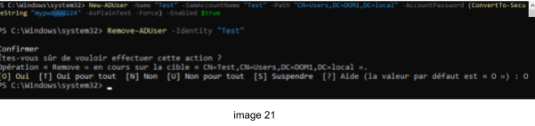
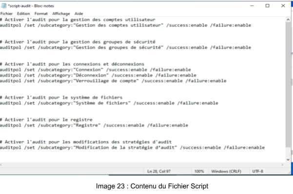

# Objective: Understand securing an Active Directory server
## SKILLS :
- Découvrir la réalisation d’un audit de sécurité sur un AD
- Maitriser les attributs d’un compte
- Maitriser les GPOs liées à WSUS

# TP 3 : Sécurisation 

GAKOU Mohamed et Khaled Salah

9/12/2024

Compte-Rendu

Sommaire

[**I. Conception du schéma de votre infrastructure:	3**](#conception-du-schéma-de-votre-infrastructure:)

[**II. Stratégie de groupe	4**](#stratégie-de-groupe)

[**III. Sécuriser les comptes:	7**](#sécuriser-les-comptes:)

[**IV. Les scripts d’administration:	8**](#les-scripts-d’administration:)

[**V. Audit de sécurité:	11**](#audit-de-sécurité:)

1. ## **Conception du schéma de votre infrastructure:** {#conception-du-schéma-de-votre-infrastructure:}

 

***Schéma d’un réseau sécurisé***

Pour renforcer la sécurité du domaine, le contrôle de domaine 2 ainsi que le serveur de stockage ont été repositionnés dans un réseau privé isolé. Cette reconfiguration place ces serveurs dans une zone protégée, séparée du reste de l’infrastructure, minimisant ainsi leur exposition à d’éventuelles menaces externes. En les confiant à un réseau restreint et inaccessible depuis l'extérieur, les risques d’attaques ou de compromission sont réduits. De cette manière, le cloisonnement des ressources sensibles assure une meilleure confidentialité des données tout en limitant la surface d’attaque potentielle.

2. ## **Stratégie de groupe** {#stratégie-de-groupe}

   Activation de l’AES dans ***GPO Editor \> Policies \> Windows Settings \> Security setting \> Local Policies \> Security Options.***  
    

***Selection : Configure encryption types allowed for kerberos***

***Selection : AES128\_HMAC\_SHA1***

Ensuite nous faisons un **klist** après une déconnexion pour voir les tickets en cache (cf à l’image ci dessous)

**Affichage des tickets klist**

Sur l’image ci-dessus, la valeur du paramètre ms-Ds-MachineAccountQuota désigne  le nombre de comptes utilisateurs que peut créer un utilisateur non administrateur. Par défaut, la valeur est fixée à 10\.

3. ## **Sécuriser les comptes:** {#sécuriser-les-comptes:}

**Le script :**

**\# Import du module Active Directory**

Import-Module ActiveDirectory

**\# Configuration des variables**

$smtpServer \= "[smtp.votreentreprise.com](http://smtp.serveurmail.com/)"  
$smtpPort \= 587  
$senderEmail \= "admin[@monstartup.com](mailto:admin@votreentreprise.com)"  
$receiverEmail \= "mkhaled[@monstartup.com](mailto:admin@votreentreprise.com)"  
$expireDate \= (Get-Date).AddDays(-30) 

**\# Récupération des comptes d'utilisateurs expirés en fonction de la date**   
**d'expiration**

$expiredUsers \= Get-ADUser \-Filter {Enabled \-eq $true \-and AccountExpirationDate \-le $expireDate}

**\# Suppression des comptes d'utilisateurs expirés**

$expiredUsers | ForEach-Object {  
    Remove-ADUser \-Identity $\_ \-Confirm:$false  
 }

**\# Envoi d’un e-mail pour avertir de la suppression des comptes expirés**

$subject \= "Comptes expirés supprimés"  
$body \= "Les comptes d'utilisateur expirés ont été supprimés avec succès."  
Send-MailMessage \-SmtpServer $smtpServer \-Port $smtpPort \-From $senderEmail \-To $recipientEmail \-Subject $subject \-Body $body

**\# Affichage d’un message de confirmation**

Write-Host "Script terminé. Les comptes d'utilisateur expirés ont été supprimés, et un e-mail de notification a été envoyé."

4. ## **Les scripts d’administration:** {#les-scripts-d’administration:}

1. **Emplacement**

Pour sécuriser le script, nous pouvons le garder sur notre machine AD car ceci est accessible uniquement au administrateur. Toutefois, nous pouvons aussi mettre en place un fichier partagé avec accès restreint  sur un serveur.

Seuls les administrateurs ou les utilisateurs autorisés devraient pouvoir lire, exécuter ou modifier ces scripts. Cet  emplacement centralisé facilite la gestion des scripts et les mises à jour.

2. **Mise en place**  
   Nous utilisons le planificateur de tâche pour exécuter le script une fois par semaine tous les dimanches. Nous donnons le nom du script, le trigger sera l'exécution une tous les dimanches et l’action sera l'exécution du script (cf aux images ci dessous)

***Création de la tâche*** 

***Création du Trigger (tous les dimanches)***

***Mise en place de l’action effectuée***

5. ## **Audit de sécurité:**  {#audit-de-sécurité:}

Le score actuel du pingcastle montre un score de 55 (cf image ci dessous). 

***Score pingcastle***

La résolution du premier problème consiste à autoriser le NTLMv2 et d’interdire LM et NTLM. Pour cela nous nous rendons dans ***GPO Editor \> Policies \> Windows Settings \> Security setting \> Local Policies \> Security Options.*** Dans  Network security: LAN Manager authentication level, nous sélectionnons “Send NTLMv2 response only. Refuse LM & NTLM” (comme dans les images ci dessous) 

***Autoriser NTLMv2***

***Autoriser NTLMv2 seulement***

### Problème ms-DsMachineAccountQuote

La résolution du deuxième problème consiste à interdire la création de comptes utilisateurs à un utilisateur non administrateur. Ce qui revient à mettre à 0 la valeur du **ms-Ds-MachineAccountQuota** (cf à l’image dessous)

***Changement de valeur du ms-Ds-MachineAccountQuota***

### Stratégie du mots de passe du contrôleur de domaine

Le problème décrit concerne la politique de mot de passe du domaine, qui permet peut-être des mots de passe de longueur inférieure à 8 caractères, ce qui peut poser un risque de sécurité. Voici comment nous l’avons résolu :

* Dans **GPMC**, **Forêt** \> **Domaines** \> **DOM1** \> **Objets de stratégie de groupe**, puis  bouton droit sur **Default Domain Policy** et **Modifier**.  
  * Dans **Configuration ordinateur** \> **Paramètres Windows** \> **Paramètres de sécurité** \> **Stratégies de compte** \> **Stratégie de mot de passe**.  
  * On modifie  la **longueur minimale du mot de passe** pour **8 caractères** ou plus.  
  * Ensuite on valide avec **gpupdate /force.**  Cf à l’image ci-dessous

### Recycle bin

L’objectif est de s’assurer que Recycle Bin feature est activé.

Pour cela, on fait : 

**Enable-ADOptionalFeature \-Identity 'Recycle Bin Feature' \-Scope ForestOrConfigurationSet \-Target 'DOM1.local'**

Puis on vérifie avec **Get-ADOptionalFeature \-Filter {Name \-eq "Recycle Bin Feature"}** si IsDisableable \= false

### Sauvegarde AD

Le problème concerne la nécessité de vérifier que les sauvegardes de l’Active Directory (AD) sont à jour et réalisées selon les normes recommandées par Microsoft.

Tout d’abord, on crée une partition NTFS  qui sera dans le chemin C:\\PNTFS qui sauvegardera l’AD.(cf sur l’image ci-dessous)

Puis nous passons à l’installation de la fonctionnalité **Sauvegarde Windows Server dans Outils et fonctionnalité**

On commence alors la sauvegarde grâce à la commande **: wbadmin start systemstatebackup \-backuptarget:C:\\PNTFS:** (Cf image 18\)

### Administrateur natif

Le problème décrit concerne l'utilisation du compte Administrateur natif (le compte Administrateur intégré), qui représente un risque de sécurité s'il est utilisé de manière routinière ou mal sécurisé. 

Tout d’abord, on crée un user AdminAD qui aura tous les droits de l’administrateur (cf image 19 et 20 )

On se connecte maintenant au nouveau compte pour tester s’il a tous les droits de l’administrateur

Nous pouvons vérifier qu’il appartient au groupe **Admins Domain** mais nous allons juste vérifier les droits effectifs en faisant un test basique (ajout et suppression de compte) cf image 21\. 

Pour des mesures de sécurité, nous modifions le nom de l’administrateur pour AdminBackup rendant son ciblage plus difficile pour les attaques automatisées.

Puis nous désactivons le compte admin principal

*NB: **PingCastle** s'appuie sur l'attribut **LastLogonTimestamp**, qui peut avoir une latence de réplication allant jusqu'à **14 jours**. Cela signifie que même si le compte est désactivé, PingCastle peut encore le considérer comme "actif" pendant ce délai.*

**Activation des events key**

L'objectif principal ici est d'activer les **événements clés** pour garantir une collecte efficace des informations critiques sans surcharger le système avec des journaux inutiles. Les événements clés correspondent aux catégories essentielles recommandées par des experts comme **adsecurity.org**.

Les événements clés à activer : 

Modifications des comptes,Connexions et déconnexions;Accès aux ressources sensibles et enfin Changements de politique et privilèges

Conformément à l’image 23, nous avons créé un script qui s’occupe de l’activation Echec/Succes des audits que nous exécutons dans Powershell

**Désactivation du Service Spooler**

Ce processus est souvent utilisé pour corriger des vulnérabilités ou des erreurs liées au service Spooler. Dans le contexte AD, cela peut être lié à un problème de performances ou de sécurité causé par des imprimantes mal configurées dans un domaine AD.  
Pour résoudre le problème, nous arrêtons le services et empêchons son démarrage automatique et application des stratégies de groupe conformément à l’image ci-dessous

