This is a complete lab project scenario to implement and experiment with networking, security, and administration concepts using OPNsense, Suricata, and virtual machines. This project simulates an enterprise environment with segmented networks, services, and a secure infrastructure.

## Lab Project Scenario: Secure Infrastructure for a Small Business

### Lab Objective: 

Create a secure and functional enterprise network infrastructure including:
1. A firewall/router (OPNsense) to manage network traffic.
2. Isolated network segments (LAN, DMZ, WAN).
3. An IDS/IPS engine (Suricata) to detect and prevent threats.
4. A secure web server in a DMZ.
5. VPN access for a remote user.

### Network Topology:
1. WAN: Internet connection (provided by the host network or a simulator).
2. LAN: Local area network for employees 
3. DMZ: Demilitarized zone hosting a public web server
4. VPN: Secure access for remote users.

# Configuration

Here we have our OpnSense Machine that has 3 interfaces : 
* WAN Interface 10.0.2.15 : The IP is given automaticlly via DHCP by the host machine 
* LAN Interface 192.168.1.1 : The LAN interface which is set statically is the local network for client computers. In VirtualBox, we choose the **Internal network mode**
* DMZ 192.168.2.1 : Dematerilized zone hosting a ubuntu web server

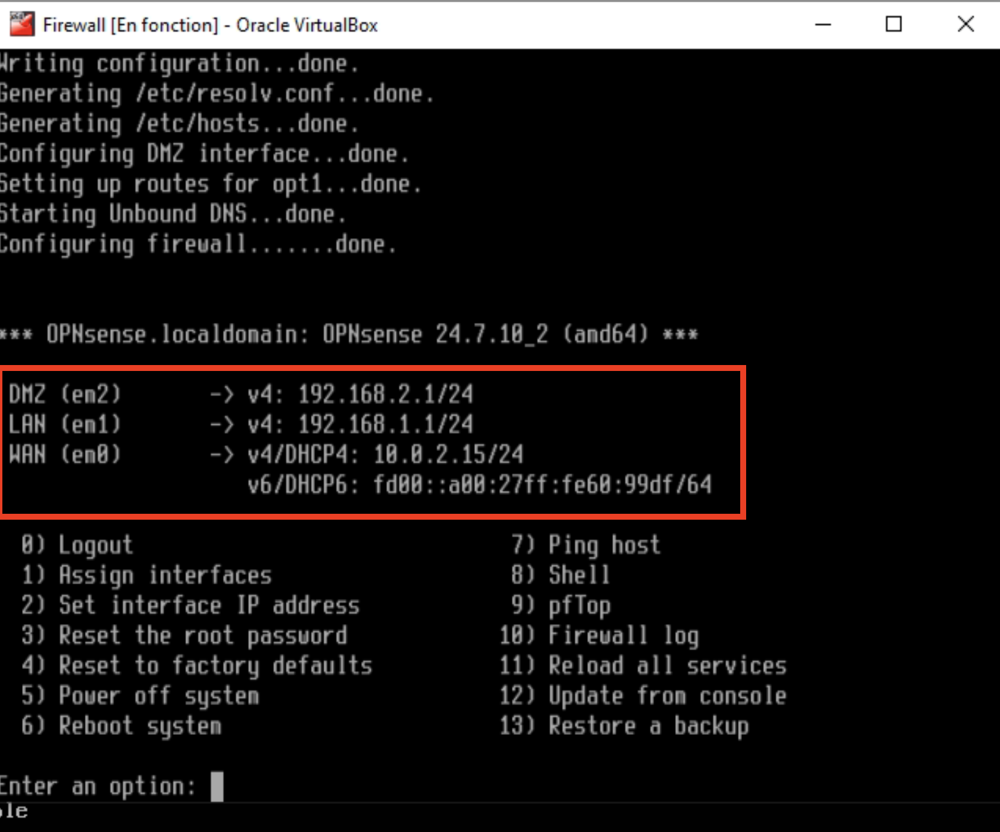

After the OpenSense Machine we set now a Kali machine which is inside the 192.168.1.0/24 (LAN network). In Virtual box we select the **Internal Network**. We will use this kali machine for accessing the OpnSense Interface at the 192.168.1.1 ip address

But We have to configure this Kali machine to be inside the LAN network, and to do so we have to open de **interface file** which allow us to set IPs on Kali.

We open that file with the **sudu cat /etc/network/interfaces, as bellow

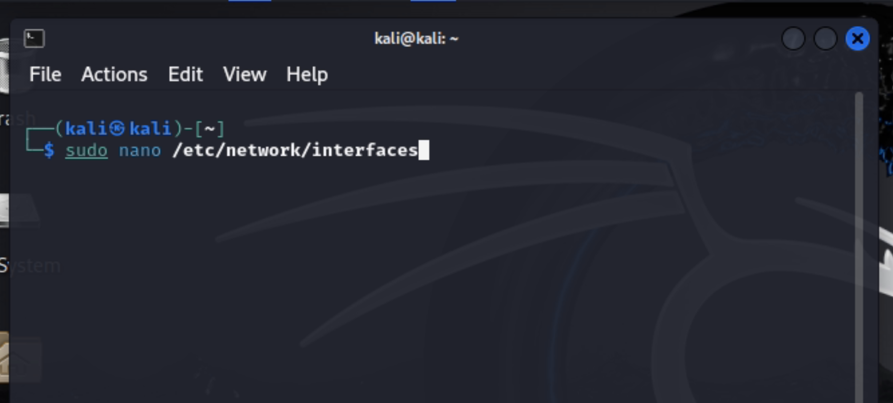

We edit this file by adding our IP address (on eth1 interface, the ip and the mask) as shown bellow

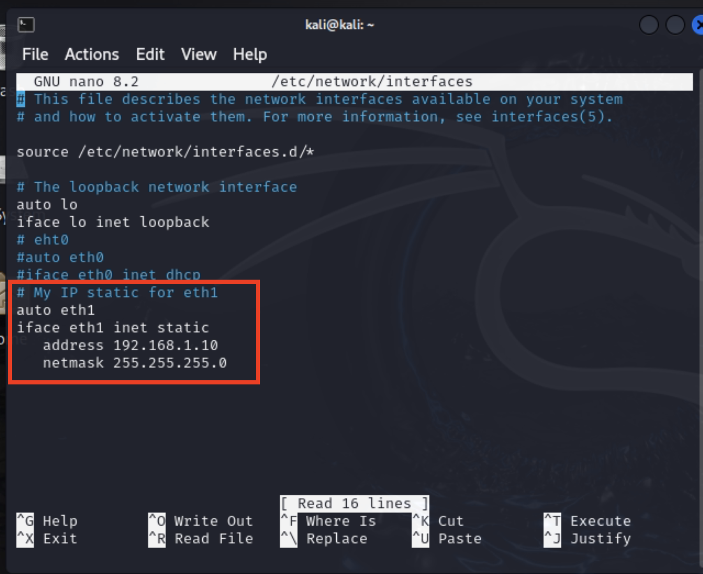

So our Kali Machine has 192.168.1.10/24 address 

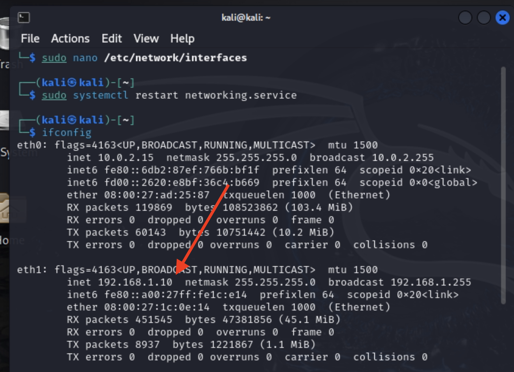

Let's try a ping toward our OpnSense LAN interface 
* 192.168.1.10 (Kali machine) -> 192.168.1.1 (OPNSense LAN interface)

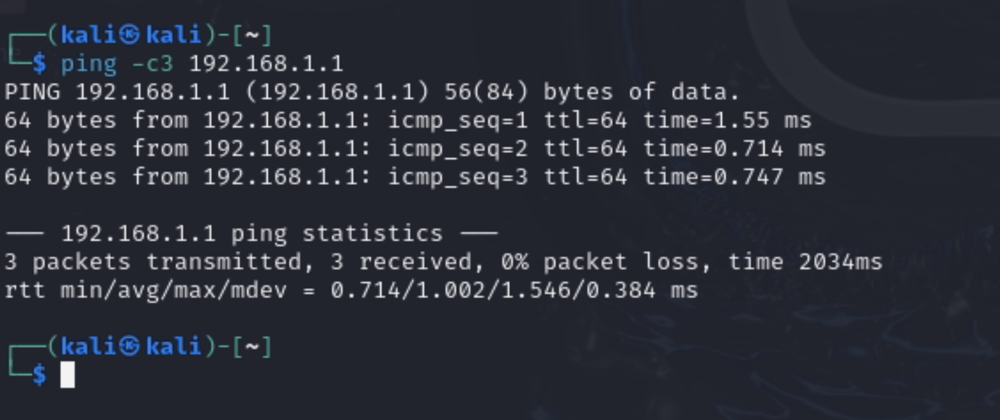

## OpnSense GUI interface

Now we have set the IP for Kali, let's connect to the Opnsense GUI Portals by searching its IP addresss on firefox, then we enter the username and password set for Opnsense and the Login button, as shown bellow

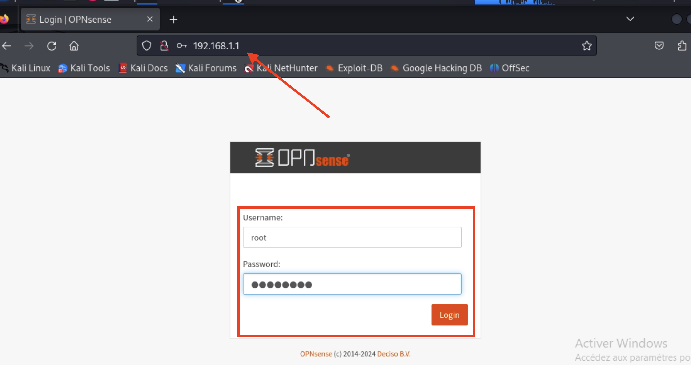

Under the "Interfaces" tab we can see the 3 interfaces
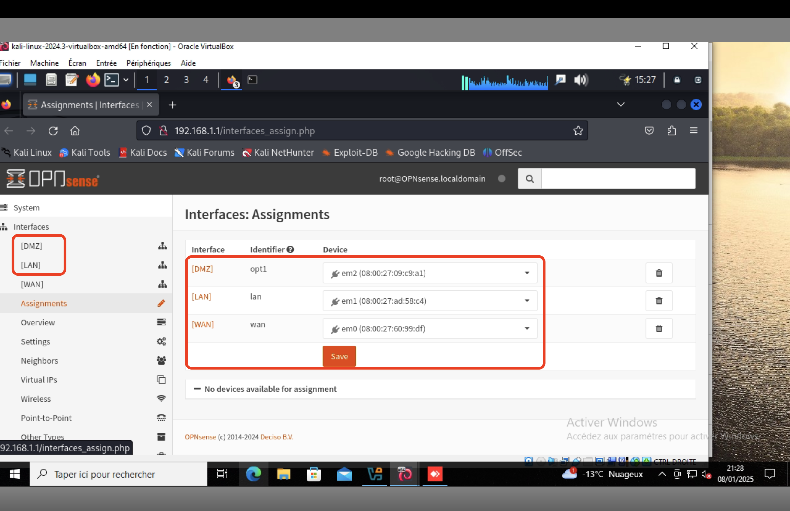

## Allowing Ping to the DMZ Interface on OPNsense

## **Context**
By default, new interfaces like the **DMZ** in OPNsense are protected by restrictive firewall rules. This means that **all incoming and outgoing traffic** is blocked unless specific rules are created to allow certain types of communication.

To enable **ping (ICMP)** to the DMZ interface, a dedicated rule must be added to the firewall. This allows the use of ping to verify network connectivity and troubleshoot potential issues.

---

## **Steps to Configure the DMZ Firewall**

### **1. Verify Default Rules**
Navigate to **Firewall > Rules > DMZ**:
   - As shown in the screenshot, no rules are defined for the DMZ interface by default, which blocks all incoming traffic.
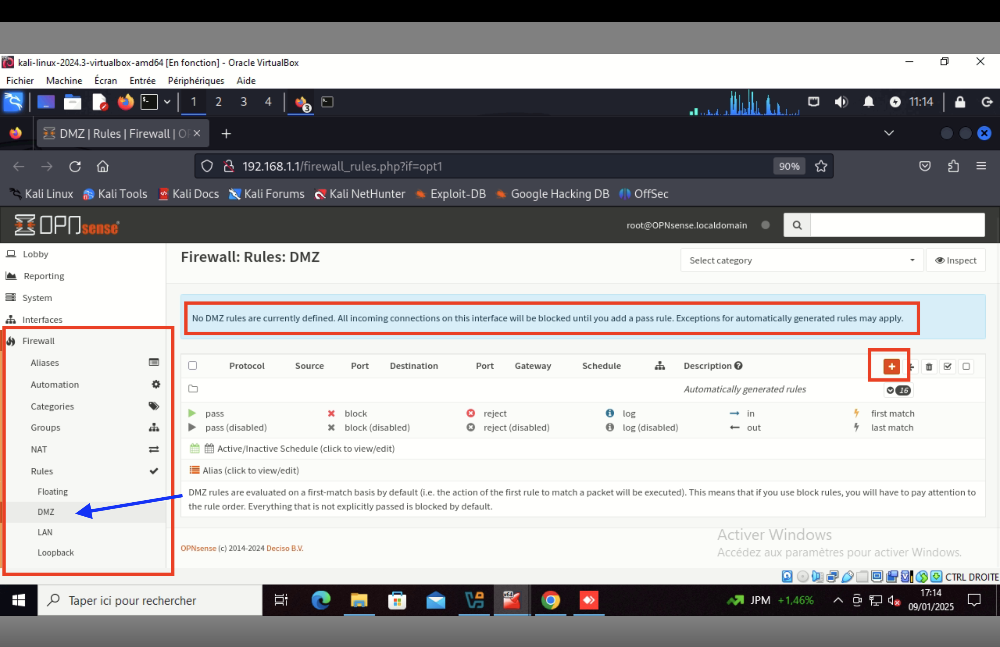
---

### **2. Add a Rule to Allow ICMP**
To allow ping to the DMZ interface:
1. Click on the **+ Add** button to create a new rule.
2. Configure the rule with the following settings:
   - **Action**: `Pass` (allow traffic).
   - **Interface**: `DMZ`.
   - **Direction**: `in` (incoming traffic to the DMZ interface).
   - **TCP/IP Version**: `IPv4`.
   - **Protocol**: `ICMP` (to allow only ping traffic).
   - **Source**: `DMZ net` (represents all devices in the DMZ network).
   - **Destination**: `DMZ net` (the IP address of the DMZ interface).
3. Click **Save** to save the rule.
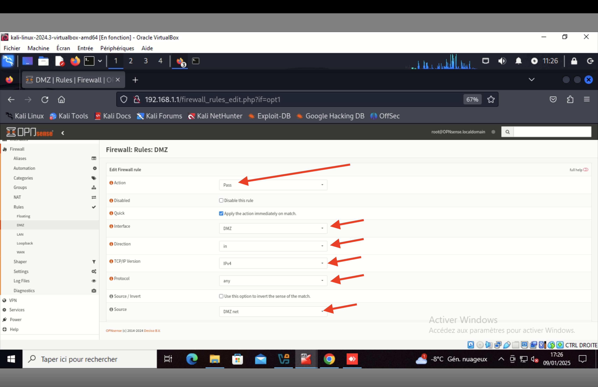
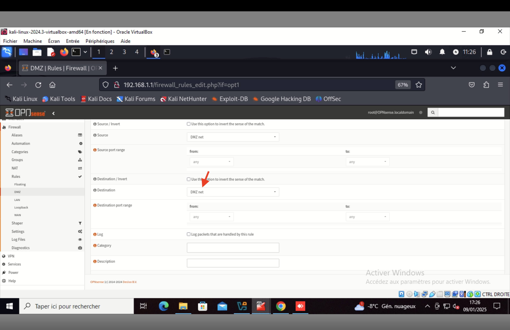
---

### **3. Apply Changes**
After creating the rule, click **Apply Changes** at the top of the page to activate the new configurations.
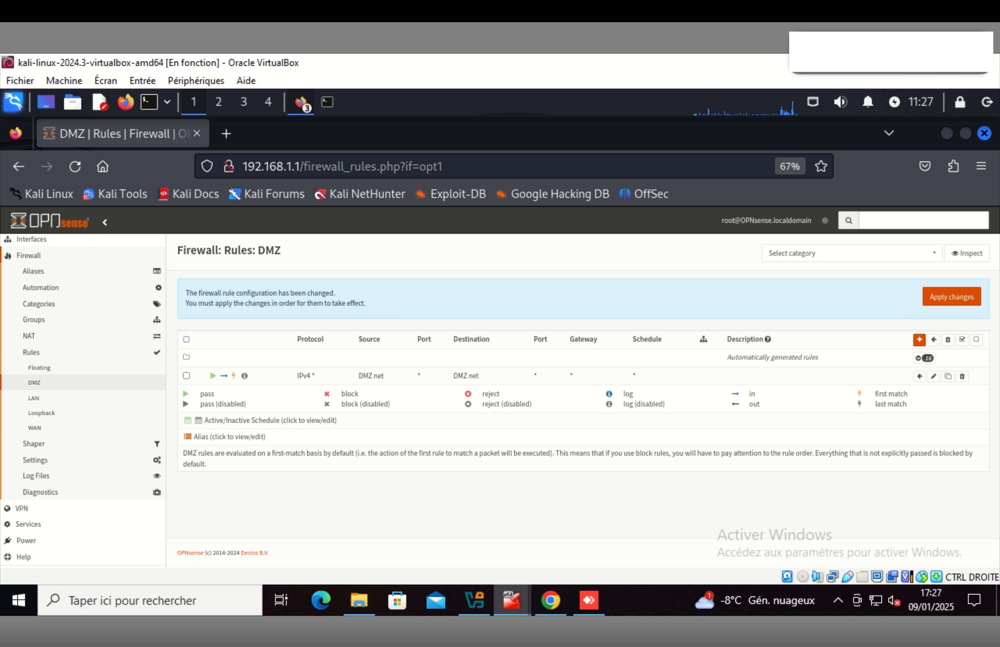
---

## **Expected Result**
With this rule in place:
- Devices in the DMZ network, or any source defined in the rule, can send ICMP packets (ping) to the DMZ interface.
- This ensures that the DMZ interface is operational and correctly connected to the network.

---

## **Security Considerations**
1. **ICMP-specific Rule**:
   - Limiting the rule to ICMP ensures that only ping traffic is allowed, keeping other types of traffic (HTTP, HTTPS, etc.) blocked.
2. **Logs (Optional)**:
   - You can enable the **Log packets that are handled by this rule** option to monitor ICMP requests in the firewall logs.

---
