**Résumé du TP**

Dans ce TP, nous avons transformé un Raspberry Pi en petit routeur/point d’accès Wi-Fi capable de fournir un réseau local isolé, avec son propre serveur DHCP/DNS, tout en sortant sur Internet via la box. Dans un second temps, nous avons ajouté un nœud Tor accessible en proxy SOCKS, afin de pouvoir router une partie du trafic vers le réseau Tor de manière contrôlée.

**Objectifs du TP**

L’objectif principal est double :

Mettre en place une infrastructure réseau complète autour du Raspberry Pi :  

* Un réseau local privé en 192.168.50.0/24,  
un pont (bridge) br0 regroupant l’interface Ethernet du LAN (eth0) et le Wi-Fi (wlan0),  
* Un serveur DHCP/DNS pour ce LAN (dnsmasq ou Pi-hole),  
un point d’accès Wi-Fi (hostapd) permettant aux clients de se connecter au LAN,  
* Un NAT sur l’interface reliée à la box (eth1) pour que les clients du LAN aient accès à Internet.

Intégrer Tor comme service optionnel :  

* Faire tourner un service Tor sur le Raspberry Pi,  
* Exposer un proxy SOCKS5 sur le port 9050, accessible depuis le LAN,  
* Laisser le trafic “normal” passer directement par la box, et ne faire passer dans Tor que les applications explicitement configurées pour utiliser le proxy.

**Architecture réseau**

L’architecture finale est la suivante :

* Interface eth1 : reliée à la box Internet, obtient une adresse IP en DHCP (192.168.1.x).  
* Interface eth0 : côté LAN filaire, intégrée dans le pont br0.  
* Interface wlan0 : utilisée par hostapd pour créer un SSID “RPi-AP”, associée également au pont br0.  
* Pont br0 : interface logique du LAN, configurée en 192.168.50.1/24.  
* Clients LAN (PC, Wi-Fi) : reçoivent une adresse en 192.168.50.x via DHCP et utilisent 192.168.50.1 comme passerelle et DNS.  

Le Raspberry Pi joue donc plusieurs rôles simultanés : routeur, point d’accès Wi-Fi, serveur DHCP/DNS, et serveur Tor.
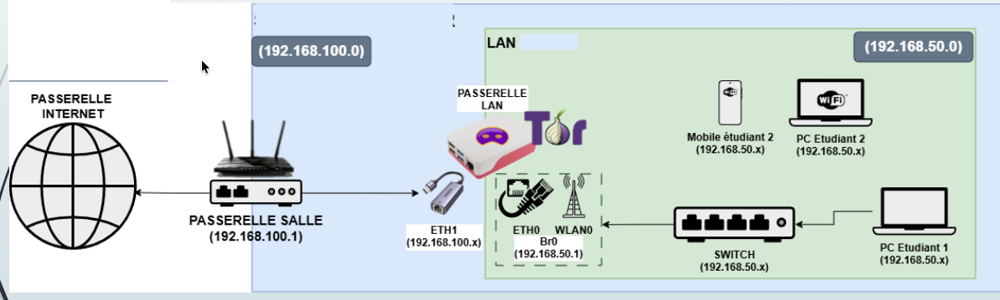
**Installation des paquets nécessaires pour le TP**  

```
sudo apt update  
sudo apt install \-y dnsmasq hostapd bridge-utils ifupdown iptables iptables-persistent
````

On crée l’interface br0 qui servira de pont, avec l’IP fixe  192.168.50.1 qui servira de passerelle pour le réseau local, et les autres en manual : eth1 recevra son IP du DHCP de la box et les autres n’ont pas d’IP.

```
sudo tee /etc/network/interfaces >/dev/null <<'EOF'
auto lo
iface lo inet loopback

allow-hotplug eth1
iface eth1 inet manual

allow-hotplug eth0
iface eth0 inet manual

allow-hotplug wlan0
iface wlan0 inet manual

auto br0
iface br0 inet static
   address 192.168.50.1
   netmask 255.255.255.0
   bridge_ports eth0
   bridge_stp off
   bridge_fd 0
   bridge_maxwait 0
EOF
```

On dit au DHCP de ne pas toucher au réseau local

```
sudo tee -a /etc/dhcpcd.conf >/dev/null <<'EOF'

denyinterfaces eth0
denyinterfaces wlan0
denyinterfaces br0
EOF
```

On applique la configuration réseau

```
sudo systemctl restart dhcpcd
sudo ifdown --force br0 2>/dev/null || true
sudo ifup br0
sudo ip addr flush dev eth0
```

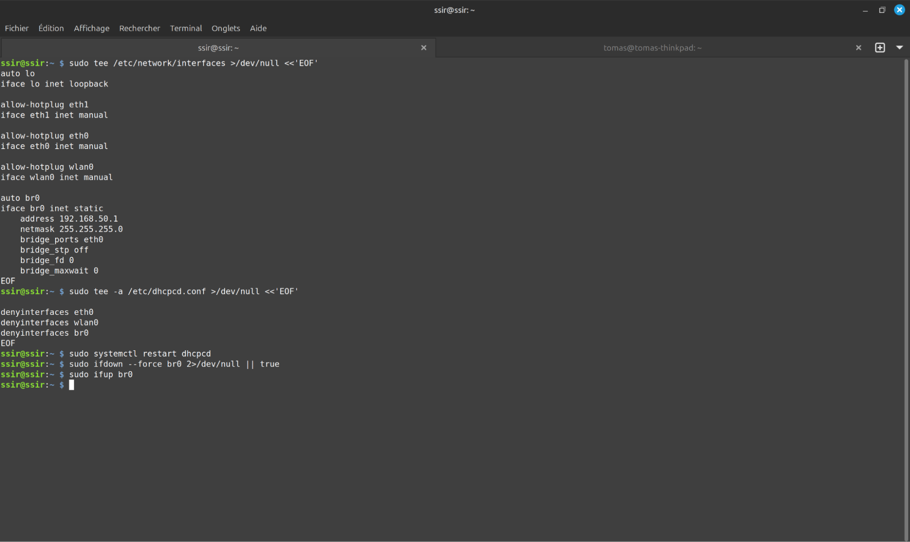

On vérifie que les IPs et les routes sont correctes

```
ip a
ip r
```

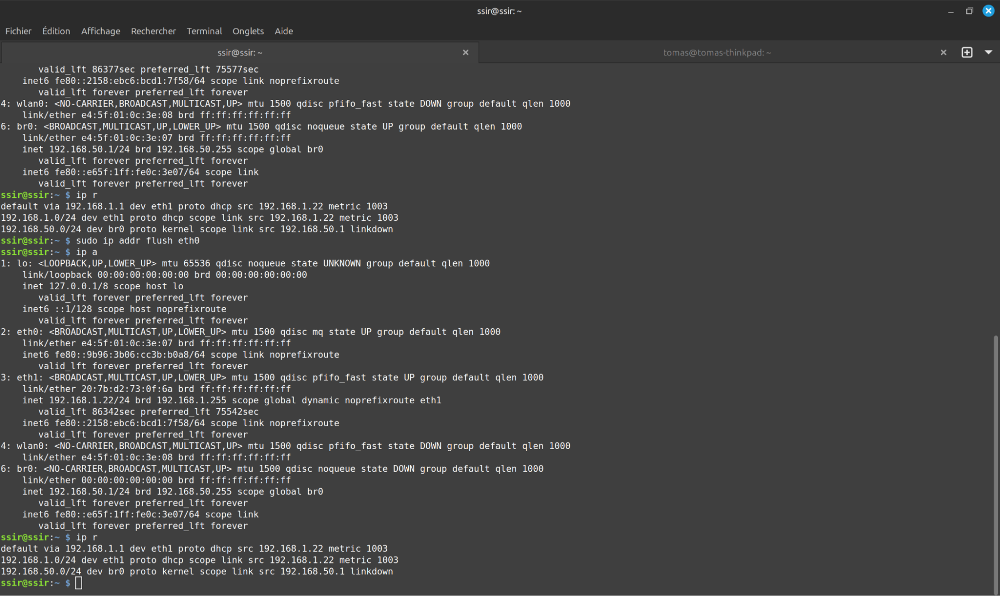

On configure dnsmasq (DHCP + DNS pour le LAN)

```
sudo tee /etc/dnsmasq.conf >/dev/null <<'EOF'
interface=br0
no-dhcp-interface=eth1    # surtout pas côté Internet

domain=ssir.lan
dhcp-authoritative

dhcp-range=192.168.50.100,192.168.50.200,12h

dhcp-option=3,192.168.50.1
dhcp-option=6,192.168.50.1

log-queries
log-dhcp
dhcp-leasefile=/var/lib/misc/dnsmasq.leases
EOF
```

On démarre dnsmasq et on l’active dès le démarrage

```
sudo systemctl enable dnsmasq
sudo systemctl restart dnsmasq
sudo systemctl status dnsmasq
```

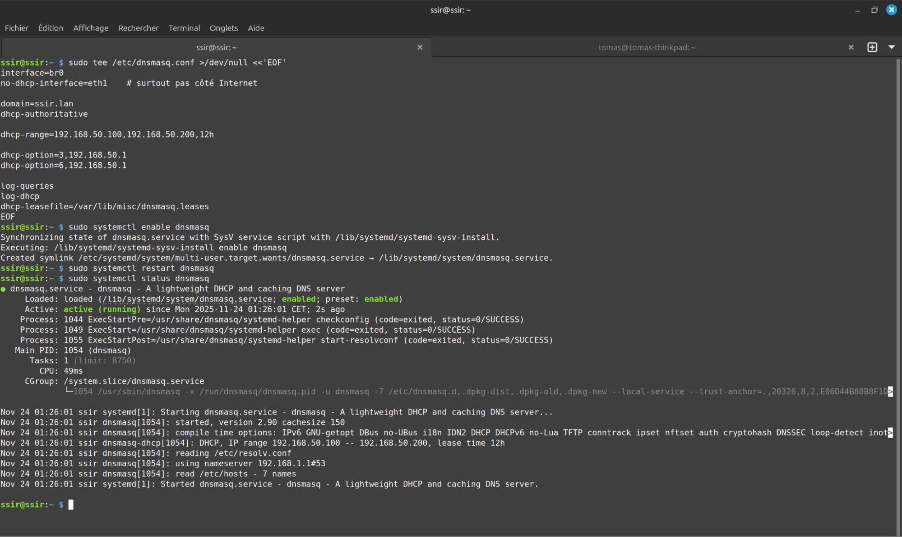

On teste le bon fonctionnement du DHCP côté PC (LAN filaire)

```
sudo dhclient -r enp1s0
sudo dhclient enp1s0

ip a show enp1s0
nmcli dev show enp1s0 | grep IP4.DNS
```

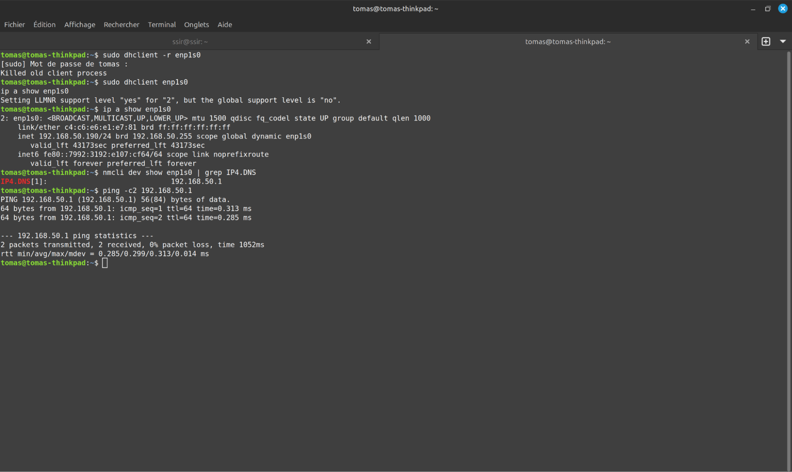

Activer le forwarding IPv4 (routage)

```sudo tee /etc/sysctl.d/99-ipforward.conf >/dev/null <<'EOF'
net.ipv4.ip_forward=1
EOF
```

Appliquer et vérifier le forwarding
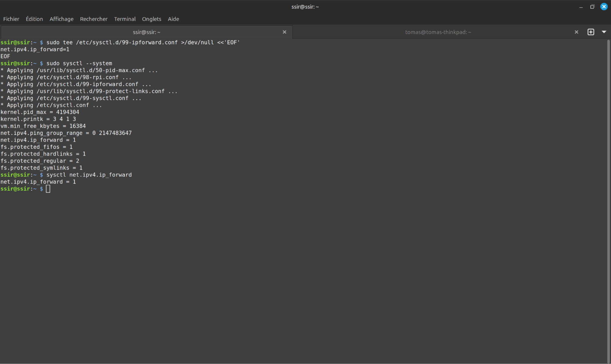

On met en place les règles iptables pour le NAT et le forwarding

````
sudo iptables -t nat -F
sudo iptables -F FORWARD

sudo iptables -t nat -A POSTROUTING -o eth1 -j MASQUERADE

sudo iptables -A FORWARD -i br0 -o eth1 -j ACCEPT

sudo iptables -A FORWARD -i eth1 -o br0 -m state --state ESTABLISHED,RELATED -j ACCEPT

sudo netfilter-persistent save
````

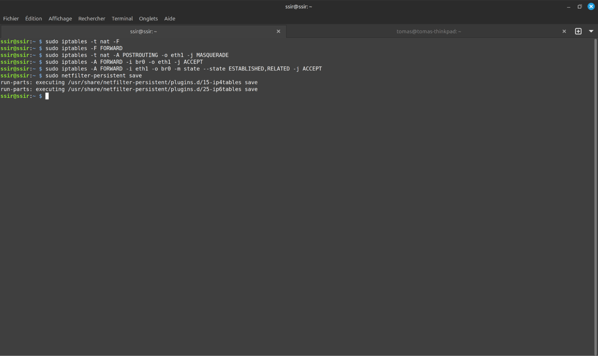

On vérifie la connectivité depuis le PC

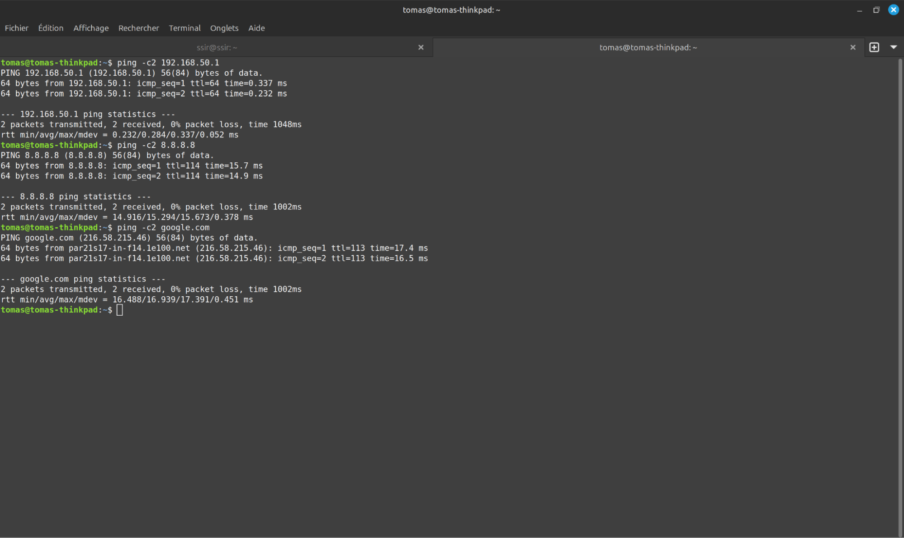

## Mise en place du point d'accès wifi
On configure le point d’accès Wi-Fi (hostapd)

````
sudo tee /etc/hostapd/hostapd.conf >/dev/null <<'EOF'
interface=wlan0
bridge=br0

ssid=RPi-AP
hw_mode=g
channel=6
ieee80211n=1
wmm_enabled=1

auth_algs=1
wpa=2
wpa_key_mgmt=WPA-PSK
rsn_pairwise=CCMP
wpa_passphrase=lOQuiZVklyFNDDpCQQj0NcHC

country_code=FR
EOF
````

On lie hostapd à sa configuration et on active le service
````

sudo sed -i 's|^#\?DAEMON_CONF=.*|DAEMON_CONF="/etc/hostapd/hostapd.conf"|' /etc/default/hostapd

sudo systemctl unmask hostapd
sudo systemctl enable hostapd
sudo systemctl restart hostapd
sudo systemctl status hostapd
````
**Preuve**
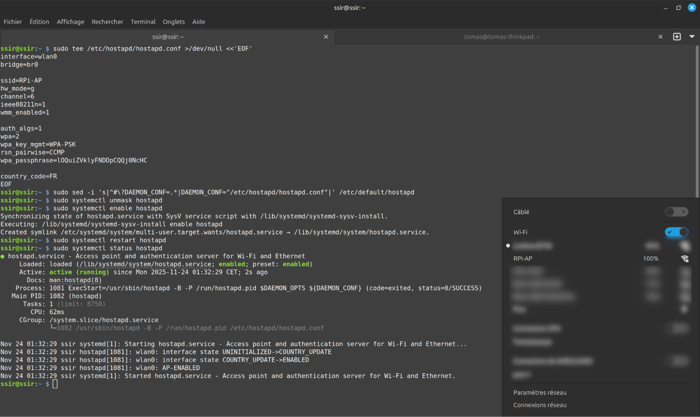
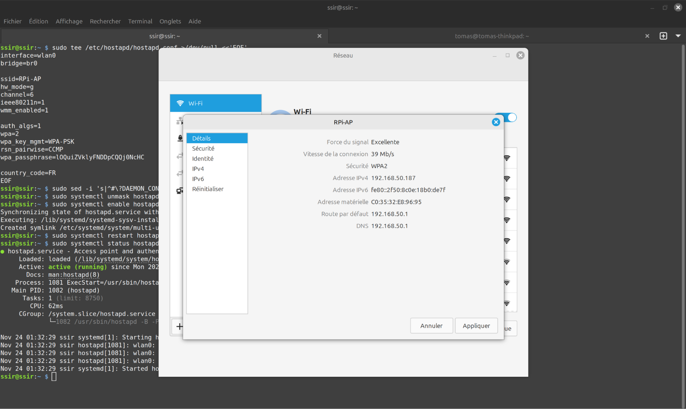

# Configuration de Tor
On installe et configure Tor

```
sudo apt update
sudo apt install -y tor

sudo nano /etc/tor/torrc
on ajoute à la fin du fichier :
# Tor accessible en SOCKS5 depuis le LAN
SocksPort 0.0.0.0:9050

Log notice syslog
```

On vérifie le bon fonctionnement de Tor et s’il écoute bien sur le port 9050

````
sudo -u debian-tor tor --verify-config

sudo systemctl restart tor@default
sudo systemctl status tor@default
sudo ss -lnpt | grep 9050
````
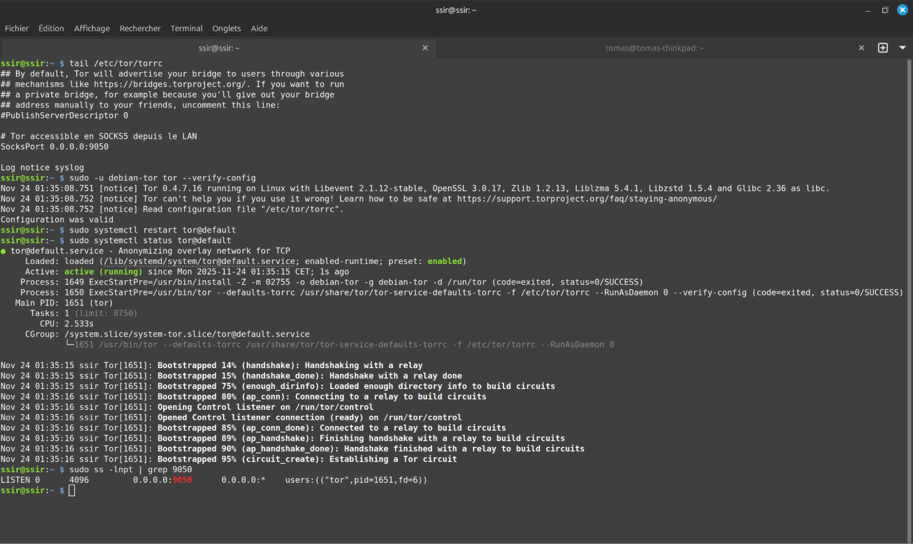


## Test de la connexion Tor à travers le port SOCKS

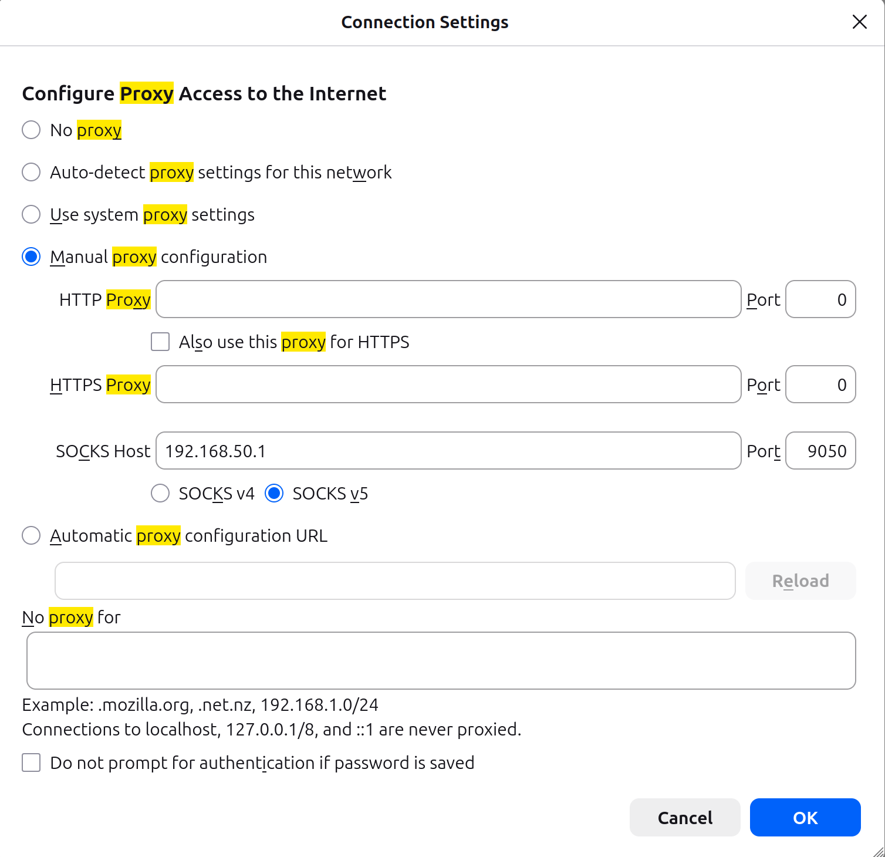
 